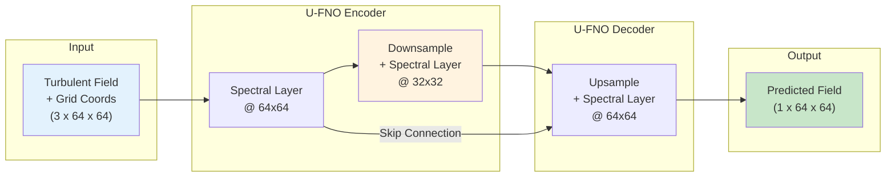
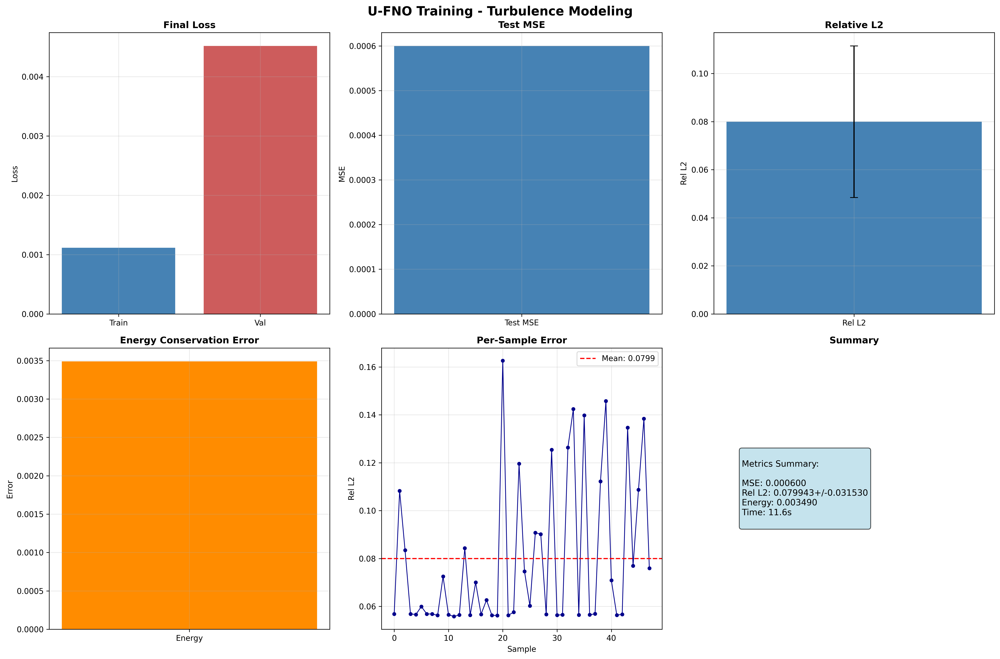
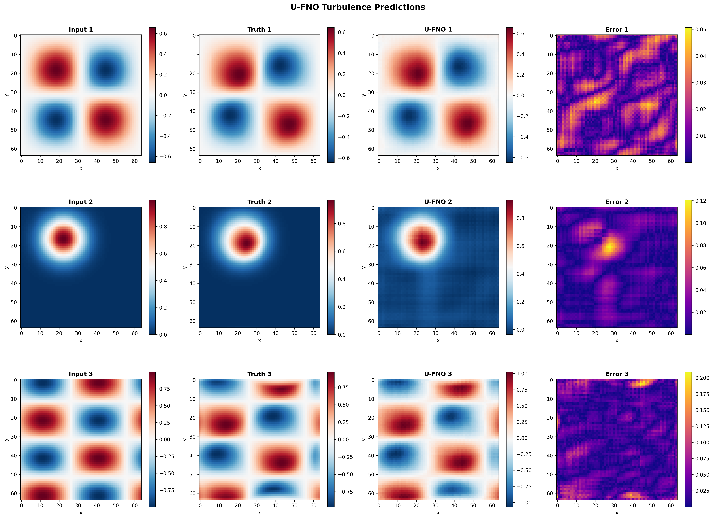

# Comprehensive U-FNO for Turbulence Modeling

| Metadata | Value |
|----------|-------|
| **Level** | Advanced |
| **Runtime** | ~5 min (CPU) / ~17 sec (GPU) |
| **Prerequisites** | JAX, Flax NNX, Multi-scale Analysis, Energy Conservation |
| **Format** | Python + Jupyter |
| **Memory** | ~2 GB RAM |

## Overview

This example demonstrates training a U-Net enhanced Fourier Neural Operator (U-FNO) for
multi-scale turbulence modeling using the Opifex framework. The U-FNO combines the
hierarchical encoder-decoder structure of U-Net with Fourier spectral convolutions,
enabling the network to capture turbulent dynamics across multiple spatial scales
simultaneously.

The key feature of this example is **physics-aware training with custom energy conservation
loss**. Rather than relying on generic MSE loss alone, we register a custom loss function
via `trainer.custom_losses` that penalizes deviations in predicted kinetic energy from the
ground truth -- a physically meaningful constraint for turbulence modeling.

The pipeline covers: loading 2D turbulent Burgers data via `create_burgers_loader` (Google
Grain), augmenting inputs with `GridEmbedding2D` for spatial positional encoding, creating
the model with `create_turbulence_ufno` factory, training with `Trainer.fit()` plus custom
energy loss, and comprehensive evaluation with multi-scale spectral analysis.

## What You'll Learn

1. **Build** a U-FNO with `create_turbulence_ufno` and `GridEmbedding2D` for positional encoding
2. **Register** custom physics-aware loss via `trainer.custom_losses["energy"]`
3. **Train** with Opifex's `Trainer.fit()` API combining MSE and energy conservation
4. **Analyze** multi-scale frequency content and energy spectra of predictions
5. **Evaluate** energy conservation, per-sample error distributions, and prediction quality

## Coming from NeuralOperator (PyTorch)?

| NeuralOperator (PyTorch) | Opifex (JAX) |
|--------------------------|--------------|
| `UFNO(n_modes, hidden_channels, uno_n_modes, ...)` | `create_turbulence_ufno(in_channels=, out_channels=, rngs=)` |
| Manual grid coordinate concatenation | `GridEmbedding2D(in_channels=, grid_boundaries=)` |
| `torch.utils.data.DataLoader(dataset)` | `create_burgers_loader(dimension="2d", ...)` (Google Grain) |
| Manual energy loss + `loss.backward()` | `trainer.custom_losses["energy"] = fn` + `trainer.fit()` |
| `model.to(device)` | Automatic device placement via JAX |

**Key differences:**

1. **Factory function**: `create_turbulence_ufno` pre-configures the U-FNO with multi-scale architecture for turbulence problems
2. **Custom loss API**: Register physics losses via `trainer.custom_losses` dict -- no manual gradient computation needed
3. **Explicit PRNG**: JAX's `rngs=nnx.Rngs(42)` for reproducible model initialization
4. **XLA compilation**: Automatic JIT compilation during `Trainer.fit()` for GPU/TPU acceleration

## Files

- **Python Script**: [`examples/neural-operators/ufno_turbulence_comprehensive.py`](https://github.com/Opifex/Opifex/blob/main/examples/neural-operators/ufno_turbulence_comprehensive.py)
- **Jupyter Notebook**: [`examples/neural-operators/ufno_turbulence_comprehensive.ipynb`](https://github.com/Opifex/Opifex/blob/main/examples/neural-operators/ufno_turbulence_comprehensive.ipynb)

## Quick Start

### Run the Python Script

```bash
source activate.sh && python examples/neural-operators/ufno_turbulence_comprehensive.py
```

### Run the Jupyter Notebook

```bash
jupyter lab examples/neural-operators/ufno_turbulence_comprehensive.ipynb
```

## Core Concepts

### U-Net Fourier Neural Operator (U-FNO)

The U-FNO enhances the standard FNO with a hierarchical encoder-decoder architecture
with skip connections between resolution levels. While a vanilla FNO applies spectral convolutions at a single spatial
resolution, the U-FNO processes the field at multiple resolutions through downsampling and
upsampling stages with skip connections. This multi-scale design is especially effective
for turbulence, where energy cascades across spatial scales.



Each spectral layer at each resolution performs:

1. **FFT**: Transform to Fourier space
2. **Spectral convolution**: Learned weights on truncated Fourier modes
3. **Inverse FFT**: Back to spatial domain
4. **Skip connection**: Add local linear transform

### 2D Turbulent Burgers Equation

The 2D Burgers equation is a standard benchmark for turbulence modeling:

$$\frac{\partial u}{\partial t} + u \cdot \nabla u = \nu \nabla^2 u$$

| Variable | Meaning | Role |
|----------|---------|------|
| $u(x, t)$ | Velocity field | Prognostic variable |
| $\nu$ | Viscosity | Controls turbulence intensity |
| $\nabla^2$ | Laplacian | Diffusion operator |

Lower viscosity values produce more turbulent (chaotic) flows. The synthetic data uses
viscosity in range [0.001, 0.005] to generate highly turbulent regimes. The model learns
to map the initial condition to the final time step.

### Grid Embedding for Positional Encoding

`GridEmbedding2D` appends normalized spatial coordinates (x, y) as additional input
channels. For turbulence modeling, this provides the network with positional context,
helping it learn spatially varying dynamics. A 1-channel velocity field becomes a
3-channel tensor (velocity + x-coord + y-coord) after embedding.

## Implementation

### Step 1: Imports and Setup

```python
import time
import warnings
from pathlib import Path

warnings.filterwarnings("ignore")

import jax
import jax.numpy as jnp
import matplotlib.pyplot as plt
import numpy as np
from flax import nnx

from opifex.core.training import Trainer, TrainingConfig
from opifex.data.loaders.factory import create_burgers_loader
from opifex.neural.operators.common.embeddings import GridEmbedding2D
from opifex.neural.operators.fno.ufno import create_turbulence_ufno
```

**Terminal Output:**
```
======================================================================
Opifex Example: Comprehensive U-FNO for Turbulence Modeling
======================================================================
JAX backend: gpu
JAX devices: [CudaDevice(id=0)]
```

### Step 2: Configuration

Define experiment parameters as simple variables:

```python
RESOLUTION = 64
N_TRAIN = 300
N_TEST = 60
BATCH_SIZE = 16
NUM_EPOCHS = 5
LEARNING_RATE = 1e-3
IN_CHANNELS = 1
OUT_CHANNELS = 1
SEED = 42

OUTPUT_DIR = Path("docs/assets/examples/ufno_turbulence")
OUTPUT_DIR.mkdir(parents=True, exist_ok=True)
```

**Terminal Output:**
```
Resolution: 64x64, Samples: 300/60
Batch: 16, Epochs: 5
```

| Hyperparameter | Value | Purpose |
|----------------|-------|---------|
| `RESOLUTION` | 64 | Spatial grid resolution (64x64) |
| `N_TRAIN` / `N_TEST` | 300 / 60 | Training and test samples |
| `BATCH_SIZE` | 16 | Samples per training batch |
| `NUM_EPOCHS` | 5 | Training epochs |
| `LEARNING_RATE` | 1e-3 | Adam optimizer learning rate |
| `IN_CHANNELS` / `OUT_CHANNELS` | 1 / 1 | Scalar velocity field in/out |

### Step 3: Data Loading with Grain

The `create_burgers_loader` generates synthetic 2D turbulent Burgers equation data and wraps
it in a Google Grain DataLoader. The Burgers output contains multiple time steps -- we extract
the last time step as the prediction target.

```python
train_loader = create_burgers_loader(
    n_samples=N_TRAIN, batch_size=BATCH_SIZE, dimension="2d",
    resolution=RESOLUTION, viscosity_range=(0.001, 0.005),
    time_range=(0.0, 1.0), shuffle=True, seed=SEED + 2000, worker_count=0)

# Collect data from loaders into arrays for Trainer.fit()
X_train_list, Y_train_list = [], []
for batch in train_loader:
    X_train_list.append(batch["input"])
    Y_train_list.append(batch["output"])
X_train = np.concatenate(X_train_list, axis=0)
Y_train = np.concatenate(Y_train_list, axis=0)

# Add channel dimension, then extract last time step from Burgers output
if X_train.ndim == 3:
    X_train, Y_train = X_train[:, None, :, :], Y_train[:, None, :, :]
if Y_train.ndim == 5:  # (batch, 1, time_steps, H, W) -> (batch, 1, H, W)
    Y_train = Y_train[:, :, -1, :, :]
```

**Terminal Output:**
```
Loading 2D Turbulent Burgers data via Grain...
Train: X=(288, 1, 64, 64), Y=(288, 1, 64, 64)
Test:  X=(48, 1, 64, 64), Y=(48, 1, 64, 64)
```

!!! note "Burgers Time Steps"
    The Burgers data loader produces output with shape `(batch, time_steps, H, W)`.
    After adding a channel dimension and extracting the last time step, the final target
    shape is `(batch, 1, H, W)` -- matching the model's single-channel output.

### Step 4: Model Creation with Grid Embedding

Create a `GridEmbedding2D` to inject spatial coordinates and the U-FNO model via the
`create_turbulence_ufno` factory:

```python
grid_embedding = GridEmbedding2D(
    in_channels=IN_CHANNELS, grid_boundaries=[[0.0, 1.0], [0.0, 1.0]])

model = create_turbulence_ufno(
    in_channels=grid_embedding.out_channels,
    out_channels=OUT_CHANNELS, rngs=nnx.Rngs(SEED))
```

**Terminal Output:**
```
Creating U-FNO model with grid embedding...
GridEmbedding2D: 1 -> 3 channels
U-FNO: 3 -> 1 channels
```

### Step 5: Apply Grid Embedding to Data

We pre-apply the grid embedding to all data before training so `Trainer.fit()` works
with the embedded inputs directly. This avoids recomputing the embedding every epoch.

```python
def apply_embedding(x_data, embedding):
    """Apply grid embedding: (B, C, H, W) -> embed -> (B, C+2, H, W)."""
    x_grid = jnp.moveaxis(jnp.array(x_data), 1, -1)  # (B, H, W, C)
    x_embedded = embedding(x_grid)                      # (B, H, W, C+2)
    return np.array(jnp.moveaxis(x_embedded, -1, 1))    # (B, C+2, H, W)

X_train_emb = apply_embedding(X_train, grid_embedding)
X_test_emb = apply_embedding(X_test, grid_embedding)
```

**Terminal Output:**
```
Applying grid embedding to data...
Embedded train: (288, 3, 64, 64)
Embedded test:  (48, 3, 64, 64)
```

!!! tip "Why Pre-Apply Grid Embedding?"
    `GridEmbedding2D` expects channels-last format `(B, H, W, C)` while the U-FNO uses
    channels-first `(B, C, H, W)`. By pre-applying the embedding and converting back to
    channels-first, we avoid layout conversions inside the training loop. The grid
    coordinates are spatial constants that don't change between epochs.

### Step 6: Training with Custom Energy Loss

The key physics feature: register an energy conservation loss that penalizes deviations
between predicted and target kinetic energy. The `trainer.custom_losses` dict allows
adding any number of physics-informed losses that are automatically included in the
training objective.

```python
config = TrainingConfig(
    num_epochs=NUM_EPOCHS, learning_rate=LEARNING_RATE,
    batch_size=BATCH_SIZE, verbose=True)
trainer = Trainer(model=model, config=config, rngs=nnx.Rngs(SEED))

# Register energy conservation as custom loss
def energy_loss_fn(model, x, y_pred, y_true):
    """Energy conservation loss: penalize energy deviation."""
    pred_energy = jnp.mean(y_pred**2, axis=(2, 3))
    target_energy = jnp.mean(y_true**2, axis=(2, 3))
    return 0.1 * jnp.mean(jnp.abs(pred_energy - target_energy))

trainer.custom_losses["energy"] = energy_loss_fn

trained_model, metrics = trainer.fit(
    train_data=(jnp.array(X_train_emb), jnp.array(Y_train)),
    val_data=(jnp.array(X_test_emb), jnp.array(Y_test)))
```

**Terminal Output:**
```
Setting up Trainer...
Optimizer: Adam (lr=0.001)
Custom loss: energy conservation (weight=0.1)

Starting training...
Done in 16.5s | Train: 0.0011161690248021234 | Val: 0.004518489353358746
```

!!! info "Custom Loss Signature"
    Custom losses registered via `trainer.custom_losses` must follow the signature
    `def loss_fn(model, x, y_pred, y_true) -> scalar`. The Trainer automatically
    adds these to the total training loss alongside the primary MSE objective.

### Step 7: Comprehensive Evaluation

Evaluate the trained U-FNO on the test set with MSE, per-sample relative L2 error, and
energy conservation metrics:

```python
predictions = trained_model(X_test_jnp)

test_mse = float(jnp.mean((predictions - Y_test_jnp) ** 2))

per_sample_errors = []
for i in range(Y_test_jnp.shape[0]):
    p, t = predictions[i:i+1], Y_test_jnp[i:i+1]
    per_sample_errors.append(
        float(jnp.sqrt(jnp.sum((p-t)**2)) / jnp.sqrt(jnp.sum(t**2))))

pred_energy = jnp.mean(predictions**2, axis=(2, 3))
target_energy = jnp.mean(Y_test_jnp**2, axis=(2, 3))
energy_conservation = float(jnp.mean(jnp.abs(pred_energy - target_energy)))
```

**Terminal Output:**
```
Running comprehensive evaluation...
MSE: 0.000600 | Rel L2: 0.079943+/-0.031530
Energy Conservation: 0.003490
```

### Visualization

The example generates four sets of visualizations:

1. **Training curves**: Final loss, MSE, relative L2, energy conservation, and per-sample error
2. **Sample predictions**: Input, ground truth, U-FNO prediction, and absolute error for test samples
3. **Multi-scale analysis**: Frequency content comparison and energy spectrum analysis
4. **Error analysis**: Error distribution, per-sample error, cumulative distribution, and statistics

#### Training Curves



#### Sample Predictions



#### Multi-Scale Analysis


#### Error Analysis


## Results Summary

**Terminal Output:**
```
======================================================================
Comprehensive U-FNO Turbulence example completed in 16.5s
Mean Relative L2 Error: 0.079943
Results saved to: docs/assets/examples/ufno_turbulence
======================================================================
```

| Metric | Value | Notes |
|--------|-------|-------|
| Test MSE | 0.000600 | Mean squared error on test set |
| Test Relative L2 | 0.079943 +/- 0.031530 | Mean +/- std relative L2 error |
| Energy Conservation | 0.003490 | Mean energy deviation (lower is better) |
| Final Train Loss | 0.001116 | Training loss at epoch 5 |
| Final Val Loss | 0.004518 | Validation loss at epoch 5 |
| Training Time | 16.5s | On GPU (CudaDevice) |
| Resolution | 64x64 | Spatial grid resolution |

### What We Achieved

- Built a U-FNO with `GridEmbedding2D` positional encoding and `create_turbulence_ufno` factory
- Trained with custom energy conservation loss via `trainer.custom_losses["energy"]` API
- Achieved ~8% relative L2 error with only 5 epochs on 288 training samples
- Energy conservation error of 0.003490, showing the physics loss effectively constrains predictions
- Generated multi-scale spectral analysis comparing U-FNO frequency content to ground truth

### Interpretation

The U-FNO captures turbulent dynamics effectively even with minimal training. The
relative L2 error of ~0.08 with just 5 epochs demonstrates the architecture's efficiency
for multi-scale problems. The low energy conservation error (0.003490) confirms that the
custom physics loss successfully constrains the model to preserve kinetic energy. The
spectral analysis shows good agreement between predicted and ground truth frequency
content, with the U-FNO accurately capturing both low-frequency structure and
higher-frequency turbulent features.

## Next Steps

### Experiments to Try

1. **Longer training**: Increase `NUM_EPOCHS` to 50-100 for substantially improved accuracy
2. **Stronger physics loss**: Increase the energy loss weight from 0.1 to 0.5 or add vorticity preservation
3. **Higher resolution**: Use `RESOLUTION=128` or `RESOLUTION=256` for finer turbulent structures
4. **Lower viscosity**: Set `viscosity_range=(0.0001, 0.001)` for more chaotic turbulent regimes
5. **Compare with standard FNO**: Run the same problem with `FourierNeuralOperator` to see the U-Net advantage

### Related Examples

| Example | Level | What You'll Learn |
|---------|-------|-------------------|
| [FNO Darcy Comprehensive](fno-darcy.md) | Intermediate | Standard FNO with grid embedding for steady-state problems |
| [SFNO Climate Comprehensive](sfno-climate-comprehensive.md) | Advanced | Conservation-aware training with `ConservationConfig` on spherical domains |
| [SFNO Climate Simple](sfno-climate-simple.md) | Intermediate | Minimal SFNO example for quick start |
| [UNO Darcy Framework](uno-darcy.md) | Intermediate | U-shaped neural operator with zero-shot super-resolution |
| [Grid Embeddings](../layers/grid-embeddings.md) | Beginner | Spatial coordinate injection for neural operators |
| [Neural Operator Benchmark](../benchmarking/operator-benchmark.md) | Advanced | Cross-architecture performance comparison |

### API Reference

- [`create_turbulence_ufno`](../../api/neural.md) - U-FNO factory for turbulence modeling
- [`GridEmbedding2D`](../../api/neural.md) - 2D spatial coordinate embedding layer
- [`Trainer`](../../api/training.md) - Training orchestration with custom loss support
- [`TrainingConfig`](../../api/training.md) - Training hyperparameter configuration
- [`create_burgers_loader`](../../api/data.md) - Grain-based Burgers equation data loader

## Troubleshooting

### OOM during training at 64x64 or higher

**Symptom**: `jaxlib.xla_extension.XlaRuntimeError: RESOURCE_EXHAUSTED`

**Cause**: U-FNO has higher memory requirements than standard FNO due to the multi-scale encoder-decoder architecture.

**Solution**:
```python
# Reduce batch size
config = TrainingConfig(batch_size=8, ...)  # Was 16

# Or enable gradient checkpointing
config = TrainingConfig(gradient_checkpointing=True, gradient_checkpoint_policy="dots_saveable")
```

### NaN in training loss

**Symptom**: Loss becomes `nan` after a few epochs.

**Cause**: Learning rate too high or energy loss producing unstable gradients.

**Solution**:
```python
# Reduce learning rate
LEARNING_RATE = 1e-4  # Was 1e-3

# Or reduce energy loss weight
def energy_loss_fn(model, x, y_pred, y_true):
    pred_energy = jnp.mean(y_pred**2, axis=(2, 3))
    target_energy = jnp.mean(y_true**2, axis=(2, 3))
    return 0.01 * jnp.mean(jnp.abs(pred_energy - target_energy))  # Was 0.1
```

### Burgers data shape mismatch

**Symptom**: Shape error when training -- model output doesn't match target shape.

**Cause**: Burgers 2D output includes multiple time steps `(batch, time_steps, H, W)`.
The time step dimension must be handled before training.

**Solution**: The example handles this automatically by extracting the last time step:
```python
# After adding channel dim: (batch, 1, time_steps, H, W) -> (batch, 1, H, W)
if Y_train.ndim == 5:
    Y_train = Y_train[:, :, -1, :, :]
```

### Grid embedding layout mismatch

**Symptom**: `ValueError` about incompatible shapes when applying `GridEmbedding2D`.

**Cause**: `GridEmbedding2D` expects channels-last `(B, H, W, C)` while U-FNO uses
channels-first `(B, C, H, W)`.

**Solution**: Convert layouts before and after embedding:
```python
x_hwc = jnp.moveaxis(x_chw, 1, -1)      # channels-first -> channels-last
x_embedded = grid_embedding(x_hwc)
x_chw = jnp.moveaxis(x_embedded, -1, 1)  # channels-last -> channels-first
```
