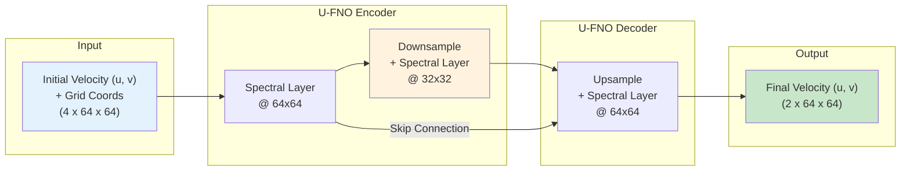
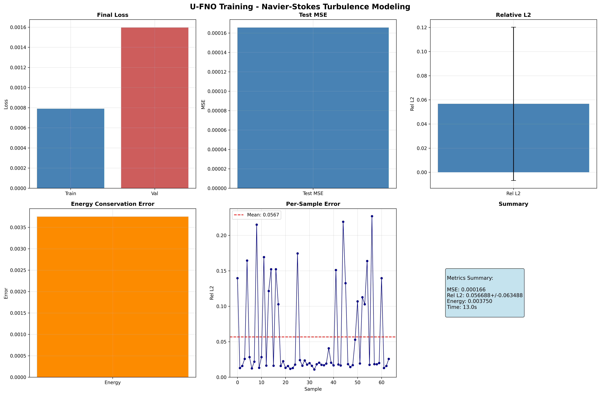
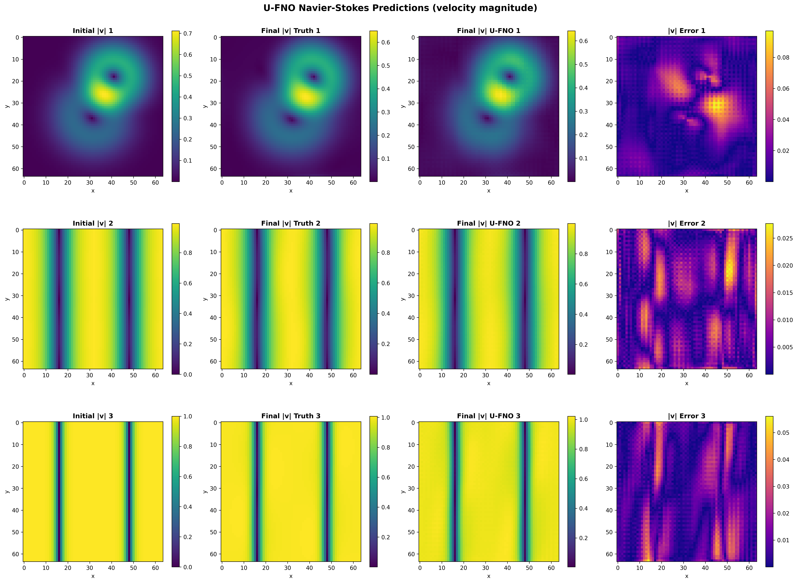
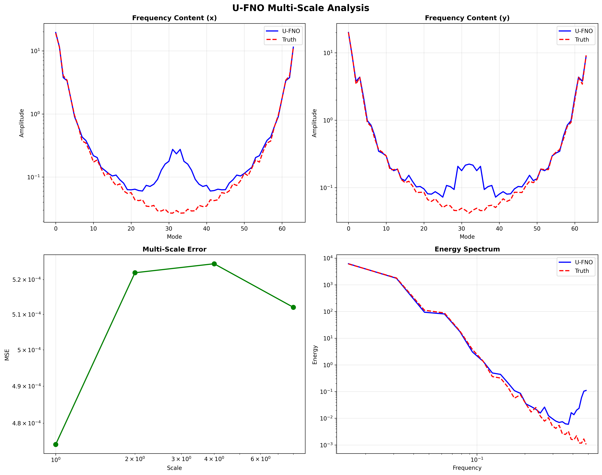
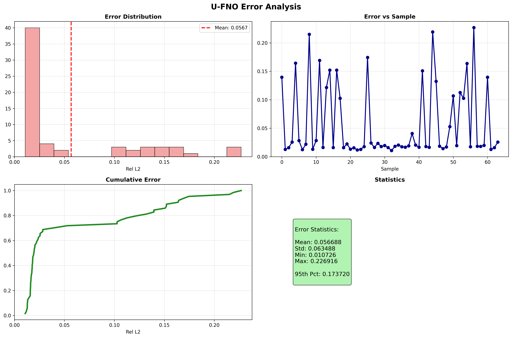

# Full U-FNO for Turbulence Modeling

| Metadata | Value |
|----------|-------|
| **Level** | Advanced |
| **Runtime** | ~5 min (CPU) / ~12 sec (GPU) |
| **Prerequisites** | JAX, Flax NNX, Multi-scale Analysis, Energy Conservation |
| **Format** | Python + Jupyter |
| **Memory** | ~2 GB RAM |

## Overview

This example demonstrates training a U-Net enhanced Fourier Neural Operator (U-FNO) for
multi-scale 2D Navier-Stokes turbulence modeling using the Opifex framework. The U-FNO
combines the hierarchical encoder-decoder structure of U-Net with Fourier spectral
convolutions, enabling the network to capture turbulent dynamics across multiple spatial
scales simultaneously. The operator maps the **initial velocity field** `(u, v)` to the
**final-time velocity field** of an incompressible Navier-Stokes flow.

The key feature of this example is **physics-aware training with custom energy conservation
loss**. Rather than relying on generic MSE loss alone, we register a custom loss function
via `trainer.custom_losses` that penalizes deviations in predicted kinetic energy from the
ground truth -- a physically meaningful constraint for turbulence modeling.

The pipeline covers: loading 2D Navier-Stokes turbulence data via
`create_navier_stokes_loader` (datarax), augmenting inputs with `GridEmbedding2D` for
spatial positional encoding, creating the model with `create_turbulence_ufno` factory,
training with `Trainer.fit()` plus custom energy loss, and full evaluation with multi-scale
spectral analysis of the velocity-magnitude field.

## What You'll Learn

1. **Build** a U-FNO with `create_turbulence_ufno` and `GridEmbedding2D` for positional encoding
2. **Register** custom physics-aware loss via `trainer.custom_losses["energy"]`
3. **Train** with Opifex's `Trainer.fit()` API combining MSE and energy conservation
4. **Analyze** multi-scale frequency content and energy spectra of predictions
5. **Evaluate** energy conservation, per-sample error distributions, and prediction quality

## Coming from NeuralOperator (PyTorch)?

| NeuralOperator (PyTorch) | Opifex (JAX) |
|--------------------------|--------------|
| `UFNO(n_modes, hidden_channels, uno_n_modes, ...)` | `create_turbulence_ufno(in_channels=, out_channels=, rngs=)` |
| Manual grid coordinate concatenation | `GridEmbedding2D(in_channels=, grid_boundaries=)` |
| `torch.utils.data.DataLoader(dataset)` | `create_navier_stokes_loader(...)` (datarax `PDELoaders`) |
| Manual energy loss + `loss.backward()` | `trainer.custom_losses["energy"] = fn` + `trainer.fit()` |
| `model.to(device)` | Automatic device placement via JAX |

**Key differences:**

1. **Factory function**: `create_turbulence_ufno` pre-configures the U-FNO with multi-scale architecture for turbulence problems
2. **Custom loss API**: Register physics losses via `trainer.custom_losses` dict -- no manual gradient computation needed
3. **Explicit PRNG**: JAX's `rngs=nnx.Rngs(42)` for reproducible model initialization
4. **XLA compilation**: Automatic JIT compilation during `Trainer.fit()` for GPU/TPU acceleration
5. **Frozen loaders**: `create_navier_stokes_loader` returns a `PDELoaders` object exposing pre-split `.train` / `.val` datarax pipelines

## Files

- **Python Script**: [`examples/neural-operators/ufno_turbulence.py`](https://github.com/avitai/opifex/blob/main/examples/neural-operators/ufno_turbulence.py)
- **Jupyter Notebook**: [`examples/neural-operators/ufno_turbulence.ipynb`](https://github.com/avitai/opifex/blob/main/examples/neural-operators/ufno_turbulence.ipynb)

## Quick Start

### Run the Python Script

```bash
source activate.sh && python examples/neural-operators/ufno_turbulence.py
```

### Run the Jupyter Notebook

```bash
jupyter lab examples/neural-operators/ufno_turbulence.ipynb
```

## Core Concepts

### U-Net Fourier Neural Operator (U-FNO)

The U-FNO enhances the standard FNO with a hierarchical encoder-decoder architecture
with skip connections between resolution levels. While a vanilla FNO applies spectral convolutions at a single spatial
resolution, the U-FNO processes the field at multiple resolutions through downsampling and
upsampling stages with skip connections. This multi-scale design is especially effective
for turbulence, where energy cascades across spatial scales.


```mermaid
graph LR
    subgraph Input
        A["Initial Velocity (u, v)<br/>+ Grid Coords<br/>(4 x 64 x 64)"]
    end

    subgraph Encoder["U-FNO Encoder"]
        B["Spectral Layer<br/>@ 64x64"]
        C["Downsample<br/>+ Spectral Layer<br/>@ 32x32"]
    end

    subgraph Decoder["U-FNO Decoder"]
        D["Upsample<br/>+ Spectral Layer<br/>@ 64x64"]
    end

    subgraph Output
        E["Final Velocity (u, v)<br/>(2 x 64 x 64)"]
    end

    A --> B --> C --> D --> E
    B -->|"Skip Connection"| D

    style A fill:#e3f2fd
    style E fill:#c8e6c9
    style C fill:#fff3e0
```

Each spectral layer at each resolution performs:

1. **FFT**: Transform to Fourier space
2. **Spectral convolution**: Learned weights on truncated Fourier modes
3. **Inverse FFT**: Back to spatial domain
4. **Skip connection**: Add local linear transform

### 2D Navier-Stokes Turbulence

The incompressible 2D Navier-Stokes equations describe turbulent fluid flow:

$$\frac{\partial \mathbf{u}}{\partial t} + (\mathbf{u} \cdot \nabla)\mathbf{u} = -\nabla p + \nu \nabla^2 \mathbf{u}, \quad \nabla \cdot \mathbf{u} = 0$$

| Variable | Meaning | Role |
|----------|---------|------|
| $\mathbf{u}(x, t) = (u, v)$ | Velocity field | Prognostic variable (2 channels) |
| $p$ | Pressure | Enforces incompressibility |
| $\nu$ | Viscosity | Controls turbulence intensity |
| $\nabla^2$ | Laplacian | Diffusion operator |

Lower viscosity values produce more turbulent (chaotic) flows. The synthetic data uses
viscosity in range [0.001, 0.005] to generate highly turbulent regimes. The model learns
to map the **initial velocity field** $(u, v)$ to the **final-time velocity field** $(u, v)$.

### Grid Embedding for Positional Encoding

`GridEmbedding2D` appends normalized spatial coordinates (x, y) as additional input
channels. For turbulence modeling, this provides the network with positional context,
helping it learn spatially varying dynamics. A 2-channel velocity field $(u, v)$ becomes a
4-channel tensor (u + v + x-coord + y-coord) after embedding.

## Implementation

### Step 1: Imports and Setup

```python
import time
import warnings
from pathlib import Path

warnings.filterwarnings("ignore")

import jax
import jax.numpy as jnp
import matplotlib.pyplot as plt
import numpy as np
from flax import nnx

from opifex.core.training import Trainer, TrainingConfig
from opifex.data.loaders.factory import create_navier_stokes_loader
from opifex.neural.operators.common.embeddings import GridEmbedding2D
from opifex.neural.operators.fno.ufno import create_turbulence_ufno
```

**Terminal Output:**
```
======================================================================
Opifex Example: Full U-FNO for 2D Navier-Stokes Turbulence Modeling
======================================================================
JAX backend: gpu
JAX devices: [CudaDevice(id=0)]
```

### Step 2: Configuration

Define experiment parameters as simple variables:

```python
resolution = 64
n_train = 300
n_test = 60
batch_size = 16
num_epochs = 5
learning_rate = 1e-3
in_channels = 2  # (u, v) velocity components
out_channels = 2  # (u, v) velocity components
seed = 42

output_dir = Path("docs/assets/examples/ufno_turbulence")
output_dir.mkdir(parents=True, exist_ok=True)
```

**Terminal Output:**
```
Resolution: 64x64, Samples: 300/60
Batch: 16, Epochs: 5
```

| Hyperparameter | Value | Purpose |
|----------------|-------|---------|
| `resolution` | 64 | Spatial grid resolution (64x64) |
| `n_train` / `n_test` | 300 / 60 | Training and test samples |
| `batch_size` | 16 | Samples per training batch |
| `num_epochs` | 5 | Training epochs |
| `learning_rate` | 1e-3 | Adam optimizer learning rate |
| `in_channels` / `out_channels` | 2 / 2 | Velocity field $(u, v)$ in/out |

### Step 3: Data Loading with datarax

The `create_navier_stokes_loader` generates synthetic 2D Navier-Stokes turbulence data and
returns a frozen `PDELoaders` object with pre-split `.train` / `.val` datarax pipelines.
Batches are channels-first dicts where `input` and `output` are each shaped `(batch, 2, H, W)`
-- the 2 channels are the `(u, v)` velocity components (initial velocity in, final velocity out).

```python
n_samples = n_train + n_test
loaders = create_navier_stokes_loader(
    n_samples=n_samples,
    batch_size=batch_size,
    resolution=resolution,
    viscosity_range=(0.001, 0.005),
    time_range=(0.0, 1.0),
    val_fraction=n_test / n_samples,
    seed=seed,
)

def _collect(pipeline: object) -> tuple[np.ndarray, np.ndarray]:
    """Materialize a datarax pipeline into channels-first (N, 2, H, W) arrays."""
    inputs, outputs = [], []
    for batch in pipeline:
        inputs.append(np.asarray(batch["input"]))
        outputs.append(np.asarray(batch["output"]))
    return np.concatenate(inputs, axis=0), np.concatenate(outputs, axis=0)

x_train, y_train = _collect(loaders.train)
x_test, y_test = _collect(loaders.val)
```

**Terminal Output:**
```
Loading 2D Navier-Stokes turbulence data via datarax...
Train: X=(304, 2, 64, 64), Y=(304, 2, 64, 64)
Test:  X=(64, 2, 64, 64), Y=(64, 2, 64, 64)
```

!!! note "Frozen PDELoaders"
    `create_navier_stokes_loader` returns a `PDELoaders` object that pre-splits the data
    into `.train` and `.val` datarax pipelines according to `val_fraction`. Each batch is a
    channels-first dict with `input` / `output` shaped `(batch, 2, H, W)` -- already matching
    the model's two-channel `(u, v)` velocity layout, so no reshaping is required.

### Step 4: Model Creation with Grid Embedding

Create a `GridEmbedding2D` to inject spatial coordinates and the U-FNO model via the
`create_turbulence_ufno` factory:

```python
grid_embedding = GridEmbedding2D(
    in_channels=in_channels, grid_boundaries=[[0.0, 1.0], [0.0, 1.0]])

model = create_turbulence_ufno(
    in_channels=grid_embedding.out_channels,
    out_channels=out_channels, rngs=nnx.Rngs(seed))
```

**Terminal Output:**
```
Creating U-FNO model with grid embedding...
GridEmbedding2D: 2 -> 4 channels
U-FNO: 4 -> 2 channels
Model parameters: 240,130,562
```

### Step 5: Apply Grid Embedding to Data

We pre-apply the grid embedding to all data before training so `Trainer.fit()` works
with the embedded inputs directly. This avoids recomputing the embedding every epoch.

```python
def apply_embedding(x_data, embedding):
    """Apply grid embedding: (B, C, H, W) -> embed -> (B, C+2, H, W)."""
    x_grid = jnp.moveaxis(jnp.array(x_data), 1, -1)  # (B, H, W, C)
    x_embedded = embedding(x_grid)                      # (B, H, W, C+2)
    return np.array(jnp.moveaxis(x_embedded, -1, 1))    # (B, C+2, H, W)

x_train_emb = apply_embedding(x_train, grid_embedding)
x_test_emb = apply_embedding(x_test, grid_embedding)
```

**Terminal Output:**
```
Applying grid embedding to data...
Embedded train: (304, 4, 64, 64)
Embedded test:  (64, 4, 64, 64)
```

!!! tip "Why Pre-Apply Grid Embedding?"
    `GridEmbedding2D` expects channels-last format `(B, H, W, C)` while the U-FNO uses
    channels-first `(B, C, H, W)`. By pre-applying the embedding and converting back to
    channels-first, we avoid layout conversions inside the training loop. The grid
    coordinates are spatial constants that don't change between epochs.

### Step 6: Training with Custom Energy Loss

The key physics feature: register an energy conservation loss that penalizes deviations
between predicted and target kinetic energy. The `trainer.custom_losses` dict allows
adding any number of physics-informed losses that are automatically included in the
training objective.

```python
config = TrainingConfig(
    num_epochs=num_epochs, learning_rate=learning_rate,
    batch_size=batch_size, verbose=True)
trainer = Trainer(model=model, config=config, rngs=nnx.Rngs(seed))

# Register energy conservation as custom loss
def energy_loss_fn(model, x, y_pred, y_true):
    """Energy conservation loss: penalize energy deviation."""
    pred_energy = jnp.mean(y_pred**2, axis=(2, 3))
    target_energy = jnp.mean(y_true**2, axis=(2, 3))
    return 0.1 * jnp.mean(jnp.abs(pred_energy - target_energy))

trainer.custom_losses["energy"] = energy_loss_fn

trained_model, metrics = trainer.fit(
    train_data=(jnp.array(x_train_emb), jnp.array(y_train)),
    val_data=(jnp.array(x_test_emb), jnp.array(y_test)))
```

**Terminal Output:**
```
Setting up Trainer...
Optimizer: Adam (lr=0.001)
Custom loss: energy conservation (weight=0.1)

Starting training...
Done in 11.5s | Train: 0.000789 | Val: 0.001596
```

!!! info "Custom Loss Signature"
    Custom losses registered via `trainer.custom_losses` must follow the signature
    `def loss_fn(model, x, y_pred, y_true) -> scalar`. The Trainer automatically
    adds these to the total training loss alongside the primary MSE objective.

### Step 7: Full Evaluation

Evaluate the trained U-FNO on the test set with MSE, per-sample relative L2 error, and
energy conservation metrics:

```python
x_test_jnp = jnp.array(x_test_emb)
y_test_jnp = jnp.array(y_test)
predictions = trained_model(x_test_jnp)

test_mse = float(jnp.mean((predictions - y_test_jnp) ** 2))

per_sample_errors = []
for i in range(y_test_jnp.shape[0]):
    p, t = predictions[i:i+1], y_test_jnp[i:i+1]
    per_sample_errors.append(
        float(jnp.sqrt(jnp.sum((p-t)**2)) / jnp.sqrt(jnp.sum(t**2))))

pred_energy = jnp.mean(predictions**2, axis=(2, 3))
target_energy = jnp.mean(y_test_jnp**2, axis=(2, 3))
energy_conservation = float(jnp.mean(jnp.abs(pred_energy - target_energy)))
```

**Terminal Output:**
```
Running full evaluation...
MSE: 0.000166 | Rel L2: 0.056688+/-0.063488
Energy Conservation: 0.003750
```

### Visualization

The example generates four sets of visualizations:

1. **Training curves**: Final loss, MSE, relative L2, energy conservation, and per-sample error
2. **Sample predictions**: Initial velocity magnitude, ground-truth final, U-FNO final, and absolute error (all on $|v| = \sqrt{u^2 + v^2}$)
3. **Multi-scale analysis**: Frequency content and energy spectrum of the velocity-magnitude field
4. **Error analysis**: Error distribution, per-sample error, cumulative distribution, and statistics

#### Training Curves



#### Sample Predictions



#### Multi-Scale Analysis



#### Error Analysis



## Results Summary

**Terminal Output:**
```
======================================================================
Full U-FNO Navier-Stokes turbulence example completed in 11.5s
Mean Relative L2 Error: 0.056688
Results saved to: docs/assets/examples/ufno_turbulence
======================================================================
```

| Metric | Value | Notes |
|--------|-------|-------|
| Test MSE | 0.000166 | Mean squared error on test set |
| Test Relative L2 | 0.056688 +/- 0.063488 | Mean +/- std relative L2 error |
| Energy Conservation | 0.003750 | Mean energy deviation (lower is better) |
| Final Train Loss | 0.000789 | Training loss at epoch 5 |
| Final Val Loss | 0.001596 | Validation loss at epoch 5 |
| Model Parameters | 240,130,562 | Total trainable parameters |
| Training Time | 11.5s | On GPU (CudaDevice) |
| Resolution | 64x64 | Spatial grid resolution |

### What We Achieved

- Built a U-FNO with `GridEmbedding2D` positional encoding and `create_turbulence_ufno` factory
- Mapped initial velocity $(u, v)$ to final-time velocity for 2D Navier-Stokes turbulence
- Trained with custom energy conservation loss via `trainer.custom_losses["energy"]` API
- Achieved ~5.7% relative L2 error with only 5 epochs on 304 training samples
- Energy conservation error of 0.003750, showing the physics loss effectively constrains predictions
- Generated multi-scale spectral analysis comparing U-FNO frequency content to ground truth

### Interpretation

The U-FNO captures turbulent dynamics effectively even with minimal training. The
relative L2 error of ~0.057 with just 5 epochs demonstrates the architecture's efficiency
for multi-scale problems. The low energy conservation error (0.003750) confirms that the
custom physics loss successfully constrains the model to preserve kinetic energy. The
spectral analysis of the velocity-magnitude field shows good agreement between predicted
and ground-truth frequency content, with the U-FNO accurately capturing both low-frequency
structure and higher-frequency turbulent features.

## Next Steps

### Experiments to Try

1. **Longer training**: Increase `num_epochs` to 50-100 for substantially improved accuracy
2. **Stronger physics loss**: Increase the energy loss weight from 0.1 to 0.5 or add vorticity preservation
3. **Higher resolution**: Use `resolution=128` or `resolution=256` for finer turbulent structures
4. **Lower viscosity**: Set `viscosity_range=(0.0001, 0.001)` for more chaotic turbulent regimes
5. **Compare with standard FNO**: Run the same Navier-Stokes problem with `FourierNeuralOperator` to see the U-Net advantage

### Related Examples

| Example | Level | What You'll Learn |
|---------|-------|-------------------|
| [FNO Darcy Full](fno-darcy.md) | Intermediate | Standard FNO with grid embedding for steady-state problems |
| [SFNO Climate Full](sfno-climate-full.md) | Advanced | Conservation-aware training with `ConservationConfig` on spherical domains |
| [SFNO Climate Simple](sfno-climate-simple.md) | Intermediate | Minimal SFNO example for quick start |
| [UNO Darcy Framework](uno-darcy.md) | Intermediate | U-shaped neural operator with zero-shot super-resolution |
| [Grid Embeddings](../layers/grid-embeddings.md) | Beginner | Spatial coordinate injection for neural operators |
| [Neural Operator Benchmark](../benchmarking/operator-benchmark.md) | Advanced | Cross-architecture performance comparison |

### API Reference

- [`create_turbulence_ufno`](../../api/neural.md) - U-FNO factory for turbulence modeling
- [`GridEmbedding2D`](../../api/neural.md) - 2D spatial coordinate embedding layer
- [`Trainer`](../../api/training.md) - Training orchestration with custom loss support
- [`TrainingConfig`](../../api/training.md) - Training hyperparameter configuration
- [`create_navier_stokes_loader`](../../api/data.md) - datarax-based 2D Navier-Stokes turbulence data loader

## Troubleshooting

### OOM during training at 64x64 or higher

**Symptom**: `jaxlib.xla_extension.XlaRuntimeError: RESOURCE_EXHAUSTED`

**Cause**: U-FNO has higher memory requirements than standard FNO due to the multi-scale encoder-decoder architecture.

**Solution**:
```python
# Reduce batch size
config = TrainingConfig(batch_size=8, ...)  # Was 16

# Or enable gradient checkpointing
config = TrainingConfig(gradient_checkpointing=True, gradient_checkpoint_policy="dots_saveable")
```

### NaN in training loss

**Symptom**: Loss becomes `nan` after a few epochs.

**Cause**: Learning rate too high or energy loss producing unstable gradients.

**Solution**:
```python
# Reduce learning rate
learning_rate = 1e-4  # Was 1e-3

# Or reduce energy loss weight
def energy_loss_fn(model, x, y_pred, y_true):
    pred_energy = jnp.mean(y_pred**2, axis=(2, 3))
    target_energy = jnp.mean(y_true**2, axis=(2, 3))
    return 0.01 * jnp.mean(jnp.abs(pred_energy - target_energy))  # Was 0.1
```

### Grid embedding layout mismatch

**Symptom**: `ValueError` about incompatible shapes when applying `GridEmbedding2D`.

**Cause**: `GridEmbedding2D` expects channels-last `(B, H, W, C)` while U-FNO uses
channels-first `(B, C, H, W)`.

**Solution**: Convert layouts before and after embedding:
```python
x_hwc = jnp.moveaxis(x_chw, 1, -1)      # channels-first -> channels-last
x_embedded = grid_embedding(x_hwc)
x_chw = jnp.moveaxis(x_embedded, -1, 1)  # channels-last -> channels-first
```
