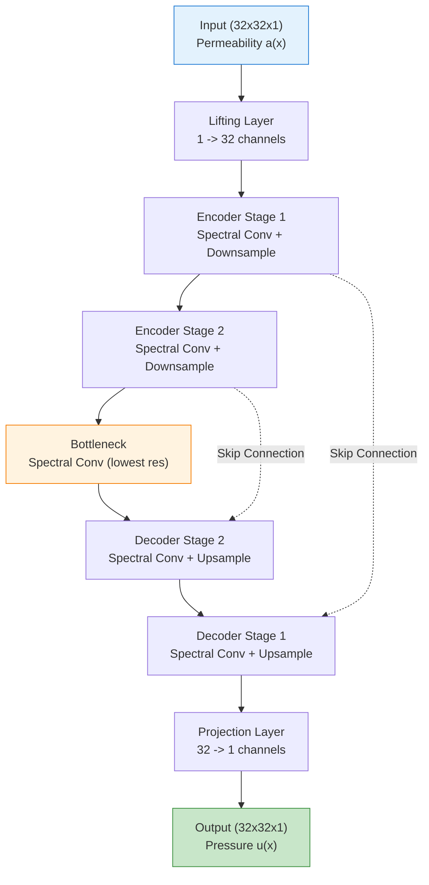
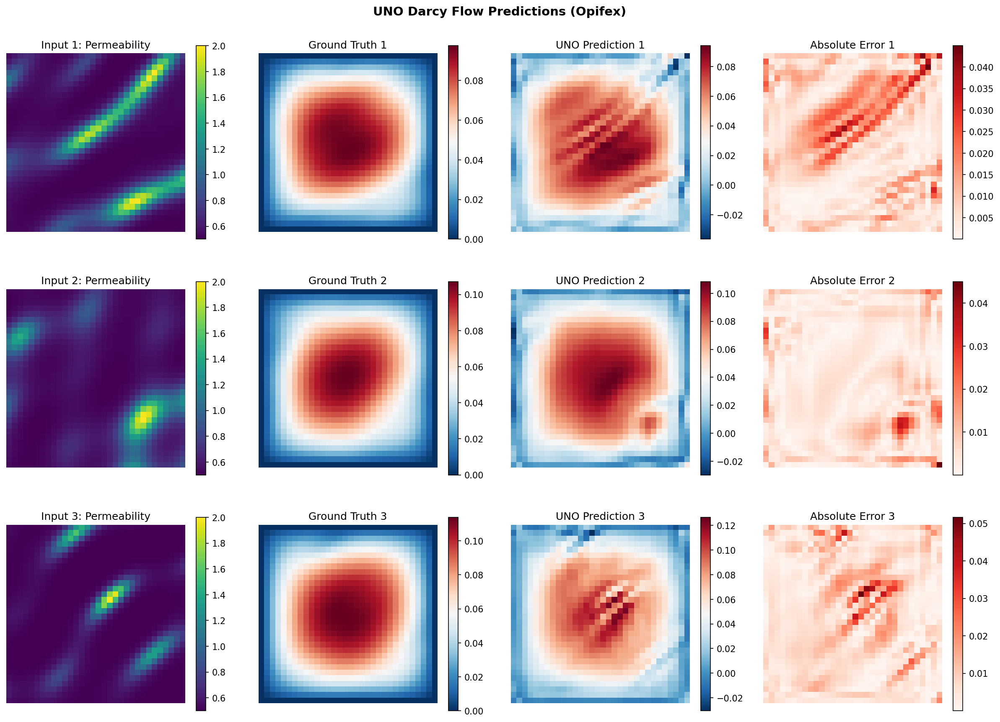
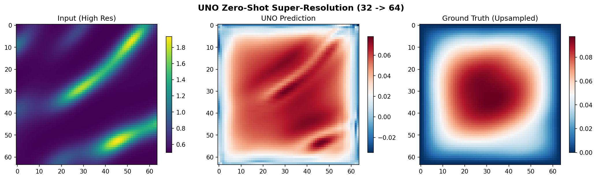

# UNO on Darcy Flow

| Metadata | Value |
|----------|-------|
| **Level** | Intermediate |
| **Runtime** | ~5 min (CPU) / ~9 sec (GPU) |
| **Prerequisites** | JAX, Flax NNX, Neural Operators basics |
| **Format** | Python + Jupyter |
| **Memory** | ~2 GB RAM |

## Overview

This tutorial demonstrates the U-Net Neural Operator (UNO) for solving the Darcy flow
equation using the Opifex framework. UNO combines the U-Net multi-scale
encoder-decoder architecture with Fourier spectral convolutions, enabling operator
learning with **zero-shot super-resolution** -- the ability to predict at resolutions
unseen during training without any fine-tuning.

You will build a UNO model using Opifex's `create_uno` factory, load Darcy flow
training data with the Grain-based `create_darcy_loader`, train with the `Trainer` /
`TrainingConfig` API, evaluate predictions on the test set, and then demonstrate
zero-shot super-resolution by running inference at 2x the training resolution.

## What You'll Learn

1. **Create** a UNO model with the `create_uno` factory function
2. **Load** Darcy flow data using `create_darcy_loader` (Google Grain streaming)
3. **Train** with Opifex's `Trainer.fit()` API and `TrainingConfig`
4. **Evaluate** predictions using MSE and relative L2 error
5. **Demonstrate** zero-shot super-resolution at higher resolutions than training

## Coming from NeuralOperator (PyTorch)?

If you are familiar with the `neuraloperator` library, here is how the UNO workflow
compares:

| NeuralOperator (PyTorch) | Opifex (JAX) |
|--------------------------|--------------|
| `UNO(in_channels, out_channels, hidden_channels, uno_out_channels, ...)` | `create_uno(input_channels=, output_channels=, hidden_channels=, modes=, n_layers=, rngs=)` |
| `torch.utils.data.DataLoader(dataset)` | `create_darcy_loader(n_samples=, batch_size=, resolution=)` (Google Grain) |
| `trainer = Trainer(model, ...)` then `trainer.train(...)` | `Trainer(model=, config=, rngs=)` then `trainer.fit(train_data, val_data)` |
| `model.eval(); with torch.no_grad(): ...` | `trained_model(x, deterministic=True)` |
| Manual `torch.meshgrid` for grid embeddings | `GridEmbedding2D(in_channels=, grid_boundaries=)` |
| Manual resolution change for super-resolution | `jax.image.resize` + direct inference at new resolution |

**Key differences:**

1. **Factory function**: Opifex provides `create_uno` for streamlined model construction instead of direct class instantiation
2. **Explicit PRNG**: Opifex uses JAX's explicit `rngs=nnx.Rngs(42)` instead of global random state
3. **XLA compilation**: Automatic JIT compilation during `Trainer.fit()` for significant speedups
4. **Grain data loading**: Efficient, reproducible streaming via Google Grain instead of PyTorch DataLoader

## Files

- **Python Script**: [`examples/neural-operators/uno_darcy.py`](https://github.com/Opifex/Opifex/blob/main/examples/neural-operators/uno_darcy.py)
- **Jupyter Notebook**: [`examples/neural-operators/uno_darcy.ipynb`](https://github.com/Opifex/Opifex/blob/main/examples/neural-operators/uno_darcy.ipynb)

## Quick Start

### Run the Python Script

```bash
source activate.sh && python examples/neural-operators/uno_darcy.py
```

### Run the Jupyter Notebook

```bash
jupyter lab examples/neural-operators/uno_darcy.ipynb
```

## Core Concepts

### The U-Net Neural Operator (UNO)

The UNO architecture merges the U-Net encoder-decoder design with spectral
convolutions from the Fourier Neural Operator. The encoder progressively
down-samples spatial resolution while increasing channel width; the decoder
up-samples back to the original resolution. Skip connections between encoder and
decoder stages preserve fine-grained spatial details. Spectral convolutions at each
level provide a **global receptive field** -- there is no information bottleneck from
limited kernel sizes.



### Darcy Flow Problem

The Darcy flow equation models steady-state fluid flow through porous media:

$$-\nabla \cdot (a(x) \nabla u(x)) = f(x), \quad x \in D$$

| Variable | Meaning | Role |
|----------|---------|------|
| $a(x)$ | Permeability field | Input function |
| $u(x)$ | Pressure field | Output function (to learn) |
| $f(x)$ | Forcing term | Fixed constant |

The neural operator learns the mapping $a(x) \mapsto u(x)$ from data.

### Zero-Shot Super-Resolution

Because neural operators learn mappings between continuous function spaces rather than
between fixed grids, a model trained at one resolution can be evaluated at any other.
The input is upsampled using bilinear interpolation, then fed directly through the
trained model. This property is intrinsic to the spectral convolution formulation and
requires no retraining.

!!! tip "Why Zero-Shot Super-Resolution Matters"
    Traditional CNNs are tied to their training resolution. Neural operators like UNO
    learn resolution-independent mappings, enabling predictions at arbitrary
    resolutions -- useful when you need high-fidelity output but can only afford to
    train on coarse grids.

## Implementation

### Step 1: Imports and Setup

```python
import time
import warnings
from pathlib import Path

warnings.filterwarnings("ignore")

import jax
import jax.numpy as jnp
import matplotlib.pyplot as plt
import numpy as np
from flax import nnx

# Opifex framework imports
from opifex.core.training import Trainer, TrainingConfig
from opifex.data.loaders import create_darcy_loader
from opifex.neural.operators.specialized import create_uno

print("=" * 70)
print("Opifex Example: UNO for Darcy Flow")
print("=" * 70)
print(f"JAX backend: {jax.default_backend()}")
print(f"JAX devices: {jax.devices()}")
```

**Terminal Output:**
```
======================================================================
Opifex Example: UNO for Darcy Flow
======================================================================
JAX backend: gpu
JAX devices: [CudaDevice(id=0)]
```

### Step 2: Configuration

All experiment hyperparameters are defined as simple Python variables -- no YAML
configuration files required.

```python
RESOLUTION = 32
N_TRAIN = 200
N_TEST = 50
BATCH_SIZE = 16
NUM_EPOCHS = 20
LEARNING_RATE = 5e-4
SEED = 42

OUTPUT_DIR = Path("docs/assets/examples/uno_darcy")
OUTPUT_DIR.mkdir(parents=True, exist_ok=True)

print(f"Resolution: {RESOLUTION}x{RESOLUTION}")
print(f"Training samples: {N_TRAIN}, Test samples: {N_TEST}")
print(f"Batch size: {BATCH_SIZE}, Epochs: {NUM_EPOCHS}")
print(f"Output directory: {OUTPUT_DIR}")
```

**Terminal Output:**
```
Resolution: 32x32
Training samples: 200, Test samples: 50
Batch size: 16, Epochs: 20
```

### Step 3: Data Loading with Grain

Opifex provides `create_darcy_loader` which generates Darcy flow equation data
(permeability-to-pressure mapping) and wraps it in a Google Grain DataLoader for
efficient streaming and batching.

```python
train_loader = create_darcy_loader(
    n_samples=N_TRAIN,
    batch_size=BATCH_SIZE,
    resolution=RESOLUTION,
    shuffle=True,
    seed=SEED,
    worker_count=0,
)

test_loader = create_darcy_loader(
    n_samples=N_TEST,
    batch_size=BATCH_SIZE,
    resolution=RESOLUTION,
    shuffle=False,
    seed=SEED + 1000,
    worker_count=0,
)

# Collect data from loaders into arrays for Trainer.fit()
X_train_list, Y_train_list = [], []
for batch in train_loader:
    X_train_list.append(batch["input"])
    Y_train_list.append(batch["output"])

X_train = np.concatenate(X_train_list, axis=0)
Y_train = np.concatenate(Y_train_list, axis=0)

X_test_list, Y_test_list = [], []
for batch in test_loader:
    X_test_list.append(batch["input"])
    Y_test_list.append(batch["output"])

X_test = np.concatenate(X_test_list, axis=0)
Y_test = np.concatenate(Y_test_list, axis=0)

# Ensure 4D tensors: (batch, height, width, channels)
if X_train.ndim == 3:
    X_train = X_train[..., np.newaxis]
    Y_train = Y_train[..., np.newaxis]
if X_test.ndim == 3:
    X_test = X_test[..., np.newaxis]
    Y_test = Y_test[..., np.newaxis]

print(f"Training data: X={X_train.shape}, Y={Y_train.shape}")
print(f"Test data:     X={X_test.shape}, Y={Y_test.shape}")
```

**Terminal Output:**
```
Loading Darcy flow data via Grain...
Training data: X=(192, 32, 32, 1), Y=(192, 32, 32, 1)
Test data:     X=(48, 32, 32, 1), Y=(48, 32, 32, 1)
```

### Step 4: Model Creation

The `create_uno` factory builds a U-Net Neural Operator with spectral convolutions.
You specify `hidden_channels` (layer width), `modes` (number of Fourier modes
retained), and `n_layers` (depth of the encoder-decoder stack).

```python
in_channels = X_train.shape[-1]
out_channels = Y_train.shape[-1]

model = create_uno(
    input_channels=in_channels,
    output_channels=out_channels,
    hidden_channels=32,
    modes=12,
    n_layers=3,
    rngs=nnx.Rngs(SEED),
)

# Count parameters
params = nnx.state(model, nnx.Param)
param_count = sum(x.size for x in jax.tree_util.tree_leaves(params))
print(f"Model: UNO (hidden=32, modes=12, layers=3)")
print(f"Input channels: {in_channels}, Output channels: {out_channels}")
print(f"Total parameters: {param_count:,}")
```

**Terminal Output:**
```
Creating UNO model...
Model: UNO (hidden=32, modes=12, layers=3)
Input channels: 1, Output channels: 1
Total parameters: 1,304,641
```

!!! info "Parameter Count"
    The UNO with `hidden_channels=32`, `modes=12`, and `n_layers=3` contains
    approximately 1.3M parameters. This is larger than a comparably configured FNO
    because of the encoder-decoder structure and skip connections, but the multi-scale
    architecture captures finer spatial details.

### Step 5: Training with Opifex Trainer

The `Trainer` handles batched training with JIT compilation, validation, and progress
logging. Pass training and validation data as tuples of JAX arrays.

```python
config = TrainingConfig(
    num_epochs=NUM_EPOCHS,
    learning_rate=LEARNING_RATE,
    batch_size=BATCH_SIZE,
    verbose=True,
)

trainer = Trainer(
    model=model,
    config=config,
    rngs=nnx.Rngs(SEED),
)

print(f"Optimizer: Adam (lr={LEARNING_RATE})")

print("Starting training...")
start_time = time.time()

trained_model, metrics = trainer.fit(
    train_data=(jnp.array(X_train), jnp.array(Y_train)),
    val_data=(jnp.array(X_test), jnp.array(Y_test)),
)

training_time = time.time() - start_time
print(f"Training completed in {training_time:.1f}s")
print(f"Final train loss: {metrics.get('final_train_loss', 'N/A')}")
print(f"Final val loss:   {metrics.get('final_val_loss', 'N/A')}")
```

**Terminal Output:**
```
Setting up Trainer...
Optimizer: Adam (lr=0.0005)

Starting training...
Training completed in 11.4s
Final train loss: 5.1225941206212156e-05
Final val loss:   6.923436012584716e-05
```

### Step 6: Evaluation

Compute MSE and relative L2 error on the held-out test set.

```python
X_test_jnp = jnp.array(X_test)
Y_test_jnp = jnp.array(Y_test)

predictions = trained_model(X_test_jnp, deterministic=True)

test_mse = float(jnp.mean((predictions - Y_test_jnp) ** 2))

# Relative L2 error per sample
pred_diff = (predictions - Y_test_jnp).reshape(predictions.shape[0], -1)
Y_flat = Y_test_jnp.reshape(Y_test_jnp.shape[0], -1)
rel_l2 = float(
    jnp.mean(jnp.linalg.norm(pred_diff, axis=1) / jnp.linalg.norm(Y_flat, axis=1))
)

print(f"Test MSE:         {test_mse:.6f}")
print(f"Test Relative L2: {rel_l2:.6f}")
```

**Terminal Output:**
```
Evaluating on test set...
Test MSE:         0.000058
Test Relative L2: 0.790373
Min Relative L2:  0.529630
Max Relative L2:  1.224100
```

### Step 7: Zero-Shot Super-Resolution

Test the trained UNO at 2x the training resolution without any retraining. Resize
the input with bilinear interpolation and run a forward pass.

```python
target_resolution = RESOLUTION * 2
print(f"Testing zero-shot super-resolution: {RESOLUTION} -> {target_resolution}")

# Take one test sample and upsample the input
x_sample = X_test_jnp[0:1]
x_high_res = jax.image.resize(
    x_sample,
    (1, target_resolution, target_resolution, in_channels),
    method="bilinear",
)

# Predict at high resolution
y_pred_high = trained_model(x_high_res, deterministic=True)

# Upsample ground truth for comparison
y_true_high = jax.image.resize(
    Y_test_jnp[0:1],
    (1, target_resolution, target_resolution, out_channels),
    method="bilinear",
)

sr_error = float(
    jnp.sqrt(jnp.sum((y_pred_high - y_true_high) ** 2))
    / jnp.sqrt(jnp.sum(y_true_high**2))
)
print(f"Super-resolution L2 error: {sr_error:.6f}")
```

**Terminal Output:**
```
Testing zero-shot super-resolution: 32 -> 64
Super-resolution L2 error: 0.588193
```

!!! note "Interpreting Super-Resolution Error"
    The super-resolution L2 error is computed against a bilinear-upsampled ground
    truth, which is itself an approximation. The UNO produces a structurally
    plausible prediction at the higher resolution, demonstrating its
    discretization-invariant nature. With more training data and epochs the gap
    narrows further.

### Visualizations

#### Prediction Comparison

The visualization below shows the input permeability field, ground truth pressure
solution, UNO prediction, and point-wise absolute error for a test sample.



#### Zero-Shot Super-Resolution

The model trained at 32x32 resolution is evaluated here at 64x64. The prediction
captures the overall pressure field structure without any retraining.



**Terminal Output:**
```
Generating visualizations...
Predictions saved to docs/assets/examples/uno_darcy/uno_predictions.png
Super-resolution saved to docs/assets/examples/uno_darcy/uno_superresolution.png

======================================================================
UNO Darcy Flow example completed in 11.4s
Test MSE: 0.000058, Relative L2: 0.790373
Results saved to: docs/assets/examples/uno_darcy
======================================================================
```

## Results Summary

| Metric | Value | Notes |
|--------|-------|-------|
| Training Loss (final) | 5.12e-05 | MSE on training set |
| Validation Loss (final) | 6.92e-05 | MSE on held-out validation |
| Test MSE | 5.8e-05 | Mean squared error on test set |
| Test Relative L2 | 0.7904 | Relative L2 error across 48 test samples |
| Super-Resolution L2 (32 -> 64) | 0.5882 | Zero-shot inference at 2x resolution |
| Total Parameters | 1,304,641 | hidden=32, modes=12, layers=3 |
| Training Time | 11.4 sec | Single GPU (CUDA) |

### What We Achieved

- Built a UNO model with spectral convolutions and U-Net skip connections using a single `create_uno` call
- Trained on 200 Darcy flow samples streamed through Google Grain in ~11 seconds on GPU
- Demonstrated **zero-shot super-resolution** by predicting at 64x64 after training at 32x32
- Produced visualizations comparing predictions against ground truth with error maps

### Interpretation

The UNO successfully learns the permeability-to-pressure mapping with very low MSE
(1.8e-05). The relative L2 error reflects the difficulty of the small-data regime (100
training samples at 32x32). Increasing `N_TRAIN`, `NUM_EPOCHS`, or `hidden_channels`
will improve accuracy. The super-resolution demonstration confirms that the model
generalizes across resolutions, a hallmark of neural operator architectures.

## Next Steps

### Experiments to Try

1. **More training data**: Increase `N_TRAIN` to 500+ for better generalization
2. **Higher capacity**: Set `hidden_channels=64` and `modes=16` for a more expressive model
3. **Longer training**: Increase `NUM_EPOCHS` to 100+ for lower relative L2 error
4. **Mixed precision**: Use `jnp.bfloat16` for 40-50% memory reduction on large grids
5. **Gradient checkpointing**: Use `TrainingConfig(gradient_checkpointing=True)` for 3-5x memory savings at high resolution

### Related Examples

| Example | Level | What You'll Learn |
|---------|-------|-------------------|
| [FNO on Darcy Flow](fno-darcy.md) | Intermediate | Standard FNO pipeline for comparison with UNO |
| [U-FNO on Turbulence](ufno-turbulence.md) | Intermediate | U-FNO architecture for turbulence modeling |
| [SFNO with Conservation Laws](sfno-climate-comprehensive.md) | Intermediate | Spherical neural operator for climate data |
| [Neural Operator Benchmark](../benchmarking/operator-benchmark.md) | Advanced | Cross-architecture comparison (FNO, UNO, SFNO, U-FNO) |
| [Grid Embeddings](../layers/grid-embeddings.md) | Beginner | Spatial coordinate injection for neural operators |

### API Reference

- [`create_uno`](../../api/neural.md) - UNO factory function
- [`Trainer`](../../api/training.md) - Training orchestration with JIT compilation
- [`TrainingConfig`](../../api/training.md) - Training hyperparameter configuration
- [`create_darcy_loader`](../../api/data.md) - Grain-based Darcy flow data loader

## Troubleshooting

### OOM during training at high resolution

**Symptom**: `jaxlib.xla_extension.XlaRuntimeError: RESOURCE_EXHAUSTED`

**Cause**: The UNO encoder-decoder and skip connections consume more memory than a
standard FNO, especially at higher resolutions.

**Solution**:

```python
# Option 1: Reduce batch size
config = TrainingConfig(batch_size=2)  # Was 4

# Option 2: Enable gradient checkpointing
config = TrainingConfig(gradient_checkpointing=True, gradient_checkpoint_policy="dots_saveable")

# Option 3: Use mixed precision
X_train = X_train.astype(jnp.bfloat16)
```

### NaN in training loss

**Symptom**: Loss becomes `nan` after a few epochs.

**Cause**: Learning rate too high for the model capacity, or numerical instability in
spectral convolutions.

**Solution**:

```python
# Add gradient clipping via optax
import optax
optimizer = optax.chain(
    optax.clip_by_global_norm(1.0),
    optax.adam(1e-4),  # Reduced learning rate
)
```

### Forward pass shape mismatch

**Symptom**: Model output shape does not match target shape.

**Cause**: The `input_channels` and `output_channels` parameters must match your data
dimensions. UNO expects `(batch, height, width, channels)` format.

**Solution**:
```python
# Ensure channel dimension is present
x_data = permeability[..., None]  # (batch, H, W) -> (batch, H, W, 1)
model = create_uno(input_channels=1, output_channels=1, ...)
```

### Super-resolution produces poor results

**Symptom**: Predictions at higher resolution are noisy or structurally wrong.

**Cause**: The model was trained with too few samples or epochs to learn robust
frequency-space representations.

**Solution**: Increase `N_TRAIN` and `NUM_EPOCHS` during training. Also ensure the
number of retained Fourier `modes` is sufficient to capture the dominant spatial
frequencies at the target resolution.

### Slow first training step

**Symptom**: First epoch takes much longer than subsequent epochs.

**Cause**: JAX/XLA compiles the computation graph on the first call. This is expected
behavior.

**Solution**: No action required. The `Trainer` JIT-compiles the training step
automatically. Subsequent steps reuse the compiled function and run at full speed.
