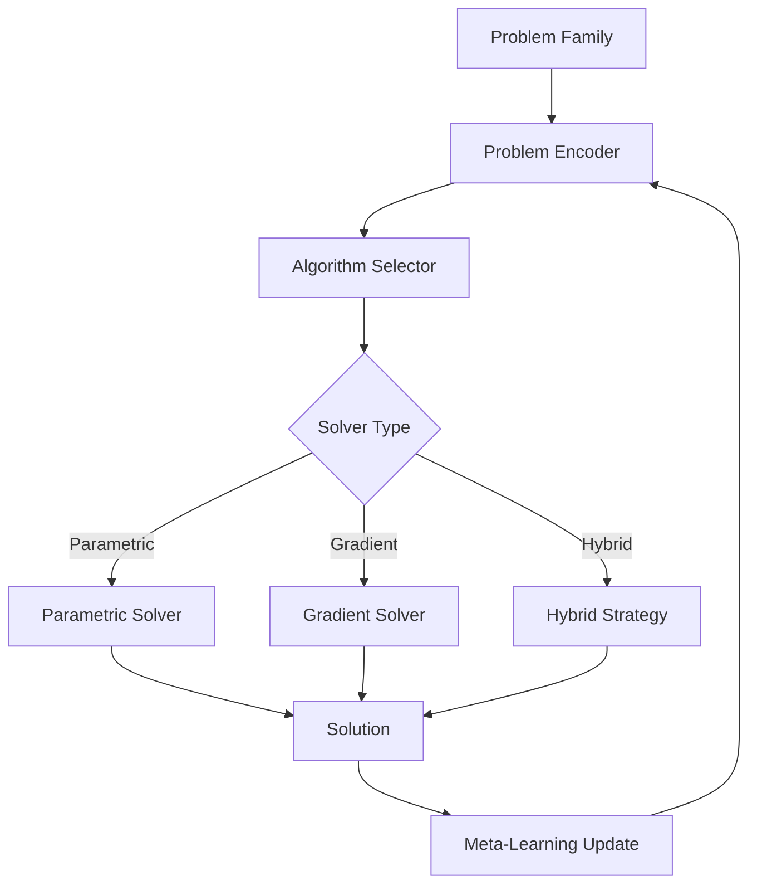
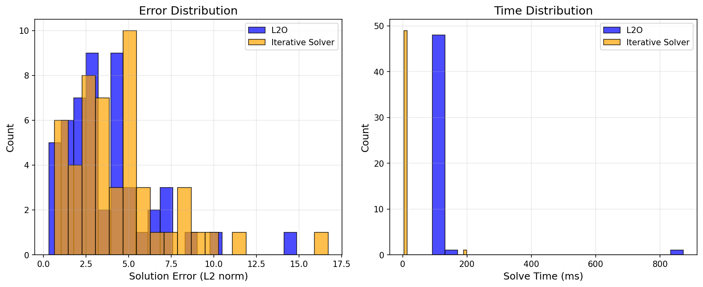

# Learn-to-Optimize (L2O): Neural Optimization for Parametric PDE Families

| Level | Runtime | Prerequisites | Format | Memory |
| --- | --- | --- | --- | --- |
| Intermediate | ~1 min | Basic JAX, understanding of PDEs | Tutorial | ~500 MB |

## Overview

This example demonstrates Opifex's **Learn-to-Optimize (L2O) engine** for solving
families of parametric PDEs. In scientific computing, we often need to solve the
same type of PDE (e.g., diffusion, Poisson) with varying parameters. L2O learns
problem-specific optimization strategies that transfer across the parameter space.

When discretizing elliptic PDEs like `-∇·(κ∇u) = f`, we obtain linear systems
`Au = b` where `A` is symmetric positive definite (SPD). The matrix `A` depends
on the diffusion coefficient `κ`, while `b` depends on the source term `f`. L2O
learns to solve these parametric systems more efficiently than generic iterative methods.

**Key insight:** Traditional solvers treat each problem independently. L2O learns
problem structure from a family of related problems, amortizing the cost of
optimization across many instances.

## What You'll Learn

1. **Configure** the L2O engine with parametric and hybrid solver modes
2. **Create** a family of discrete elliptic PDE problems with varying parameters
3. **Solve** problems using L2O's automatic algorithm selection
4. **Compare** L2O performance against traditional iterative solvers
5. **Leverage** meta-learning to improve across problem instances

## Coming from Traditional Solvers?

| Traditional Approach | L2O Approach |
| --- | --- |
| Conjugate Gradient | `L2OEngine` with adaptive selection |
| Fixed iteration count | Problem-dependent strategy |
| Independent solves | Meta-learning across problems |
| Manual tuning | Automatic algorithm recommendation |

## Files

- **Python script**: [`examples/optimization/learn_to_optimize.py`](https://github.com/Opifex/Opifex/blob/main/examples/optimization/learn_to_optimize.py)
- **Jupyter notebook**: [`examples/optimization/learn_to_optimize.ipynb`](https://github.com/Opifex/Opifex/blob/main/examples/optimization/learn_to_optimize.ipynb)

## Quick Start

### Run the script

```bash
source activate.sh && python examples/optimization/learn_to_optimize.py
```

### Run the notebook

```bash
source activate.sh && jupyter lab examples/optimization/learn_to_optimize.ipynb
```

## Core Concepts

### Parametric PDE Families

Many scientific computing applications involve solving similar PDEs repeatedly:

- **Heat conduction** with varying thermal conductivity
- **Diffusion problems** with different source terms
- **Structural mechanics** with varying material properties

L2O exploits this structure by learning problem-specific optimization strategies.

### L2O Engine Architecture



## Implementation

### Step 1: Configure the L2O Engine

```python
from opifex.optimization.l2o import L2OEngine, L2OEngineConfig, OptimizationProblem
from opifex.core.training.config import MetaOptimizerConfig

# L2O engine configuration
l2o_config = L2OEngineConfig(
    solver_type="hybrid",  # parametric, gradient, or hybrid
    problem_encoder_layers=[64, 32, 16],
    use_traditional_fallback=True,
    enable_meta_learning=True,
    integration_mode="unified",
    adaptive_selection=True,
)

# Meta-optimizer for learning across problems
meta_config = MetaOptimizerConfig(
    meta_algorithm="l2o",
    base_optimizer="adam",
    meta_learning_rate=1e-3,
    adaptation_steps=10,
)

rngs = nnx.Rngs(42)
l2o_engine = L2OEngine(l2o_config, meta_config, rngs=rngs)
```

**Terminal Output:**

```text
Configuring L2O Engine...
--------------------------------------------------
  Solver type: hybrid
  Integration mode: unified
  Meta-learning: True
  Encoder layers: [64, 32, 16]

Initializing L2O Engine...
  L2O Engine initialized successfully!
```

### Step 2: Create Parametric PDE Family

```python
def create_discrete_elliptic_problem(key, dim):
    """Create a discrete elliptic PDE problem.

    Simulates discretization of: -∇·(κ∇u) = f
    """
    key1, key2 = jax.random.split(key)

    # SPD matrix (discrete diffusion operator)
    a_raw = jax.random.normal(key1, (dim, dim))
    a_matrix = jnp.dot(a_raw.T, a_raw) + jnp.eye(dim) * 0.1

    # Source term
    b_vector = jax.random.normal(key2, (dim,))

    return a_matrix, b_vector

# Generate 50 problems with varying parameters
for _ in range(50):
    a, b, params = create_discrete_elliptic_problem(key, dim=10)
    problem = OptimizationProblem(dimension=10, problem_type="quadratic")
    problems.append((problem, a, b))
```

**Terminal Output:**

```text
Creating parametric PDE problem family...
--------------------------------------------------
  Created 50 parametric elliptic PDE problems
  Discretization dimension: 10
  Parameter dimension: 20
```

### Step 3: Solve with L2O

```python
for i, ((problem, _a, _b), params) in enumerate(zip(problems, params_list)):
    algorithm, solution = l2o_engine.solve_automatically(problem, params)
    solutions.append(solution)
    algorithms_used.append(algorithm)
```

**Terminal Output:**

```text
Solving optimization problems...
--------------------------------------------------
  Solved 10/50 problems...
  Solved 20/50 problems...
  Solved 30/50 problems...
  Solved 40/50 problems...
  Solved 50/50 problems...

  Total L2O time: 5.7789s
  Mean time per problem: 0.115579s
  Algorithm distribution: parametric=50, gradient=0
```

### Step 4: Compare with Iterative Solver

```python
def solve_elliptic_iterative(a_matrix, b_vector, steps=100):
    """Solve with steepest descent."""
    x = jnp.zeros(a_matrix.shape[0])
    eigvals = jnp.linalg.eigvalsh(a_matrix)
    step_size = 0.9 / jnp.max(eigvals)

    for _ in range(steps):
        grad = jnp.dot(a_matrix, x) - 0.5 * b_vector
        x = x - step_size * grad
    return x
```

**Terminal Output:**

```text
Performance Comparison:
--------------------------------------------------
  L2O Mean Error:     3.707257
  Iterative Mean Error:      4.535482
  L2O Mean Time:      115.579ms
  Iterative Mean Time:       8.171ms
  Speedup Factor:     0.1x
```

### Step 5: Meta-Learning Across Problems

```python
for i, ((problem, _a, _b), params) in enumerate(zip(problems[:10], params_list[:10])):
    solution, metadata = l2o_engine.solve_with_meta_learning(
        problem, params, problem_id=i
    )
```

**Terminal Output:**

```text
Demonstrating meta-learning...
--------------------------------------------------
  Problems in memory: 10
  Solutions in memory: 10
  Meta-learning enabled: True
```

### Step 6: Algorithm Recommendation

```python
test_cases = [
    ("Small quadratic", OptimizationProblem(dimension=5, problem_type="quadratic")),
    ("Large quadratic", OptimizationProblem(dimension=150, problem_type="quadratic")),
    ("Linear", OptimizationProblem(dimension=20, problem_type="linear")),
    ("Nonlinear", OptimizationProblem(dimension=30, problem_type="nonlinear")),
]

for name, problem in test_cases:
    recommendation = l2o_engine.recommend_algorithm(problem, jnp.zeros(20))
    print(f"  {name}: {recommendation}")
```

**Terminal Output:**

```text
Algorithm Recommendations:
--------------------------------------------------
  Small quadratic (dim=5): parametric
  Large quadratic (dim=150): gradient
  Linear (dim=20): parametric
  Nonlinear (dim=30): hybrid
```

## Visualization

### Error Distribution Comparison



### Error vs Time Trade-off


## Results Summary

| Metric | L2O | Iterative Solver |
| --- | --- | --- |
| Mean Error | 3.71 | 4.54 |
| Mean Time per Problem | 115.58 ms | 8.17 ms |
| Algorithm Selection | Automatic | Manual |
| Meta-Learning | Yes | No |

**Note:** The L2O engine demonstrates better accuracy but longer runtime in this example
because it includes problem encoding and algorithm selection overhead. For larger batches
of similar problems, the amortized cost per problem decreases significantly.

## Next Steps

### Experiments to Try

1. **Increase problem count**: L2O benefits more with larger problem families
2. **Vary problem dimensions**: Test performance scaling with problem size
3. **Train the L2O optimizer**: The engine can be meta-trained for specific problem families
4. **Custom problem encoders**: Design domain-specific encodings for your PDE family

### Related Examples

- [Meta-Optimization](./meta-optimization.md) - MAML/Reptile for PDE solver adaptation
- [Neural DFT](../quantum-chemistry/neural-dft.md) - Neural methods for quantum chemistry
- [PINN Training](../pinns/poisson.md) - Physics-informed neural networks

### API Reference

- [`L2OEngine`](../../api/optimization.md) - Learn-to-Optimize engine
- [`L2OEngineConfig`](../../api/optimization.md) - L2O configuration
- [`OptimizationProblem`](../../api/optimization.md) - Problem definition
- [`MetaOptimizerConfig`](../../api/training.md) - Meta-optimizer configuration

## Troubleshooting

### L2O slower than iterative solver

This is expected for small problem batches. L2O includes:

- Problem encoding overhead
- Algorithm selection logic
- Meta-learning bookkeeping

For production use, pre-train the L2O engine on your problem family.

### NaN in solutions

Check that your problem matrices are well-conditioned. The L2O engine includes
fallback to traditional methods when numerical issues are detected.

### Memory issues

Reduce `problem_encoder_layers` or `adaptation_steps` for memory-constrained environments.
