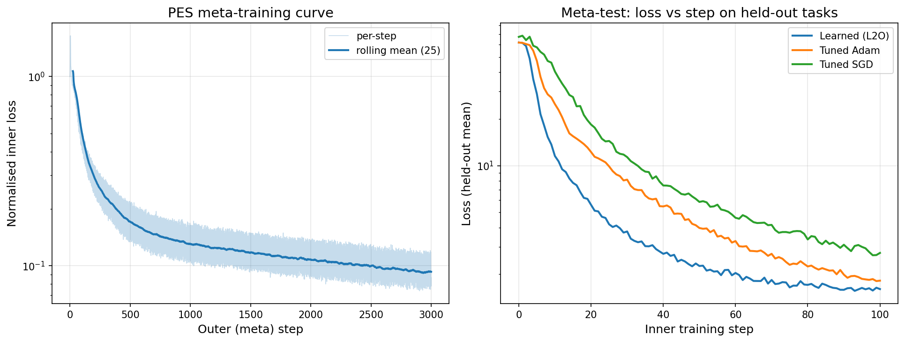
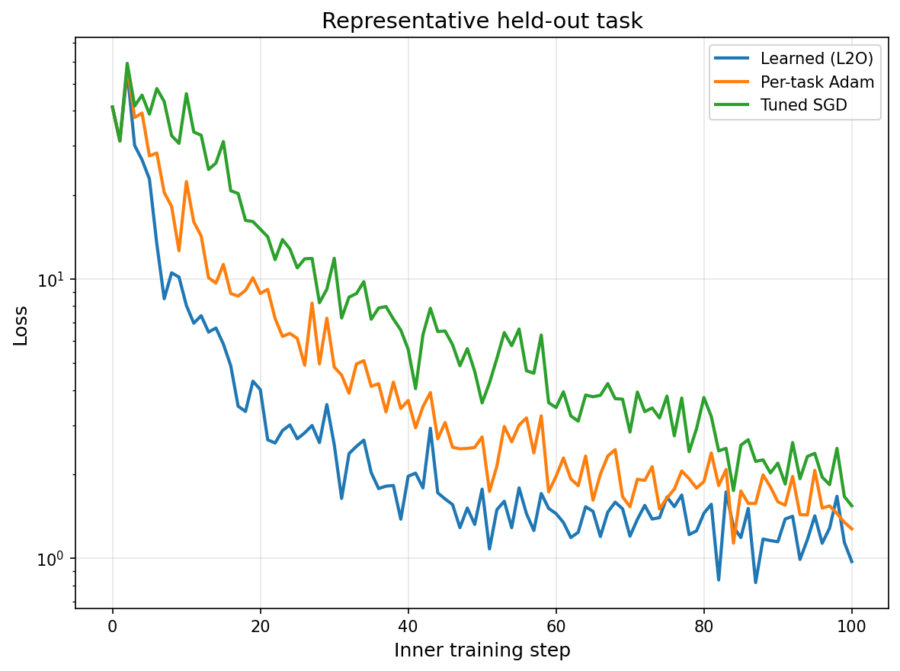

# Learn-to-Optimize (L2O): A Meta-Trained Optimiser for Neural-Network Training

| Level | Runtime | Prerequisites | Format | Memory |
| --- | --- | --- | --- | --- |
| Intermediate | ~25 s (GPU) | JAX basics, gradient-based optimisation | Tutorial | ~1 GB |

## Overview

This example meta-trains a **learned optimiser** — a small neural network that *is* an optimiser
update rule — and shows it generalising to held-out neural-network training problems where it
beats a *properly tuned* classical optimiser.

A hand-designed optimiser (SGD, Adam) applies the same fixed update rule to every problem. A
*learned* optimiser is trained so that its update rule is itself good across a whole
*distribution* of objectives. Opifex follows the design of Google's `learned_optimization`
library and the L2O literature.

**Key insight:** L2O's genuine advantage shows on *non-convex, stochastic* training — where a
single fixed learning rate is most compromised and the learned optimiser's implicit learning-rate
schedule (a tanh embedding of the step index) gives it a real edge. The showcase task here is
therefore small neural-network training, not a convex toy.

## What You'll Learn

1. **Tasks carry their objective** — `Task` / `TaskFamily` provide a meta-training distribution
   and a held-out meta-test split.
2. **A per-parameter MLP optimiser** — `MLPLearnedOptimizer` maps per-parameter features to a
   `(direction, magnitude)` update, shared across all coordinates.
3. **PES meta-training** — Persistent Evolution Strategies meta-trains the optimiser without
   back-propagating through the unroll.
4. **Honest benchmarking** — compare against *distribution-tuned* Adam and SGD on held-out tasks
   and report speedup-at-target, scoped to in-distribution generalisation.

## Files

- **Python script**: [`examples/optimization/learn_to_optimize.py`](https://github.com/avitai/opifex/blob/main/examples/optimization/learn_to_optimize.py)
- **Jupyter notebook**: [`examples/optimization/learn_to_optimize.ipynb`](https://github.com/avitai/opifex/blob/main/examples/optimization/learn_to_optimize.ipynb)

## Quick Start

### Run the script

```bash
source activate.sh && python examples/optimization/learn_to_optimize.py
```

### Run the notebook

```bash
source activate.sh && jupyter lab examples/optimization/learn_to_optimize.ipynb
```

## Background

- **Andrychowicz et al. 2016**, *Learning to learn by gradient descent by gradient descent*
  ([arXiv:1606.04474](https://arxiv.org/abs/1606.04474)).
- **Metz et al. 2020**, *Tasks, stability, architecture, and compute*
  ([arXiv:2009.11243](https://arxiv.org/abs/2009.11243)) — the per-parameter MLP optimiser.
- **Vicol et al. 2021**, *Persistent Evolution Strategies*
  ([arXiv:2112.13835](https://arxiv.org/abs/2112.13835)) — the meta-training estimator.
- **Eldan et al. 2023** ([arXiv:2310.18191](https://arxiv.org/abs/2310.18191)) — the cautionary
  critique on out-of-distribution generalisation, which is why every claim below is scoped to
  held-out tasks *from the meta-training family*.

See [Learn-to-Optimize Methods](../../methods/l2o.md) for the full method description.

## Implementation

### Step 1: A family of small neural-network training tasks

Each task is a teacher-student MLP regression: a random *teacher* MLP generates targets from
Gaussian inputs, and the *student* (same architecture) is trained by MSE on stochastic
minibatches. The optimum (loss 0) is realisable, but the landscape is non-convex in the student
weights — the genuine L2O setting. A fresh teacher and dataset per task force the meta-trained
optimiser to generalise across many training problems.

```python
from opifex.optimization.l2o import L2OEngine, MLPLearnedOptimizer, MLPTaskFamily

family = MLPTaskFamily(
    input_dim=8, hidden_dim=16, output_dim=4, num_data=512, batch_size=32
)
learned_optimizer = MLPLearnedOptimizer(hidden_size=32, hidden_layers=2, step_mult=0.03)
engine = L2OEngine(learned_optimizer, family)
```

**Terminal Output:**

```text
Building MLP task family and learned optimiser...
------------------------------------------------------------------------
  Inner task: teacher-student MLP 8->16->4 (MSE)
  Tasks per PES step: 32
  Learned optimiser: per-parameter MLP (32x2), 19 input features
```

### Step 2: Meta-train the learned optimiser with PES

`L2OEngine.meta_train` runs Persistent Evolution Strategies: it perturbs the optimiser
meta-parameters antithetically, unrolls the inner training on 32 tasks in parallel, and feeds the
unbiased ES gradient estimate to an outer Adam. The whole inner unroll is JIT-compiled and
scanned — there is no Python-level optimisation loop.

```python
meta_losses = engine.meta_train(
    jax.random.key(0),
    num_outer_steps=3000, num_tasks=32,
    trunc_length=20, total_horizon=100,
    perturbation_std=0.01, meta_learning_rate=3e-3,
)
```

**Terminal Output:**

```text
Meta-training with PES...
------------------------------------------------------------------------
  Outer steps: 3000
  Meta-loss (first 20 steps avg): 1.1082
  Meta-loss (last 20 steps avg):  0.0929
  Meta-loss reduction: 11.93x
```

### Step 3: Meta-test on a held-out split vs tuned Adam and SGD

The trained optimiser is applied to 48 fresh tasks (a different RNG stream = in-distribution
held-out split) and compared against **distribution-tuned** Adam and SGD baselines: a single
learning rate is selected on the task distribution and applied unchanged to every held-out task
(a per-task sweep would be an undeployable oracle). The speedup is measured at a per-task target
loss (10% of the baseline's initial loss), censoring any task that never reaches it.

```python
adam_result = engine.benchmark(
    jax.random.key(1), num_tasks=48, num_steps=100,
    target_fraction=0.1, transformation=optax.adam,
)
sgd_result = engine.benchmark(
    jax.random.key(2), num_tasks=48, num_steps=100,
    target_fraction=0.1, transformation=optax.sgd,
)
```

**Terminal Output:**

```text
Meta-testing on held-out tasks vs distribution-tuned baselines...
------------------------------------------------------------------------
  Held-out tasks: 48
  Learned final loss (mean):    1.6052
  Tuned-Adam final loss (mean): 1.8185 (lr=0.100)
  Tuned-SGD final loss (mean):  2.7426 (lr=0.100)
  Median speedup @ 10%-target vs tuned Adam: 1.82x
  Median speedup @ 10%-target vs tuned SGD:  2.67x
```

## Results

```text
========================================================================
RESULTS SUMMARY
========================================================================
  Meta-loss reduction:            11.93x
  Learned final loss (held-out):  1.6052
  Tuned-Adam final loss:          1.8185
  Tuned-SGD final loss:           2.7426
  Speedup vs tuned Adam:          1.82x
  Speedup vs tuned SGD:           2.67x
========================================================================
```

The meta-trained optimiser **decisively beats tuned SGD** (≈2.7× faster to the target, lower final
loss) and **beats tuned Adam** (≈1.8× faster, lower final loss) on held-out tasks — and it trains
in ~25 s on a GPU. The claim is scoped to held-out tasks drawn from the meta-training family; it is
not an out-of-distribution result (cf. [arXiv:2310.18191](https://arxiv.org/abs/2310.18191)).

| Method | Held-out final loss (mean) | Speedup @ 10%-target |
| --- | --- | --- |
| **Learned (L2O)** | **1.61** | — |
| Tuned Adam | 1.82 | 1.82× (learned is faster) |
| Tuned SGD | 2.74 | 2.67× (learned is faster) |

## Visualization

### Meta-training curve and held-out learning curves

The left panel is the PES meta-training curve (raw per-step loss faint, rolling-mean trend bold —
the standard presentation for an evolution-strategies estimate). The right panel is the meta-test:
the learned optimiser (blue) descends below tuned Adam (orange) and tuned SGD (green) on held-out
tasks.



### Representative held-out task

A single held-out task: the learned optimiser versus per-task-tuned Adam and tuned SGD.



## Next Steps

### Experiments to Try

- Increase `num_outer_steps` or `num_tasks` for a stronger learned optimiser (PES variance drops
  with more parallel tasks).
- Vary the task family (`hidden_dim`, `num_data`, `batch_size`) and watch generalisation change.
- Swap in `LearnableSGD` to validate the PES estimator against a single learnable learning rate.
- Persist and reload the meta-learned parameters with `engine.save_theta` / `engine.load_theta`.

### Related Examples

- [Meta-Optimization](meta-optimization.md) — the `opifex.optimization.meta_optimization`
  framework.

### API Reference

- [Learn-to-Optimize Methods](../../methods/l2o.md)
- [Optimization API](../../api/optimization.md)

## Troubleshooting

### The meta-training curve is noisy

PES is an evolution-strategies estimator, so the per-step meta-loss is inherently noisy; the
example overlays a rolling mean to show the trend. Increasing `num_tasks` lowers the variance.

### Meta-training diverges

A too-large `meta_learning_rate` (outer Adam) or `step_mult` can destabilise PES — reduce them, or
increase `num_tasks` (≥32 keeps PES stable for this task). The reference defaults
(`step_mult=1e-3`) are calibrated for much longer training; this short demo uses `step_mult=0.03`.

### The learned optimiser does not beat the baseline

Generalisation is scoped to held-out tasks from the *meta-training* family. A learned optimiser
trained on one family is not expected to beat tuned baselines on a different distribution.
