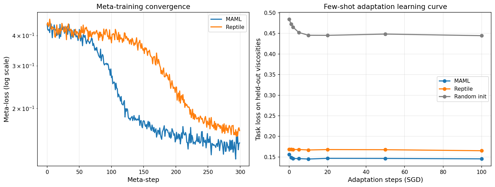

# Meta-Optimization: MAML and Reptile for a Family of PDEs

| Metadata | Value |
|----------|-------|
| **Level** | Advanced |
| **Runtime** | ~3 min (GPU) / ~10 min (CPU) |
| **Prerequisites** | JAX, Flax NNX, PINNs, gradient-based meta-learning |
| **Format** | Python + Jupyter |
| **Memory** | ~1 GB |

## Overview

Solving a *family* of PDEs that differ only in a parameter (here the Burgers viscosity `nu`) by
training a fresh physics-informed network (PINN) for each instance wastes the structure shared
across the family. **Gradient-based meta-learning** instead learns a single initialisation `theta`
such that a handful of ordinary gradient steps adapt it to any new `nu` — amortising the shared
physics into the starting point.

This example meta-learns that initialisation with opifex's `maml_meta_train` and
`reptile_meta_train` (the real algorithms — MAML, Finn et al. 2017,
[arXiv:1703.03400](https://arxiv.org/abs/1703.03400); Reptile, Nichol et al. 2018,
[arXiv:1803.02999](https://arxiv.org/abs/1803.02999)), then measures few-shot adaptation on
**held-out** viscosities against training a fresh network from a random initialisation.

The Burgers PINN is expressed as a `Task` / `TaskFamily` (the same abstraction the
learned-optimiser stack uses), so the example only supplies the physics — the meta-learning comes
from the library.

**Key result:** both meta-learned initialisations solve unseen viscosities **zero-shot** (MAML
0.156, Reptile 0.168 task loss) to a loss **65% below** what a random initialisation reaches after
100 SGD adaptation steps (0.445).

## What You'll Learn

1. Express a PDE-solver family as an opifex `Task` / `TaskFamily`
2. Meta-learn a PINN initialisation with `maml_meta_train` and `reptile_meta_train`
3. Measure few-shot `adapt`-ation on unseen viscosities via the learning curve vs a from-scratch
   baseline

## Files

- **Python script**: [`examples/optimization/meta_optimization.py`](https://github.com/avitai/opifex/blob/main/examples/optimization/meta_optimization.py)
- **Jupyter notebook**: [`examples/optimization/meta_optimization.ipynb`](https://github.com/avitai/opifex/blob/main/examples/optimization/meta_optimization.ipynb)

## Quick Start

```bash
source activate.sh && python examples/optimization/meta_optimization.py
```

## Core Concepts

### Task / TaskFamily

The meta-trainers operate on a `TaskFamily` — a distribution over objectives. A `BurgersTask` is
one viscosity (`init` samples PINN parameters; `loss` is the physics-informed loss on freshly
sampled collocation points), and `BurgersTaskFamily.sample` draws a viscosity uniformly from
`[NU_MIN, NU_MAX]`. Parameters are a plain pytree of `(weight, bias)` tuples so the meta-trainers
can differentiate through inner adaptation.

```python
@dataclass(frozen=True)
class BurgersTask(Task):
    nu: jax.Array

    def init(self, key):
        return init_pinn_params(key)

    def loss(self, params, key):
        xt_domain, xt_initial, u_initial, xt_boundary = sample_collocation(key)
        loss_pde = jnp.mean(burgers_residual(params, xt_domain, self.nu) ** 2)
        loss_ic = jnp.mean((pinn_forward(params, xt_initial).squeeze() - u_initial) ** 2)
        loss_bc = jnp.mean(pinn_forward(params, xt_boundary).squeeze() ** 2)
        return loss_pde + loss_ic + loss_bc
```

### Task Distribution: Burgers Equation

The Burgers equation with varying viscosity ν:

$$\frac{\partial u}{\partial t} + u \frac{\partial u}{\partial x} = \nu \frac{\partial^2 u}{\partial x^2}$$

- **Low viscosity** (ν → 0): sharp gradients, shock-like behaviour
- **High viscosity**: smooth, diffusion-dominated solutions
- **Meta-learning**: captures the common structure across the viscosity range

### MAML vs Reptile

| Aspect | MAML | Reptile |
| --- | --- | --- |
| Meta-objective | Post-adaptation (query) loss, differentiated through the inner steps (`first_order=True` here) | Move `theta` towards each task's adapted parameters |
| Inner trajectory | Short (5 steps) | Longer (20 steps) — needed to move `theta` |
| Zero-shot loss (this run) | **0.156** | 0.168 |

## Coming from Other Meta-Learning Frameworks?

| Framework | Opifex |
| --- | --- |
| `learn2learn` / `higher` MAML | `maml_meta_train(task_family, init_params, key, ..., first_order=False)` |
| Reptile implementations | `reptile_meta_train(task_family, init_params, key, ...)` |
| Inner-loop fine-tuning | `adapt(task, init_params, key, inner_steps=, inner_lr=)` |
| Task distribution | `TaskFamily.sample(key) -> Task` |

## Implementation

### Step 1: Meta-train both initialisations

```python
from opifex.optimization.l2o.meta_learning import adapt, maml_meta_train, reptile_meta_train

family = BurgersTaskFamily()
init_params = init_pinn_params(init_key)  # shared starting point

maml_params, maml_curve = maml_meta_train(
    family, init_params, maml_key,
    num_outer_steps=300, num_tasks=8, inner_steps=5, inner_lr=0.01,
    meta_lr=1e-3, first_order=True,
)
reptile_params, reptile_curve = reptile_meta_train(
    family, init_params, reptile_key,
    num_outer_steps=300, num_tasks=8, inner_steps=20, inner_lr=0.01, meta_lr=0.3,
)
```

**Terminal Output:**

```text
PINN architecture (2, 32, 32, 1)  (1,185 parameters)
Task family: Burgers viscosity ~ U[0.005, 0.05]

Meta-training MAML (first-order) for 300 steps...
Meta-training Reptile for 300 steps...
  MAML    meta-loss: 0.4461 -> 0.1442
  Reptile meta-loss: 0.4434 -> 0.1620
```

### Step 2: Few-shot learning curve on held-out viscosities

For each held-out viscosity, `adapt` (plain SGD — the inner rule meta-training assumes) from each
initialisation and record the task loss after `k` steps:

```python
def few_shot_loss(start, nu, key, steps):
    task = BurgersTask(nu=nu)
    adapted = adapt(task, start, key, inner_steps=steps, inner_lr=0.01)
    return float(task.loss(adapted, jax.random.fold_in(key, 7)))
```

**Terminal Output:**

```text
Few-shot adaptation on 4 held-out viscosities
(SGD, inner_lr=0.01); task loss after k steps, averaged over viscosities:
------------------------------------------------------------------------
  steps         0        1        2        5       10       20       50      100
  MAML          0.1563   0.1484   0.1461   0.1460   0.1449   0.1466   0.1463   0.1453
  Reptile       0.1682   0.1681   0.1680   0.1681   0.1669   0.1679   0.1675   0.1651
  Random init   0.4846   0.4728   0.4652   0.4523   0.4455   0.4454   0.4484   0.4445

========================================================================
RESULTS — task loss on held-out viscosities (lower is better)
========================================================================
  MAML        zero-shot (0 steps): 0.1563
  Reptile     zero-shot (0 steps): 0.1682
  Random init zero-shot (0 steps): 0.4846
  Random init after 100 steps : 0.4445

  The best meta-init solves unseen viscosities ZERO-SHOT to a loss 65% below what a
  random init reaches after 100 SGD steps.
```

The meta-learned initialisations start in a low-loss basin and stay there; the random
initialisation descends slowly with SGD and never catches up within 100 steps.

## Visualization



## Results Summary

| Initialisation | Zero-shot loss | Loss after 100 SGD steps |
| --- | --- | --- |
| MAML | **0.156** | 0.145 |
| Reptile | 0.168 | 0.165 |
| Random | 0.485 | 0.445 |

**Key Findings:**

- Both meta-learned initialisations solve held-out viscosities zero-shot to a loss the random
  initialisation cannot reach in 100 SGD steps (a 65% reduction).
- MAML edges out Reptile here; Reptile needs a longer inner trajectory (20 vs 5 steps) to move its
  initialisation, after which it is competitive.
- The benefit is in the *initialisation*: the few-shot curves are nearly flat for the meta-inits
  because they already sit near the family's shared solution.

## Next Steps

### Experiments to Try

1. **Second-order MAML**: pass `first_order=False` to `maml_meta_train` (more expensive — the PINN
   loss already uses second-order autodiff — but a tighter meta-gradient).
2. **Wider viscosity range**: widen `[NU_MIN, NU_MAX]` and watch the random-init gap grow.
3. **More meta-training**: raise `META_STEPS` and `num_tasks` for a lower zero-shot loss.
4. **Different PDEs**: define a new `TaskFamily` for a heat- or wave-equation family.

### Related Examples

- [Learn-to-Optimize (L2O)](./learn-to-optimize.md) — meta-learning an *update rule* (vs the
  *initialisation* meta-learned here)

### API Reference

- `opifex.optimization.l2o.meta_learning.maml_meta_train`
- `opifex.optimization.l2o.meta_learning.reptile_meta_train`
- `opifex.optimization.l2o.meta_learning.adapt`
- `opifex.optimization.l2o.core.Task`, `opifex.optimization.l2o.core.TaskFamily`

## Troubleshooting

### Reptile meta-loss barely moves

Reptile's update moves `theta` towards each task's adapted parameters; with too few inner steps the
adapted parameters barely differ from `theta`, so the move is tiny. Increase `inner_steps` (this
example uses 20) or raise `meta_lr`.

### MAML init good for few steps but drifts over many

MAML optimises the initialisation for its inner step count. Evaluate few-shot quality near that
budget, or meta-train with more inner steps to match the intended adaptation length.

### Plain-SGD adaptation is unstable over many steps

PINNs trained with plain SGD plateau and can diverge at higher learning rates over long horizons.
Keep the adaptation horizon short (the meta-learning win is in *few* steps) and the inner learning
rate modest.
