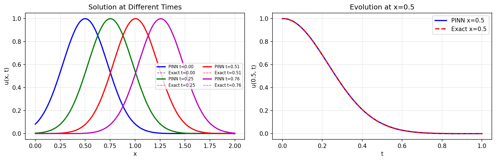

# Advection Equation PINN

| Metadata          | Value                            |
|-------------------|----------------------------------|
| **Level**         | Intermediate                     |
| **Runtime**       | ~2 min (GPU) / ~8 min (CPU)      |
| **Prerequisites** | JAX, Flax NNX, basic calculus    |
| **Format**        | Python + Jupyter                 |
| **Memory**        | ~500 MB RAM                      |

## Overview

This tutorial demonstrates solving the 1D linear advection equation using a
Physics-Informed Neural Network (PINN). The advection equation describes pure
transport of a quantity by a flow field without diffusion.

This is a fundamental hyperbolic PDE where information propagates along
characteristic lines. PINNs must learn to track the traveling wave solution.

## What You'll Learn

1. **Implement** a PINN for first-order hyperbolic PDEs
2. **Handle** inflow boundary conditions for transport problems
3. **Capture** traveling wave solutions
4. **Understand** the characteristic method interpretation

## Coming from DeepXDE?

| DeepXDE                                     | Opifex (JAX)                                        |
|---------------------------------------------|-----------------------------------------------------|
| `dde.geometry.GeometryXTime(geom, time)`    | `jnp.column_stack([x, t])` for (x, t)               |
| `dde.icbc.DirichletBC` for inflow           | Custom `inflow_loss()` function                     |
| `dde.icbc.IC` for initial condition         | Custom `initial_loss()` function                    |
| `model.train(iterations=10000)`             | 10000 epochs with Adam optimizer                    |

**Key differences:**

1. **Explicit gradients**: Use `jax.grad` for automatic differentiation
2. **Inflow BC**: Handled via loss term matching analytical solution
3. **No special geometry**: Simple uniform sampling in space-time domain

## Files

- **Python Script**: [`examples/pinns/advection.py`](https://github.com/Opifex/Opifex/blob/main/examples/pinns/advection.py)
- **Jupyter Notebook**: [`examples/pinns/advection.ipynb`](https://github.com/Opifex/Opifex/blob/main/examples/pinns/advection.ipynb)

## Quick Start

### Run the Python Script

```bash
source activate.sh && python examples/pinns/advection.py
```

### Run the Jupyter Notebook

```bash
jupyter lab examples/pinns/advection.ipynb
```

## Core Concepts

### Advection Equation

$$\frac{\partial u}{\partial t} + c \frac{\partial u}{\partial x} = 0$$

| Component | This Example |
|-----------|-------------|
| Domain | $x \in [0, 2]$, $t \in [0, 1]$ |
| Velocity | $c = 1$ |
| IC | Gaussian pulse $u(x,0) = e^{-(x-0.5)^2/0.1}$ |
| BC | Inflow condition at $x = 0$ |
| Solution | $u(x,t) = u_0(x - ct)$ (traveling wave) |

### Physical Interpretation

- **Transport**: Information propagates along characteristics $x - ct = \text{const}$
- **No diffusion**: The solution maintains its shape as it travels
- **Inflow BC**: At $x=0$, we specify incoming values from the left boundary

## Implementation

### Step 1: Imports and Configuration

```python
import jax
import jax.numpy as jnp
import optax
from flax import nnx
```

**Terminal Output:**

```text
======================================================================
Opifex Example: Advection Equation PINN
======================================================================
JAX backend: gpu
JAX devices: [CudaDevice(id=0)]
Advection velocity: c = 1.0
Domain: x in [0.0, 2.0], t in [0.0, 1.0]
Collocation: 5000 domain, 200 inflow, 400 initial
Network: [2] + [40, 40, 40] + [1]
Training: 10000 epochs @ lr=0.001
```

### Step 2: Define the Problem

```python
C = 1.0  # Advection velocity

def exact_solution(x, t):
    """Exact solution: Gaussian pulse traveling with speed c."""
    x0 = 0.5
    sigma2 = 0.1
    return jnp.exp(-((x - C * t - x0) ** 2) / sigma2)

def initial_condition(x):
    """Initial condition: Gaussian pulse centered at x=0.5."""
    return jnp.exp(-((x - 0.5) ** 2) / 0.1)

def inflow_condition(t):
    """Inflow BC at x=0: u(0, t) matches analytical solution."""
    return jnp.exp(-((-C * t - 0.5) ** 2) / 0.1)
```

**Terminal Output:**

```text
Advection equation: du/dt + c*du/dx = 0
  Velocity: c = 1.0
  IC: u(x, 0) = exp(-(x-0.5)^2 / 0.1)
  BC: u(0, t) = exact solution at inflow
  Solution: u(x, t) = u0(x - c*t)
```

### Step 3: Create the PINN

```python
class AdvectionPINN(nnx.Module):
    def __init__(self, hidden_dims: list[int], *, rngs: nnx.Rngs):
        super().__init__()
        layers = []
        in_features = 2  # (x, t)

        for hidden_dim in hidden_dims:
            layers.append(nnx.Linear(in_features, hidden_dim, rngs=rngs))
            in_features = hidden_dim

        layers.append(nnx.Linear(in_features, 1, rngs=rngs))
        self.layers = nnx.List(layers)

    def __call__(self, xt: jax.Array) -> jax.Array:
        h = xt
        for layer in self.layers[:-1]:
            h = jnp.tanh(layer(h))
        return self.layers[-1](h)

pinn = AdvectionPINN(hidden_dims=[40, 40, 40], rngs=nnx.Rngs(42))
```

**Terminal Output:**

```text
Creating PINN model...
PINN parameters: 3,441
```

### Step 4: Generate Collocation Points

```python
key = jax.random.PRNGKey(42)
keys = jax.random.split(key, 4)

# Domain interior points
x_domain = jax.random.uniform(keys[0], (N_DOMAIN,), minval=X_MIN, maxval=X_MAX)
t_domain = jax.random.uniform(keys[1], (N_DOMAIN,), minval=T_MIN, maxval=T_MAX)
xt_domain = jnp.column_stack([x_domain, t_domain])

# Inflow boundary (x = 0)
t_inflow = jax.random.uniform(keys[2], (N_BOUNDARY,), minval=T_MIN, maxval=T_MAX)
xt_inflow = jnp.column_stack([jnp.zeros(N_BOUNDARY), t_inflow])
u_inflow = inflow_condition(t_inflow)

# Initial condition (t = 0)
x_initial = jax.random.uniform(keys[3], (N_INITIAL,), minval=X_MIN, maxval=X_MAX)
xt_initial = jnp.column_stack([x_initial, jnp.zeros(N_INITIAL)])
u_initial = initial_condition(x_initial)
```

**Terminal Output:**

```text
Generating collocation points...
Domain points:   (5000, 2)
Inflow points:   (200, 2)
Initial points:  (400, 2)
```

### Step 5: Define Physics-Informed Loss

```python
def compute_pde_residual(pinn, xt):
    """Compute advection PDE residual: u_t + c*u_x = 0."""

    def u_scalar(xt_single):
        return pinn(xt_single.reshape(1, 2)).squeeze()

    def residual_single(xt_single):
        grad_u = jax.grad(u_scalar)(xt_single)
        u_x = grad_u[0]
        u_t = grad_u[1]
        return u_t + C * u_x

    return jax.vmap(residual_single)(xt)

def total_loss(pinn, xt_dom, xt_ic, u_ic, xt_in, u_in, lambda_bc=10.0):
    loss_pde = pde_loss(pinn, xt_dom)
    loss_ic = initial_loss(pinn, xt_ic, u_ic)
    loss_in = inflow_loss(pinn, xt_in, u_in)
    return loss_pde + lambda_bc * (loss_ic + loss_in)
```

### Step 6: Training

```python
opt = nnx.Optimizer(pinn, optax.adam(LEARNING_RATE), wrt=nnx.Param)

@nnx.jit
def train_step(pinn, opt, xt_dom, xt_ic, u_ic, xt_in, u_in):
    def loss_fn(model):
        return total_loss(model, xt_dom, xt_ic, u_ic, xt_in, u_in)

    loss, grads = nnx.value_and_grad(loss_fn)(pinn)
    opt.update(pinn, grads)
    return loss

for epoch in range(EPOCHS):
    loss = train_step(pinn, opt, xt_domain, xt_initial, u_initial, xt_inflow, u_inflow)
```

**Terminal Output:**

```text
Training PINN...
  Epoch     1/10000: loss=3.735486e+00
  Epoch  2000/10000: loss=5.986348e-04
  Epoch  4000/10000: loss=1.633124e-04
  Epoch  6000/10000: loss=1.010060e-04
  Epoch  8000/10000: loss=1.360641e-04
  Epoch 10000/10000: loss=6.163503e-06
Final loss: 6.163503e-06
```

### Step 7: Evaluation

**Terminal Output:**

```text
Evaluating PINN...
Relative L2 error:   1.866364e-03
Maximum point error: 3.505945e-03
Mean point error:    6.586521e-04
Mean PDE residual:   1.024557e-03
```

## Visualization




## Results Summary

| Metric              | Value       |
|---------------------|-------------|
| Final Loss          | 6.16e-06    |
| Relative L2 Error   | 0.19%       |
| Maximum Point Error | 3.51e-03    |
| Mean Point Error    | 6.59e-04    |
| Mean PDE Residual   | 1.02e-03    |
| Parameters          | 3,441       |
| Training Epochs     | 10,000      |

## Next Steps

### Experiments to Try

1. **Vary velocity**: Try $c = 2$ or $c = 0.5$ to see different propagation speeds
2. **Different IC**: Use a step function or sinusoidal initial condition
3. **Longer time**: Extend domain to $t \in [0, 2]$ to track the wave further
4. **Higher resolution**: Increase collocation points for better accuracy

### Related Examples

| Example                                   | Level        | What You'll Learn              |
|-------------------------------------------|--------------|--------------------------------|
| [Burgers Equation](burgers.md)            | Intermediate | Nonlinear advection-diffusion  |
| [Wave Equation](wave.md)                  | Intermediate | Second-order hyperbolic        |
| [Heat Equation](heat-equation.md)         | Beginner     | Pure diffusion (parabolic)     |

### Troubleshooting

| Issue | Solution |
|-------|----------|
| Poor tracking at late times | Increase training epochs or add more collocation points near later times |
| Oscillations near boundaries | Check inflow condition matches analytical solution exactly |
| Slow convergence | Try learning rate scheduling or increase lambda_bc weight |
