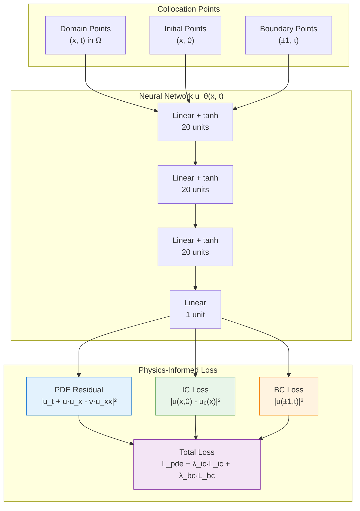
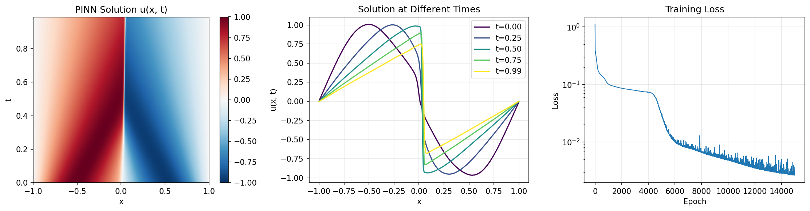

# Burgers Equation PINN

| Metadata          | Value                            |
|-------------------|----------------------------------|
| **Level**         | Intermediate                     |
| **Runtime**       | ~3 min (GPU) / ~10 min (CPU)     |
| **Prerequisites** | JAX, Flax NNX, calculus basics   |
| **Format**        | Python + Jupyter                 |
| **Memory**        | ~500 MB RAM                      |

## Overview

This tutorial demonstrates solving the 1D viscous Burgers equation using a
Physics-Informed Neural Network (PINN). The Burgers equation is a fundamental
nonlinear PDE that serves as a simplified model for fluid dynamics and shock
wave formation.

The Burgers equation combines nonlinear advection with viscous diffusion,
making it an important testbed for numerical methods. PINNs can capture
sharp gradients and shock-like behavior without explicit shock-capturing
schemes required by traditional methods.

## What You'll Learn

1. **Implement** a PINN for time-dependent nonlinear PDEs
2. **Sample** collocation points for domain, boundary, and initial conditions
3. **Compute** gradients using JAX autodiff (first and second derivatives)
4. **Balance** PDE residual, IC, and BC losses with appropriate weights
5. **Visualize** spatiotemporal solutions and solution evolution

## Coming from DeepXDE?

If you are familiar with the DeepXDE library:

| DeepXDE                                     | Opifex (JAX)                                        |
|---------------------------------------------|-----------------------------------------------------|
| `dde.geometry.GeometryXTime(geom, timedomain)` | `jax.random.uniform(key, (N, 2))` for (x, t)     |
| `dde.grad.jacobian(y, x, i=0, j=1)`         | `jax.grad(u_fn, argnums=1)(x, t)` for u_t         |
| `dde.icbc.IC(geom, func, lambda_fun)`       | Manual initial condition sampling + loss term       |
| `dde.icbc.DirichletBC(geom, func, boundary)`| Manual boundary sampling + loss term                |
| `dde.data.TimePDE(geom, pde, ic, bc, num_domain)` | Explicit collocation arrays                  |
| `model.compile("adam", lr=1e-3)`            | `nnx.Optimizer(pinn, optax.adam(lr), wrt=nnx.Param)`|
| `model.train(iterations=15000)`             | Custom training loop with `@nnx.jit`                |

**Key differences:**

1. **Pure JAX autodiff**: Use `jax.grad` directly instead of custom gradient APIs
2. **Explicit collocation**: Collocation points are simple JAX arrays
3. **Separate IC/BC sampling**: Initial and boundary conditions are sampled separately
4. **JIT compilation**: Entire training step is XLA-compiled for GPU acceleration

## Files

- **Python Script**: [`examples/pinns/burgers.py`](https://github.com/Opifex/Opifex/blob/main/examples/pinns/burgers.py)
- **Jupyter Notebook**: [`examples/pinns/burgers.ipynb`](https://github.com/Opifex/Opifex/blob/main/examples/pinns/burgers.ipynb)

## Quick Start

### Run the Python Script

```bash
source activate.sh && python examples/pinns/burgers.py
```

### Run the Jupyter Notebook

```bash
jupyter lab examples/pinns/burgers.ipynb
```

## Core Concepts

### Burgers Equation

The 1D viscous Burgers equation is a nonlinear parabolic PDE:

$$\frac{\partial u}{\partial t} + u \frac{\partial u}{\partial x} = \nu \frac{\partial^2 u}{\partial x^2}$$

where $\nu$ is the kinematic viscosity (diffusion coefficient).

| Component | This Example |
|-----------|-------------|
| Domain | $x \in [-1, 1]$, $t \in [0, 0.99]$ |
| Viscosity | $\nu = 0.01/\pi \approx 0.003183$ |
| Initial condition | $u(x, 0) = -\sin(\pi x)$ |
| Boundary conditions | $u(\pm 1, t) = 0$ (Dirichlet) |

### Physical Interpretation

The Burgers equation models:

- **Nonlinear advection** ($u \cdot u_x$): Wave steepening and shock formation
- **Viscous diffusion** ($\nu \cdot u_{xx}$): Smoothing that prevents discontinuities

At low viscosity, the solution develops steep gradients. This example uses
moderate viscosity where the solution remains smooth but shows characteristic
nonlinear behavior.

### PINN Loss Components



### Computing Derivatives

The PDE residual requires first and second derivatives:

```python
def compute_pde_residual(pinn, x, t):
    def u_fn(x_single, t_single):
        xt = jnp.array([x_single, t_single])
        return pinn(xt.reshape(1, 2)).squeeze()

    def residual_single(x_single, t_single):
        # First derivatives
        u = u_fn(x_single, t_single)
        u_t = jax.grad(u_fn, argnums=1)(x_single, t_single)
        u_x = jax.grad(u_fn, argnums=0)(x_single, t_single)

        # Second derivative
        u_xx = jax.grad(lambda x: jax.grad(u_fn, argnums=0)(x, t_single))(x_single)

        # Burgers: u_t + u*u_x - nu*u_xx = 0
        return u_t + u * u_x - NU * u_xx

    return jax.vmap(residual_single)(x, t)
```

## Implementation

### Step 1: Imports and Configuration

```python
import jax
import jax.numpy as jnp
import optax
from flax import nnx
```

**Terminal Output:**

```text
======================================================================
Opifex Example: Burgers Equation PINN
======================================================================
JAX backend: gpu
JAX devices: [CudaDevice(id=0)]
Domain: x ∈ [-1.0, 1.0], t ∈ [0.0, 0.99]
Viscosity: nu = 0.003183
Collocation: 2540 domain, 80 boundary, 160 initial
Network: [2] + [20, 20, 20] + [1]
Training: 15000 epochs @ lr=0.001
```

### Step 2: Define the Problem

```python
# DeepXDE configuration
NU = 0.01 / jnp.pi  # Viscosity
X_MIN, X_MAX = -1.0, 1.0
T_MIN, T_MAX = 0.0, 0.99

# Collocation points (matching DeepXDE)
N_DOMAIN = 2540
N_BOUNDARY = 80
N_INITIAL = 160

def initial_condition(x):
    """Initial condition: u(x, 0) = -sin(πx)."""
    return -jnp.sin(jnp.pi * x)
```

**Terminal Output:**

```text
Burgers equation: du/dt + u*du/dx = nu*d2u/dx2
Initial condition: u(x, 0) = -sin(πx)
Boundary conditions: u(±1, t) = 0
```

### Step 3: Create the PINN

```python
class BurgersPINN(nnx.Module):
    def __init__(self, hidden_dims: list[int], *, rngs: nnx.Rngs):
        layers = []
        in_features = 2  # (x, t)

        for hidden_dim in hidden_dims:
            layers.append(nnx.Linear(in_features, hidden_dim, rngs=rngs))
            in_features = hidden_dim

        layers.append(nnx.Linear(in_features, 1, rngs=rngs))
        self.layers = nnx.List(layers)

    def __call__(self, xt: jax.Array) -> jax.Array:
        h = xt
        for layer in self.layers[:-1]:
            h = jnp.tanh(layer(h))
        return self.layers[-1](h)

pinn = BurgersPINN(hidden_dims=[20, 20, 20], rngs=nnx.Rngs(42))
```

**Terminal Output:**

```text
Creating PINN model...
PINN parameters: 921
```

### Step 4: Generate Collocation Points

```python
# Domain points (interior)
x_domain = jax.random.uniform(key1, (N_DOMAIN,), minval=X_MIN, maxval=X_MAX)
t_domain = jax.random.uniform(key2, (N_DOMAIN,), minval=T_MIN, maxval=T_MAX)

# Initial condition points (t = 0)
x_initial = jax.random.uniform(key3, (N_INITIAL,), minval=X_MIN, maxval=X_MAX)
t_initial = jnp.zeros(N_INITIAL)

# Boundary points (x = ±1)
t_boundary = jax.random.uniform(key4, (N_BOUNDARY,), minval=T_MIN, maxval=T_MAX)
x_boundary_left = jnp.full(N_BOUNDARY // 2, X_MIN)
x_boundary_right = jnp.full(N_BOUNDARY // 2, X_MAX)
```

**Terminal Output:**

```text
Generating collocation points...
Domain points:   (2540, 2)
Boundary points: (80, 2)
Initial points:  (160, 2)
```

### Step 5: Training

**Terminal Output:**

```text
Training PINN...
  Epoch     1/15000: loss=1.109028e+00
  Epoch  3000/15000: loss=7.919201e-02
  Epoch  6000/15000: loss=1.014442e-02
  Epoch  9000/15000: loss=5.904152e-03
  Epoch 12000/15000: loss=3.557441e-03
  Epoch 15000/15000: loss=2.660285e-03
Final loss: 2.660285e-03
```

### Step 6: Evaluation

**Terminal Output:**

```text
Evaluating PINN...
Mean PDE residual: 2.539036e-02
Initial condition error: 3.055971e-02
Boundary condition error: 2.018995e-03
```

### Visualization

#### Solution Evolution



#### Analysis


## Results Summary

| Metric              | Value       |
|---------------------|-------------|
| Final Loss          | 2.66e-03    |
| Mean PDE Residual   | 2.54e-02    |
| IC Error            | 3.06e-02    |
| BC Error            | 2.02e-03    |
| Parameters          | 921         |
| Training Epochs     | 15,000      |

## Next Steps

### Experiments to Try

1. **Higher viscosity**: Try $\nu = 0.1/\pi$ for smoother solutions
2. **Lower viscosity**: Try $\nu = 0.001/\pi$ to see steeper gradients
3. **Larger network**: Use `hidden_dims=[40, 40, 40, 40]` for higher accuracy
4. **More epochs**: Train for 30,000+ epochs for better convergence
5. **Adaptive weights**: Implement loss balancing for IC/BC terms

### Related Examples

| Example                                   | Level        | What You'll Learn              |
|-------------------------------------------|--------------|--------------------------------|
| [Poisson Equation](poisson.md)            | Intermediate | Elliptic PDEs                  |
| [Heat Equation](heat-equation.md)         | Intermediate | Simpler time-dependent PDE     |
| [FNO on Burgers](../neural-operators/fno-burgers.md) | Intermediate | Data-driven alternative |
| [PINO on Burgers](../neural-operators/pino-burgers.md) | Advanced | Hybrid approach |

### API Reference

- [`nnx.Linear`](https://flax.readthedocs.io/en/latest/api_reference/flax.nnx/nn/linear.html) - Linear layer
- [`nnx.Optimizer`](https://flax.readthedocs.io/en/latest/api_reference/flax.nnx/training/optimizer.html) - Optimizer wrapper
- [`jax.grad`](https://jax.readthedocs.io/en/latest/_autosummary/jax.grad.html) - Gradient computation
- [`jax.vmap`](https://jax.readthedocs.io/en/latest/_autosummary/jax.vmap.html) - Vectorized mapping

## Troubleshooting

### Loss oscillates or diverges

**Symptom**: Training loss fluctuates wildly or increases.

**Cause**: Learning rate too high or poorly balanced loss terms.

**Solution**: Reduce learning rate or adjust loss weights:

```python
# Lower learning rate
LEARNING_RATE = 5e-4

# Adjust loss weights
lambda_ic = 100.0  # Increase if IC not satisfied
lambda_bc = 100.0  # Increase if BCs not satisfied
```

### Solution blows up at later times

**Symptom**: Solution looks good near t=0 but becomes incorrect at larger t.

**Cause**: Insufficient domain collocation points in later time region.

**Solution**: Use more domain points or time-stratified sampling:

```python
# Stratified sampling in time
t_bins = jnp.linspace(T_MIN, T_MAX, 10)
points_per_bin = N_DOMAIN // 9
t_domain = jnp.concatenate([
    jax.random.uniform(key, (points_per_bin,), minval=t_bins[i], maxval=t_bins[i+1])
    for i, key in enumerate(jax.random.split(key, 9))
])
```

### IC error much higher than PDE residual

**Symptom**: Initial condition has large error compared to PDE residual.

**Cause**: Network prioritizes minimizing PDE over satisfying IC.

**Solution**: Increase IC loss weight or use hard constraint:

```python
# Hard BC/IC constraint (recommended)
def hard_constraint(pinn, xt):
    x, t = xt[:, 0], xt[:, 1]
    u_nn = pinn(xt).squeeze()
    # Multiply by t to enforce u(x,0) = 0, add IC
    return u_nn * t + (1 - t) * initial_condition(x)
```

### Slow convergence

**Symptom**: Need many epochs (>50,000) to converge.

**Cause**: Network architecture not suited for solution structure.

**Solution**: Use tanh activation (smooth), deeper network, or Fourier features:

```python
# Fourier feature encoding
def fourier_features(xt, scales=[1, 2, 4, 8]):
    features = [xt]
    for s in scales:
        features.append(jnp.sin(s * jnp.pi * xt))
        features.append(jnp.cos(s * jnp.pi * xt))
    return jnp.concatenate(features, axis=-1)
```
