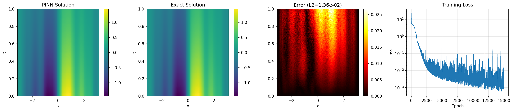

# Diffusion-Reaction Equation PINN

| Metadata          | Value                            |
|-------------------|----------------------------------|
| **Level**         | Intermediate                     |
| **Runtime**       | ~3 min (GPU) / ~12 min (CPU)     |
| **Prerequisites** | JAX, Flax NNX, PDEs              |
| **Format**        | Python + Jupyter                 |
| **Memory**        | ~500 MB RAM                      |

## Overview

This tutorial demonstrates solving a diffusion-reaction equation using a PINN.
The problem features multiple frequency components (sine waves) that the network
must learn simultaneously, making it a good test for spectral approximation.

The equation models phenomena where diffusion and source/reaction terms compete,
such as heat transfer with internal heat generation or chemical diffusion with
reaction kinetics.

## What You'll Learn

1. **Implement** a PINN for diffusion-reaction PDEs
2. **Apply** hard constraints for multi-frequency initial conditions
3. **Handle** manufactured solutions with complex source terms
4. **Understand** how networks learn multiple frequency components

## Coming from DeepXDE?

| DeepXDE                                     | Opifex (JAX)                                        |
|---------------------------------------------|-----------------------------------------------------|
| `dde.geometry.Interval(-np.pi, np.pi)`      | `jnp.linspace(-jnp.pi, jnp.pi, N)`                  |
| `net.apply_output_transform(transform)`     | Hard constraint in `__call__` method                |
| `dde.nn.FNN([2] + [30]*6 + [1])`            | `nnx.Linear` layers with tanh activation            |
| `model.train(iterations=20000)`             | 15000 epochs with Adam optimizer                    |

**Key differences:**

1. **Hard constraint**: `u = t*(pi^2 - x^2)*u_hat + IC(x)` enforces IC and BC
2. **Source term**: Computed analytically from manufactured solution
3. **Multi-frequency IC**: Sum of sin(kx)/k terms with k = 1, 2, 3, 4, 8

## Files

- **Python Script**: [`examples/pinns/diffusion_reaction.py`](https://github.com/Opifex/Opifex/blob/main/examples/pinns/diffusion_reaction.py)
- **Jupyter Notebook**: [`examples/pinns/diffusion_reaction.ipynb`](https://github.com/Opifex/Opifex/blob/main/examples/pinns/diffusion_reaction.ipynb)

## Quick Start

### Run the Python Script

```bash
source activate.sh && python examples/pinns/diffusion_reaction.py
```

### Run the Jupyter Notebook

```bash
jupyter lab examples/pinns/diffusion_reaction.ipynb
```

## Core Concepts

### Diffusion-Reaction Equation

$$\frac{\partial u}{\partial t} = D \frac{\partial^2 u}{\partial x^2} + f(x, t)$$

| Component | This Example |
|-----------|-------------|
| Domain | $x \in [-\pi, \pi]$, $t \in [0, 1]$ |
| Diffusion | $D = 1$ |
| Solution | $u = e^{-t}(\sin x + \frac{\sin 2x}{2} + \frac{\sin 3x}{3} + \frac{\sin 4x}{4} + \frac{\sin 8x}{8})$ |
| IC | Sum of sine waves at $t=0$ |
| BC | $u(\pm\pi, t) = 0$ (Dirichlet) |

### Physical Interpretation

- **Diffusion**: Smooths spatial gradients
- **Source term**: Chosen to maintain the multi-frequency structure
- **Exponential decay**: All frequency components decay at the same rate

## Implementation

### Step 1: Imports and Configuration

```python
import jax
import jax.numpy as jnp
import optax
from flax import nnx
```

**Terminal Output:**

```text
======================================================================
Opifex Example: Diffusion-Reaction Equation PINN
======================================================================
JAX backend: gpu
JAX devices: [CudaDevice(id=0)]

Diffusion coefficient: D = 1.0
Domain: x in [-3.1416, 3.1416], t in [0.0, 1.0]
Collocation: 2000 domain, 100 boundary, 200 initial
Network: [2] + [30, 30, 30, 30, 30, 30] + [1]
Training: 15000 epochs @ lr=0.001
```

### Step 2: Define the Problem

```python
D = 1.0  # Diffusion coefficient

def exact_solution(x, t):
    """Exact solution: sum of sine waves with exponential decay."""
    return jnp.exp(-t) * (
        jnp.sin(x) + jnp.sin(2*x)/2 + jnp.sin(3*x)/3
        + jnp.sin(4*x)/4 + jnp.sin(8*x)/8
    )

def source_term(x, t):
    """Source term f(x, t) for the manufactured solution."""
    return jnp.exp(-t) * (
        3*jnp.sin(2*x)/2 + 8*jnp.sin(3*x)/3
        + 15*jnp.sin(4*x)/4 + 63*jnp.sin(8*x)/8
    )
```

**Terminal Output:**

```text
Diffusion-reaction: du/dt = D*d^2u/dx^2 + f(x,t)
  Diffusion: D = 1.0
  Solution: sum of sin(kx)/k terms with exp(-t) decay
  BC: u(-pi, t) = u(pi, t) = 0 (periodic-like)
  IC: u(x, 0) = sin(x) + sin(2x)/2 + ...
```

### Step 3: Create PINN with Hard Constraint

```python
class DiffusionReactionPINN(nnx.Module):
    def __init__(self, hidden_dims: list[int], *, rngs: nnx.Rngs):
        super().__init__()
        layers = []
        in_features = 2  # (x, t)

        for hidden_dim in hidden_dims:
            layers.append(nnx.Linear(in_features, hidden_dim, rngs=rngs))
            in_features = hidden_dim

        layers.append(nnx.Linear(in_features, 1, rngs=rngs))
        self.layers = nnx.List(layers)

    def __call__(self, xt: jax.Array) -> jax.Array:
        """Forward pass with hard constraint for IC and BC."""
        x, t = xt[:, 0:1], xt[:, 1:2]

        # Network output
        h = xt
        for layer in self.layers[:-1]:
            h = jnp.tanh(layer(h))
        u_hat = self.layers[-1](h)

        # Hard constraint: u = t*(pi^2 - x^2)*u_hat + IC(x)
        ic_term = (jnp.sin(x) + jnp.sin(2*x)/2 + jnp.sin(3*x)/3
                   + jnp.sin(4*x)/4 + jnp.sin(8*x)/8)
        bc_mask = t * (jnp.pi**2 - x**2)

        return bc_mask * u_hat + ic_term

pinn = DiffusionReactionPINN(hidden_dims=[30]*6, rngs=nnx.Rngs(42))
```

**Terminal Output:**

```text
Creating PINN model...
PINN parameters: 4,771
```

### Step 4: Generate Collocation Points

```python
key = jax.random.PRNGKey(42)
keys = jax.random.split(key, 4)

# Domain interior points
x_domain = jax.random.uniform(keys[0], (N_DOMAIN,), minval=X_MIN, maxval=X_MAX)
t_domain = jax.random.uniform(keys[1], (N_DOMAIN,), minval=T_MIN, maxval=T_MAX)
xt_domain = jnp.column_stack([x_domain, t_domain])
```

**Terminal Output:**

```text
Generating collocation points...
Domain points: (2000, 2)
```

### Step 5: Define Physics-Informed Loss

```python
def compute_pde_residual(pinn, xt):
    """Compute diffusion-reaction PDE residual."""

    def u_scalar(xt_single):
        return pinn(xt_single.reshape(1, 2)).squeeze()

    def residual_single(xt_single):
        x, t = xt_single[0], xt_single[1]

        grad_u = jax.grad(u_scalar)(xt_single)
        u_t = grad_u[1]

        hess = jax.hessian(u_scalar)(xt_single)
        u_xx = hess[0, 0]

        f = source_term(x, t)

        # Residual: u_t - D*u_xx - f = 0
        return u_t - D * u_xx - f

    return jax.vmap(residual_single)(xt)

def pde_loss(pinn, xt):
    residual = compute_pde_residual(pinn, xt)
    return jnp.mean(residual**2)
```

### Step 6: Training

```python
opt = nnx.Optimizer(pinn, optax.adam(LEARNING_RATE), wrt=nnx.Param)

@nnx.jit
def train_step(pinn, opt, xt_dom):
    def loss_fn(model):
        return pde_loss(model, xt_dom)

    loss, grads = nnx.value_and_grad(loss_fn)(pinn)
    opt.update(pinn, grads)
    return loss

for epoch in range(EPOCHS):
    loss = train_step(pinn, opt, xt_domain)
```

**Terminal Output:**

```text
Training PINN...
  Epoch     1/15000: loss=2.404716e+01
  Epoch  3000/15000: loss=8.812878e-03
  Epoch  6000/15000: loss=4.998077e-03
  Epoch  9000/15000: loss=7.960054e-03
  Epoch 12000/15000: loss=1.765104e-03
  Epoch 15000/15000: loss=5.911256e-03
Final loss: 5.911256e-03
```

### Step 7: Evaluation

**Terminal Output:**

```text
Evaluating PINN...
Relative L2 error:   1.364888e-02
Maximum point error: 2.670667e-02
Mean point error:    5.508810e-03
Mean PDE residual:   5.571126e-02
IC error (hard):     0.000000e+00
```

## Visualization




## Results Summary

| Metric              | Value       |
|---------------------|-------------|
| Final Loss          | 5.91e-03    |
| Relative L2 Error   | 1.36%       |
| Maximum Error       | 2.67e-02    |
| Mean PDE Residual   | 5.57e-02    |
| IC Error (hard)     | **0.0**     |
| Parameters          | 4,771       |
| Training Epochs     | 15,000      |

## Next Steps

### Experiments to Try

1. **Fewer frequencies**: Remove higher frequency terms to see easier convergence
2. **More epochs**: Train for 30000+ epochs to reduce residual
3. **Larger network**: Try `[40]*8` for better frequency resolution
4. **Different decay**: Modify source term for non-uniform decay rates

### Related Examples

| Example                                   | Level        | What You'll Learn              |
|-------------------------------------------|--------------|--------------------------------|
| [Heat Equation](heat-equation.md)         | Beginner     | Simpler diffusion (no reaction)|
| [Allen-Cahn](allen-cahn.md)               | Advanced     | Nonlinear reaction term        |
| [Helmholtz](helmholtz.md)                 | Intermediate | Multi-frequency with sin act   |

### Troubleshooting

| Issue | Solution |
|-------|----------|
| High frequency not captured | Increase network depth or width |
| IC not exact | Check hard constraint formula matches exact IC |
| Slow convergence | Try learning rate scheduling |
| Loss oscillates | Reduce learning rate or add more collocation points |
