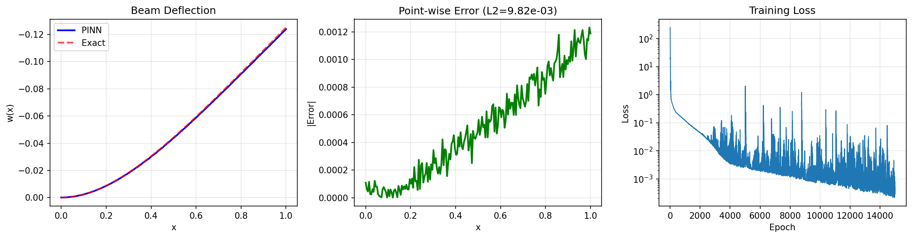
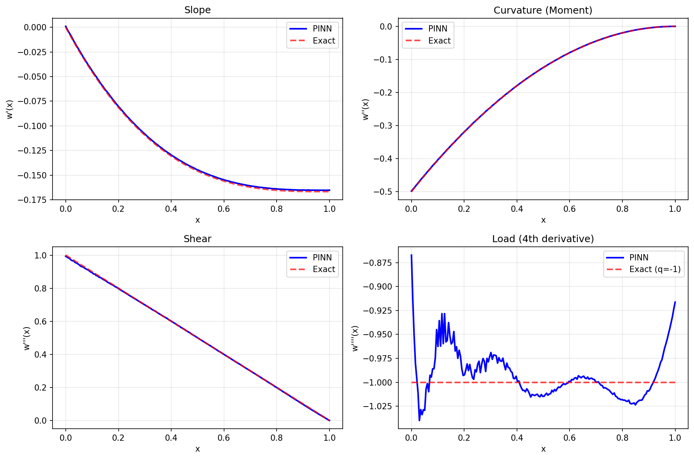

# Euler-Bernoulli Beam PINN

| Metadata          | Value                            |
|-------------------|----------------------------------|
| **Level**         | Intermediate                     |
| **Runtime**       | ~2 min (GPU) / ~10 min (CPU)     |
| **Prerequisites** | JAX, Flax NNX, structural mechanics |
| **Format**        | Python + Jupyter                 |
| **Memory**        | ~300 MB RAM                      |

## Overview

This tutorial demonstrates solving the Euler-Bernoulli beam equation using a PINN.
This is a fourth-order ODE from structural mechanics that describes the deflection
of beams under load, fundamental to civil and mechanical engineering.

The cantilever beam problem tests the PINN's ability to handle high-order
derivatives and multiple boundary conditions at different locations.

## What You'll Learn

1. **Implement** a PINN for fourth-order ODEs
2. **Compute** up to 4th derivatives using nested JAX autodiff
3. **Handle** mixed boundary conditions (Dirichlet + Neumann + operator BCs)
4. **Apply** PINNs to structural mechanics problems
5. **Visualize** deflection and internal forces (moment, shear)

## Coming from DeepXDE?

| DeepXDE                                     | Opifex (JAX)                                        |
|---------------------------------------------|-----------------------------------------------------|
| `dde.grad.hessian(y, x)` for w''            | Nested `jax.grad` calls                             |
| `dde.icbc.OperatorBC` for w'', w'''         | Custom loss terms with derivatives                  |
| `dde.geometry.Interval(0, 1)`               | `jnp.linspace(0, 1, N)`                             |
| `model.train(iterations=10000)`             | 15000 epochs with Adam optimizer                    |

**Key differences:**

1. **Nested differentiation**: Use `jax.grad` recursively for 4th derivative
2. **BC as loss terms**: All BCs enforced via weighted loss components
3. **Vectorized derivatives**: `jax.vmap` over derivative computation

## Files

- **Python Script**: [`examples/pinns/euler_beam.py`](https://github.com/Opifex/Opifex/blob/main/examples/pinns/euler_beam.py)
- **Jupyter Notebook**: [`examples/pinns/euler_beam.ipynb`](https://github.com/Opifex/Opifex/blob/main/examples/pinns/euler_beam.ipynb)

## Quick Start

### Run the Python Script

```bash
source activate.sh && python examples/pinns/euler_beam.py
```

### Run the Jupyter Notebook

```bash
jupyter lab examples/pinns/euler_beam.ipynb
```

## Core Concepts

### Euler-Bernoulli Beam Equation

$$EI \frac{d^4 w}{dx^4} = q(x)$$

| Component | This Example |
|-----------|-------------|
| Domain | $x \in [0, 1]$ |
| Flexural rigidity | $EI = 1$ |
| Load | $q = -1$ (uniform, downward) |
| Solution | $w = -\frac{x^4}{24} + \frac{x^3}{6} - \frac{x^2}{4}$ |

### Cantilever Beam Boundary Conditions

| Location | Condition | Physical Meaning |
|----------|-----------|------------------|
| $x = 0$ | $w(0) = 0$ | Fixed deflection |
| $x = 0$ | $w'(0) = 0$ | Fixed slope |
| $x = 1$ | $w''(1) = 0$ | Zero bending moment |
| $x = 1$ | $w'''(1) = 0$ | Zero shear force |

### Physical Interpretation

- **Deflection** $w(x)$: Vertical displacement of beam centerline
- **Slope** $w'(x)$: Rotation angle of beam cross-section
- **Curvature** $w''(x)$: Related to bending moment $M = EI \cdot w''$
- **Shear** $w'''(x)$: Related to shear force $V = EI \cdot w'''$

## Implementation

### Step 1: Imports and Configuration

```python
import jax
import jax.numpy as jnp
import optax
from flax import nnx
```

**Terminal Output:**

```text
======================================================================
Opifex Example: Euler-Bernoulli Beam PINN
======================================================================
JAX backend: gpu
JAX devices: [CudaDevice(id=0)]

Euler-Bernoulli beam: EI * d^4w/dx^4 = q
  Load: q = -1.0
Domain: x in [0.0, 1.0]
Collocation: 100 domain, 10 boundary
Network: [1] + [20, 20, 20] + [1]
Training: 15000 epochs @ lr=0.001
```

### Step 2: Define the Problem

```python
Q = -1.0  # Distributed load (negative = downward)
X_MIN, X_MAX = 0.0, 1.0

def exact_solution(x):
    """Exact solution for cantilever beam with uniform load."""
    return -(x**4) / 24 + (x**3) / 6 - (x**2) / 4

def exact_derivative(x):
    """First derivative: w'(x)."""
    return -(x**3) / 6 + (x**2) / 2 - x / 2
```

**Terminal Output:**

```text
Cantilever beam (fixed at x=0, free at x=1):
  w(0) = 0      (deflection)
  w'(0) = 0     (slope)
  w''(1) = 0    (moment)
  w'''(1) = 0   (shear)
  q = -1.0      (uniform load)
  Solution: w = -x^4/24 + x^3/6 - x^2/4
```

### Step 3: Create the PINN

```python
class EulerBeamPINN(nnx.Module):
    def __init__(self, hidden_dims: list[int], *, rngs: nnx.Rngs):
        super().__init__()
        layers = []
        in_features = 1  # x only (no time)

        for hidden_dim in hidden_dims:
            layers.append(nnx.Linear(in_features, hidden_dim, rngs=rngs))
            in_features = hidden_dim

        layers.append(nnx.Linear(in_features, 1, rngs=rngs))
        self.layers = nnx.List(layers)

    def __call__(self, x: jax.Array) -> jax.Array:
        h = x
        for layer in self.layers[:-1]:
            h = jnp.tanh(layer(h))
        return self.layers[-1](h)

pinn = EulerBeamPINN(hidden_dims=[20, 20, 20], rngs=nnx.Rngs(42))
```

**Terminal Output:**

```text
Creating PINN model...
PINN parameters: 901
```

### Step 4: Generate Collocation Points

```python
key = jax.random.PRNGKey(42)

# Domain interior points
x_domain = jax.random.uniform(key, (N_DOMAIN,), minval=X_MIN, maxval=X_MAX)
x_domain = x_domain.reshape(-1, 1)

# Boundary points
x_left = jnp.zeros((N_BOUNDARY // 2, 1))   # x = 0 (fixed end)
x_right = jnp.ones((N_BOUNDARY // 2, 1))   # x = 1 (free end)
```

**Terminal Output:**

```text
Generating collocation points...
Domain points: (100, 1)
Left BC points: (5, 1)
Right BC points: (5, 1)
```

### Step 5: Fourth Derivative Computation

The key challenge is computing the 4th derivative using nested `jax.grad` calls:

```python
def compute_derivatives(pinn, x):
    """Compute w, w', w'', w''', w'''' at given points."""

    def w_scalar(x_single):
        return pinn(x_single.reshape(1, 1)).squeeze()

    def derivatives_single(x_single):
        w = w_scalar(x_single)

        # w' = dw/dx
        w_x = jax.grad(w_scalar)(x_single)[0]

        # w'' = d^2w/dx^2
        def w_x_fn(xs):
            return jax.grad(w_scalar)(xs)[0]
        w_xx = jax.grad(w_x_fn)(x_single)[0]

        # w''' = d^3w/dx^3
        def w_xx_fn(xs):
            def w_x_inner(xs2):
                return jax.grad(w_scalar)(xs2)[0]
            return jax.grad(w_x_inner)(xs)[0]
        w_xxx = jax.grad(w_xx_fn)(x_single)[0]

        # w'''' = d^4w/dx^4
        def w_xxx_fn(xs):
            def w_xx_inner(xs2):
                def w_x_inner2(xs3):
                    return jax.grad(w_scalar)(xs3)[0]
                return jax.grad(w_x_inner2)(xs2)[0]
            return jax.grad(w_xx_inner)(xs)[0]
        w_xxxx = jax.grad(w_xxx_fn)(x_single)[0]

        return w, w_x, w_xx, w_xxx, w_xxxx

    return jax.vmap(derivatives_single)(x)
```

### Step 6: Define Physics-Informed Loss

```python
def pde_loss(pinn, x):
    """PDE loss: w'''' + 1 = 0 (since q=-1 and EI=1)."""
    _, _, _, _, w_xxxx = compute_derivatives(pinn, x)
    residual = w_xxxx - Q  # w'''' = q = -1
    return jnp.mean(residual**2)

def bc_loss(pinn, x_left, x_right):
    """Boundary condition losses for cantilever beam."""
    # Left BC: w(0) = 0, w'(0) = 0
    w_l, w_x_l, _, _, _ = compute_derivatives(pinn, x_left)
    loss_w0 = jnp.mean(w_l**2)
    loss_wx0 = jnp.mean(w_x_l**2)

    # Right BC: w''(1) = 0, w'''(1) = 0
    _, _, w_xx_r, w_xxx_r, _ = compute_derivatives(pinn, x_right)
    loss_wxx1 = jnp.mean(w_xx_r**2)
    loss_wxxx1 = jnp.mean(w_xxx_r**2)

    return loss_w0 + loss_wx0 + loss_wxx1 + loss_wxxx1

def total_loss(pinn, x_dom, x_left, x_right, lambda_bc=100.0):
    """Total loss = PDE + weighted BC."""
    loss_pde = pde_loss(pinn, x_dom)
    loss_bc = bc_loss(pinn, x_left, x_right)
    return loss_pde + lambda_bc * loss_bc
```

### Step 7: Training

```python
opt = nnx.Optimizer(pinn, optax.adam(LEARNING_RATE), wrt=nnx.Param)

@nnx.jit
def train_step(pinn, opt, x_dom, x_left, x_right):
    def loss_fn(model):
        return total_loss(model, x_dom, x_left, x_right)

    loss, grads = nnx.value_and_grad(loss_fn)(pinn)
    opt.update(pinn, grads)
    return loss

for epoch in range(EPOCHS):
    loss = train_step(pinn, opt, x_domain, x_left, x_right)
```

**Terminal Output:**

```text
Training PINN...
  Epoch     1/15000: loss=2.477272e+02
  Epoch  3000/15000: loss=2.196092e-02
  Epoch  6000/15000: loss=2.239256e-03
  Epoch  9000/15000: loss=1.150323e-03
  Epoch 12000/15000: loss=8.906908e-03
  Epoch 15000/15000: loss=2.925966e-04
Final loss: 2.925966e-04
```

### Step 8: Evaluation

**Terminal Output:**

```text
Evaluating PINN...
Relative L2 error:   9.822021e-03
Maximum point error: 1.229844e-03
Mean point error:    4.862132e-04

Boundary condition errors:
  w(0) = -5.951524e-05 (should be 0)
  w'(0) = 1.018226e-03 (should be 0)
  w''(1) = -1.121461e-04 (should be 0)
  w'''(1) = 6.520748e-05 (should be 0)
```

## Visualization





## Results Summary

| Metric              | Value       |
|---------------------|-------------|
| Final Loss          | 2.93e-04    |
| Relative L2 Error   | 0.98%       |
| Maximum Error       | 1.23e-03    |
| BC w(0)             | -5.95e-05   |
| BC w'(0)            | 1.02e-03    |
| BC w''(1)           | -1.12e-04   |
| BC w'''(1)          | 6.52e-05    |
| Parameters          | 901         |
| Training Epochs     | 15,000      |

## Next Steps

### Experiments to Try

1. **Hard constraints**: Implement hard BC for w(0)=0 and w'(0)=0
2. **Variable load**: Use non-uniform q(x) like triangular or sinusoidal
3. **Simply supported**: Change BCs to w(0)=w(1)=0, w''(0)=w''(1)=0
4. **2D plate**: Extend to biharmonic equation for plate bending

### Related Examples

| Example                                   | Level        | What You'll Learn              |
|-------------------------------------------|--------------|--------------------------------|
| [Poisson Equation](poisson.md)            | Beginner     | 2nd-order elliptic PDE         |
| [Helmholtz Equation](helmholtz.md)        | Intermediate | 2nd-order with wavenumber      |
| [Wave Equation](wave.md)                  | Intermediate | 2nd-order in time              |

### Troubleshooting

| Issue | Solution |
|-------|----------|
| BC not satisfied | Increase lambda_bc weight or training epochs |
| Derivative noise | Use more hidden layers or wider network |
| Slow 4th derivative | Pre-compile with `jax.jit` outside training loop |
| Loss plateaus | Try learning rate scheduling or L-BFGS refinement |
