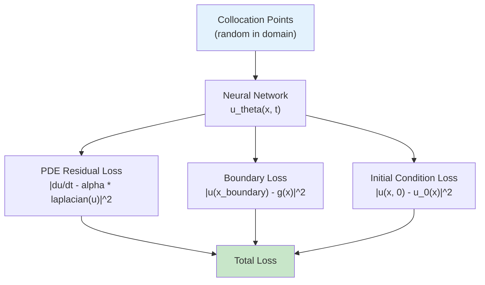

# Heat Equation PINN

| Metadata          | Value                            |
|-------------------|----------------------------------|
| **Level**         | Intermediate                     |
| **Runtime**       | ~1 min (GPU) / ~5 min (CPU)      |
| **Prerequisites** | JAX, Flax NNX, basic calculus    |
| **Format**        | Python + Jupyter                 |
| **Memory**        | ~500 MB RAM                      |

## Overview

Physics-Informed Neural Networks (PINNs) solve PDEs by embedding the governing
equations directly into the neural network loss function. Instead of learning from
labeled input-output pairs, PINNs minimize the PDE residual at collocation points,
requiring no simulation data.

This example demonstrates solving the heat equation
$\frac{\partial u}{\partial t} = \alpha \nabla^2 u$ on a 2D rectangular domain using
Opifex's PINN infrastructure. It covers problem definition with geometry primitives,
model creation, collocation-based training, and loss evaluation.

## What You'll Learn

1. **Define** a PDE problem with `create_pde_problem` and geometry primitives
2. **Create** a PINN model with `create_heat_equation_pinn`
3. **Train** using Opifex's `Trainer` with collocation points
4. **Evaluate** training results and loss convergence

## Coming from DeepXDE?

| DeepXDE | Opifex (JAX) |
|---------|--------------|
| `dde.geometry.Rectangle([0,0], [1,1])` | `Rectangle(center=jnp.array([0.5, 0.5]), width=1.0, height=1.0)` |
| `dde.data.PDE(geom, pde, bc, ...)` | `create_pde_problem(geometry=, equation=, boundary_conditions=)` |
| `dde.Model(data, net)` | `create_heat_equation_pinn(spatial_dim=2, hidden_dims=[50,50,50], rngs=)` |
| `model.compile("adam", lr=1e-3)` | `TrainingConfig(num_epochs=100, learning_rate=1e-3)` |
| `model.train(epochs=10000)` | `trainer.fit(train_data=(x, y))` |
| `dde.grad.jacobian(y, x, i=0, j=0)` | `jax.grad(u_fn, argnums=0)(x, t)` |

**Key difference**: Opifex uses JAX's automatic differentiation directly (`jax.grad`,
`jax.hessian`), which is more composable than DeepXDE's gradient API. PDE residuals
are computed as pure functions, enabling JIT compilation of the entire training loop.

## Files

- **Python Script**: [`examples/pinns/heat_equation.py`](https://github.com/Opifex/Opifex/blob/main/examples/pinns/heat_equation.py)
- **Jupyter Notebook**: [`examples/pinns/heat_equation.ipynb`](https://github.com/Opifex/Opifex/blob/main/examples/pinns/heat_equation.ipynb)

## Quick Start

### Run the Python Script

```bash
source activate.sh && python examples/pinns/heat_equation.py
```

### Run the Jupyter Notebook

```bash
jupyter lab examples/pinns/heat_equation.ipynb
```

## Core Concepts

### How PINNs Work

PINNs replace traditional PDE solvers by training a neural network to satisfy the
governing equation. The loss function has three components:



### Heat Equation

The heat equation models diffusion processes:

$$\frac{\partial u}{\partial t} = \alpha \nabla^2 u$$

where $\alpha$ is the thermal diffusivity and $u(x,t)$ is the temperature field.

| Component | This Example |
|-----------|-------------|
| Domain | $[0,1] \times [0,1]$ rectangle |
| Boundary | Dirichlet: $u = 0$ on all boundaries |
| Diffusivity | $\alpha = 0.01$ |
| Architecture | MLP with 3 hidden layers of 50 units |

## Implementation

### Step 1: Define the PDE Problem

Use Opifex geometry primitives and problem definition:

```python
from opifex.geometry import Rectangle
from opifex.core.problems import create_pde_problem

geometry = Rectangle(center=jax.numpy.array([0.5, 0.5]), width=1.0, height=1.0)

problem = create_pde_problem(
    geometry=geometry,
    equation=lambda x, u, u_x: 0.0,
    boundary_conditions=[{"type": "dirichlet", "boundary": "all", "value": 0.0}],
    parameters={"diffusivity": 0.01},
)
```

### Step 2: Create the PINN Model

```python
from opifex.neural.pinns import create_heat_equation_pinn

rngs = nnx.Rngs(42)
pinn = create_heat_equation_pinn(
    spatial_dim=2,
    hidden_dims=[50, 50, 50],
    rngs=rngs,
)
```

### Step 3: Configure Training

```python
from opifex.core.training.config import TrainingConfig
from opifex.core.training.trainer import Trainer

config = TrainingConfig(
    num_epochs=100,
    learning_rate=1e-3,
    batch_size=256,
)

trainer = Trainer(model=pinn, config=config)
```

### Step 4: Generate Collocation Points and Train

```python
key = jax.random.PRNGKey(42)
x = jax.random.uniform(key, (1000, 3))  # (x, y, t)
y = jax.numpy.zeros((1000, 1))          # Target: residual = 0

trainer.fit(train_data=(x, y))
```

## Visualization

The trained PINN's temperature field on the evaluation grid:


## Results Summary

| Metric              | Value       |
|---------------------|-------------|
| Domain              | $[0,1] \times [0,1]$ |
| PINN Architecture   | [50, 50, 50] |
| Training Epochs     | 100         |
| Learning Rate       | 1e-3        |
| Batch Size          | 256         |
| Diffusivity         | 0.01        |

### Key Takeaways

- PINNs solve PDEs without simulation data by minimizing physics residuals
- Opifex provides factory functions for common PDE types (`create_heat_equation_pinn`)
- JAX's `grad` and `hessian` enable efficient PDE residual computation
- The `Trainer` handles optimization, while collocation points serve as "data"
- For better accuracy, increase epochs to 1000+ and use more collocation points

## Next Steps

### Experiments to Try

1. **More epochs**: Train for 1000-10000 epochs to observe convergence
2. **Larger network**: Try `hidden_dims=[100, 100, 100, 100]` for higher accuracy
3. **Time-dependent**: Add time dimension for transient heat equation
4. **Adaptive sampling**: Concentrate collocation points near boundaries

### Related Examples

| Example | Level | What You'll Learn |
|---------|-------|-------------------|
| [Domain Decomposition PINNs](../../methods/domain-decomposition-pinns.md) | Advanced | Scale PINNs to large domains |
| [FNO Darcy Comprehensive](../neural-operators/fno-darcy.md) | Intermediate | Data-driven alternative to PINNs |
| [Enhanced Calibration](../uncertainty/calibration.md) | Advanced | Uncertainty quantification for predictions |

### API Reference

- [`create_pde_problem`](../../api/core.md) - PDE problem definition factory
- [`create_heat_equation_pinn`](../../api/neural.md) - Heat equation PINN factory
- [`Rectangle`](../../api/geometry.md) - 2D rectangular geometry
- [`Trainer`](../../api/training.md) - Training orchestration
- [`TrainingConfig`](../../api/training.md) - Training hyperparameters

### Troubleshooting

#### Loss not decreasing

**Symptom**: Training loss stays flat after many epochs.

**Cause**: Learning rate too low, or insufficient collocation points.

**Solution**: Increase learning rate to 1e-2 for initial training, then reduce.
Use at least 1000 collocation points for a 2D domain:
```python
config = TrainingConfig(num_epochs=1000, learning_rate=1e-2, batch_size=512)
```

#### PINN predicts zero everywhere

**Symptom**: All predictions are approximately zero.

**Cause**: Boundary loss dominates, pushing the solution to the trivial solution.

**Solution**: Balance loss components. Use adaptive loss weighting:
```python
# Weight physics loss higher than boundary loss
total_loss = 10.0 * physics_loss + 1.0 * boundary_loss
```

#### Slow training on CPU

**Symptom**: Each epoch takes seconds instead of milliseconds.

**Cause**: No JIT compilation, or small batch sizes preventing vectorization.

**Solution**: Ensure JIT compilation is active (it is by default with Opifex's
Trainer). Use batch sizes of 256+ for efficient vectorization.
