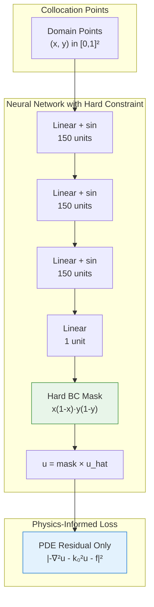
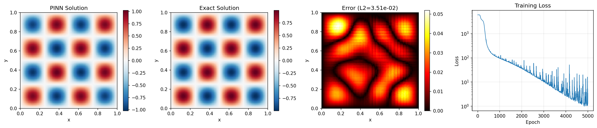

# Helmholtz Equation PINN

| Metadata          | Value                            |
|-------------------|----------------------------------|
| **Level**         | Intermediate                     |
| **Runtime**       | ~2 min (GPU) / ~8 min (CPU)      |
| **Prerequisites** | JAX, Flax NNX, wave physics      |
| **Format**        | Python + Jupyter                 |
| **Memory**        | ~800 MB RAM                      |

## Overview

This tutorial demonstrates solving the 2D Helmholtz equation using a
Physics-Informed Neural Network (PINN). The Helmholtz equation arises
in acoustics, electromagnetics, seismology, and quantum mechanics as
the time-independent form of the wave equation.

This example showcases a **hard boundary constraint** technique where
the network output is multiplied by a function that vanishes on boundaries,
automatically satisfying Dirichlet conditions without explicit boundary loss.

## What You'll Learn

1. **Implement** a PINN for the Helmholtz equation with oscillatory solutions
2. **Apply** hard boundary constraints using output transforms
3. **Use** sinusoidal activation functions for wave-like solutions
4. **Handle** high-frequency solutions that challenge spectral bias
5. **Compare** hard vs soft boundary enforcement strategies

## Coming from DeepXDE?

If you are familiar with the DeepXDE library:

| DeepXDE                                     | Opifex (JAX)                                        |
|---------------------------------------------|-----------------------------------------------------|
| `dde.geometry.Rectangle([0,0], [1,1])`      | `jax.random.uniform(key, (N, 2))` for (x, y)        |
| `dde.grad.hessian(y, x, i=0, j=0)`          | `jax.hessian(u_fn)(xy)[0, 0]` for u_xx              |
| `net.apply_output_transform(transform)`     | Hard constraint in `__call__` method                |
| `dde.nn.FNN([2]+[150]*3+[1], "sin")`        | Custom `HelmholtzPINN` with `jnp.sin` activation    |
| `model.compile("adam", lr=1e-3)`            | `nnx.Optimizer(pinn, optax.adam(lr), wrt=nnx.Param)`|

**Key differences:**

1. **Hard constraint in model**: BC enforcement built into network forward pass
2. **Sin activation**: `jnp.sin(layer(h))` instead of tanh for oscillatory solutions
3. **No BC loss**: With hard constraints, only PDE residual is needed
4. **Zero boundary error**: Hard constraint achieves machine precision on boundaries

## Files

- **Python Script**: [`examples/pinns/helmholtz.py`](https://github.com/Opifex/Opifex/blob/main/examples/pinns/helmholtz.py)
- **Jupyter Notebook**: [`examples/pinns/helmholtz.ipynb`](https://github.com/Opifex/Opifex/blob/main/examples/pinns/helmholtz.ipynb)

## Quick Start

### Run the Python Script

```bash
source activate.sh && python examples/pinns/helmholtz.py
```

### Run the Jupyter Notebook

```bash
jupyter lab examples/pinns/helmholtz.ipynb
```

## Core Concepts

### Helmholtz Equation

The Helmholtz equation is an elliptic PDE:

$$-\nabla^2 u - k_0^2 u = f(x, y)$$

| Component | This Example |
|-----------|-------------|
| Domain | $[0, 1] \times [0, 1]$ |
| Wave number | $k_0 = 4\pi$ (2 wavelengths per unit) |
| Source term | $f = k_0^2 \sin(k_0 x) \sin(k_0 y)$ |
| Boundary conditions | $u = 0$ on $\partial\Omega$ (Dirichlet) |
| Analytical solution | $u = \sin(k_0 x) \sin(k_0 y)$ |

### Hard Boundary Constraint

Instead of adding a boundary loss term, we modify the network output:

$$u_{PINN}(x, y) = x(1-x) \cdot y(1-y) \cdot \hat{u}_{NN}(x, y)$$

This ensures $u = 0$ on all boundaries **exactly** because:
- At $x = 0$ or $x = 1$: $x(1-x) = 0$
- At $y = 0$ or $y = 1$: $y(1-y) = 0$

### PINN Architecture



## Implementation

### Step 1: Imports and Configuration

```python
import jax
import jax.numpy as jnp
import optax
from flax import nnx
```

**Terminal Output:**

```text
======================================================================
Opifex Example: Helmholtz Equation PINN
======================================================================
JAX backend: gpu
JAX devices: [CudaDevice(id=0)]
Wave number: k0 = 12.5664 (n=2 modes)
Wavelength: 0.5000
Domain: [0, 1] x [0, 1]
Collocation: 2500 domain, 400 boundary
Network: [2] + [150, 150, 150] + [1]
Hard BC constraint: True
Training: 5000 epochs @ lr=0.001
```

### Step 2: Define the Problem

```python
N_MODES = 2  # Number of wavelengths in each direction
K0 = 2.0 * jnp.pi * N_MODES  # Wave number k0 = 4*pi

def exact_solution(xy):
    x, y = xy[:, 0], xy[:, 1]
    return jnp.sin(K0 * x) * jnp.sin(K0 * y)

def source_term(xy):
    x, y = xy[:, 0], xy[:, 1]
    return K0**2 * jnp.sin(K0 * x) * jnp.sin(K0 * y)
```

**Terminal Output:**

```text
Helmholtz equation: -nabla^2(u) - k0^2 * u = f(x,y)
  Wave number: k0 = 2*pi*2 = 12.5664
  Source term: f = k0^2 * sin(k0*x) * sin(k0*y)
  Boundary: u = 0 (Dirichlet)
  Analytical solution: u = sin(k0*x) * sin(k0*y)
```

### Step 3: Create PINN with Hard Constraint

```python
class HelmholtzPINN(nnx.Module):
    def __init__(self, hidden_dims: list[int], *, rngs: nnx.Rngs):
        layers = []
        in_features = 2
        for hidden_dim in hidden_dims:
            layers.append(nnx.Linear(in_features, hidden_dim, rngs=rngs))
            in_features = hidden_dim
        layers.append(nnx.Linear(in_features, 1, rngs=rngs))
        self.layers = nnx.List(layers)

    def __call__(self, xy):
        h = xy
        for layer in self.layers[:-1]:
            h = jnp.sin(layer(h))  # sin activation
        u_hat = self.layers[-1](h)

        # Hard constraint: u = x*(1-x) * y*(1-y) * u_hat
        x, y = xy[:, 0:1], xy[:, 1:2]
        bc_mask = x * (1 - x) * y * (1 - y)
        return bc_mask * u_hat
```

**Terminal Output:**

```text
Creating PINN model...
PINN parameters: 45,901
```

### Step 4: Training (PDE Loss Only)

```python
def total_loss(pinn, xy_dom, xy_bc, lambda_bc=100.0):
    loss_pde = pde_loss(pinn, xy_dom)
    # No boundary loss needed with hard constraint!
    return loss_pde
```

**Terminal Output:**

```text
Training PINN...
  Epoch     1/5000: loss=6.029034e+03
  Epoch  1000/5000: loss=9.683103e+01
  Epoch  2000/5000: loss=3.790305e+01
  Epoch  3000/5000: loss=1.175391e+01
  Epoch  4000/5000: loss=8.398210e+00
  Epoch  5000/5000: loss=3.463675e+00
Final loss: 3.463675e+00
```

### Step 5: Evaluation

**Terminal Output:**

```text
Evaluating PINN...
Relative L2 error:   3.506146e-02
Maximum point error: 5.202329e-02
Mean point error:    1.372658e-02
Mean PDE residual:   1.556803e+00
Boundary error:      0.000000e+00
```

Note the **boundary error is exactly zero** thanks to the hard constraint!

### Visualization

#### Solution Comparison



#### Cross-Sections


## Results Summary

| Metric              | Value       |
|---------------------|-------------|
| Final Loss          | 3.46        |
| Relative L2 Error   | 3.51%       |
| Maximum Point Error | 5.20e-02    |
| Mean Point Error    | 1.37e-02    |
| Mean PDE Residual   | 1.56        |
| Boundary Error      | **0.0**     |
| Parameters          | 45,901      |
| Training Epochs     | 5,000       |

## Next Steps

### Experiments to Try

1. **More modes**: Try $n = 4$ or $n = 8$ for higher frequency solutions
2. **Soft constraint**: Compare accuracy with `USE_HARD_CONSTRAINT = False`
3. **Different activations**: Try tanh (will struggle with oscillations)
4. **More epochs**: Train for 20,000+ epochs for lower L2 error
5. **Fourier features**: Add input encoding for high-frequency modes

### Related Examples

| Example                                   | Level        | What You'll Learn              |
|-------------------------------------------|--------------|--------------------------------|
| [Poisson Equation](poisson.md)            | Intermediate | Elliptic without wave behavior |
| [Wave Equation](wave.md)                  | Intermediate | Time-dependent wave physics    |
| [Navier-Stokes](navier-stokes.md)         | Advanced     | Multi-output coupled PDEs      |

### API Reference

- [`nnx.Linear`](https://flax.readthedocs.io/en/latest/api_reference/flax.nnx/nn/linear.html) - Linear layer
- [`nnx.Optimizer`](https://flax.readthedocs.io/en/latest/api_reference/flax.nnx/training/optimizer.html) - Optimizer wrapper
- [`jax.hessian`](https://jax.readthedocs.io/en/latest/_autosummary/jax.hessian.html) - Hessian computation

## Troubleshooting

### Loss very high with oscillatory solution

**Symptom**: Loss stays at $10^3$ or higher even after training.

**Cause**: tanh activation can't represent high-frequency oscillations (spectral bias).

**Solution**: Use sin activation as shown, or add Fourier feature encoding:

```python
# Sin activation (recommended for oscillatory solutions)
h = jnp.sin(layer(h))

# Or Fourier features
def fourier_features(xy, k=4):
    x, y = xy[:, 0:1], xy[:, 1:2]
    features = [x, y]
    for i in range(1, k+1):
        features.extend([
            jnp.sin(2*jnp.pi*i*x), jnp.cos(2*jnp.pi*i*x),
            jnp.sin(2*jnp.pi*i*y), jnp.cos(2*jnp.pi*i*y)
        ])
    return jnp.concatenate(features, axis=-1)
```

### Hard constraint causes training instability

**Symptom**: Loss fluctuates wildly or NaN values appear.

**Cause**: The boundary mask squashes gradients near boundaries.

**Solution**: Use slightly offset boundaries in mask, or use soft constraint:

```python
# Soft boundary mask (avoids exactly zero gradients)
eps = 0.01
bc_mask = (x + eps) * (1 - x + eps) * (y + eps) * (1 - y + eps)
```

### Solution has wrong number of oscillations

**Symptom**: PINN shows fewer peaks than expected.

**Cause**: Network capacity insufficient for given $k_0$.

**Solution**: Increase network width or add more layers:

```python
# Wider network for high k0
HIDDEN_DIMS = [256, 256, 256, 256]
```
