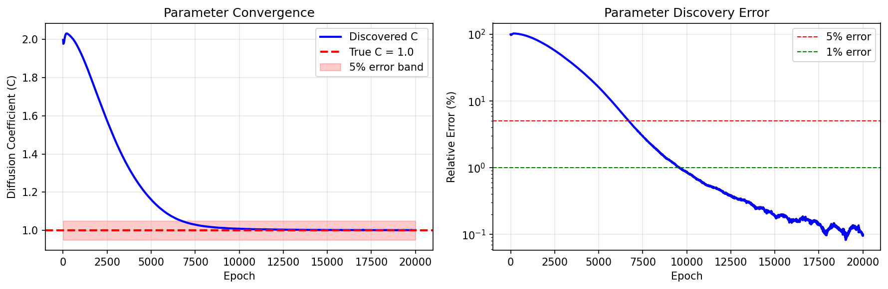

# Inverse Diffusion Equation PINN

| Metadata          | Value                            |
|-------------------|----------------------------------|
| **Level**         | Advanced                         |
| **Runtime**       | ~3 min (GPU) / ~15 min (CPU)     |
| **Prerequisites** | JAX, Flax NNX, inverse problems  |
| **Format**        | Python + Jupyter                 |
| **Memory**        | ~500 MB RAM                      |

## Overview

This tutorial demonstrates solving an inverse problem: discovering the unknown
diffusion coefficient in the heat/diffusion equation from sparse observations.
This is a fundamental inverse problem in PDE parameter identification.

Inverse problems are critical for scientific applications where model parameters
are unknown but observations of the system are available. PINNs provide a natural
framework for these problems by treating the unknown parameter as a trainable variable.

## What You'll Learn

1. **Implement** a PINN with trainable PDE parameters
2. **Design** loss functions for inverse problems
3. **Balance** physics constraints with observation data
4. **Track** parameter convergence during training
5. **Validate** discovered parameters against ground truth

## Coming from DeepXDE?

| DeepXDE                                     | Opifex (JAX)                                        |
|---------------------------------------------|-----------------------------------------------------|
| `dde.Variable(2.0)`                         | `nnx.Param(jnp.log(jnp.array(C_init)))`             |
| `external_trainable_variables=C`            | Parameter included in `nnx.Param` state             |
| `dde.callbacks.VariableValue(C)`            | Track `pinn.C` directly in training loop            |
| `model.train(iterations=50000)`             | 20000 epochs with Adam optimizer                    |

**Key differences:**

1. **Log transform**: Use `log_C` with `exp` to ensure positivity
2. **Native tracking**: Parameter history tracked directly without callbacks
3. **Unified optimization**: Both network and parameter use same optimizer

## Files

- **Python Script**: [`examples/pinns/inverse_diffusion.py`](https://github.com/Opifex/Opifex/blob/main/examples/pinns/inverse_diffusion.py)
- **Jupyter Notebook**: [`examples/pinns/inverse_diffusion.ipynb`](https://github.com/Opifex/Opifex/blob/main/examples/pinns/inverse_diffusion.ipynb)

## Quick Start

### Run the Python Script

```bash
source activate.sh && python examples/pinns/inverse_diffusion.py
```

### Run the Jupyter Notebook

```bash
jupyter lab examples/pinns/inverse_diffusion.ipynb
```

## Core Concepts

### Inverse Problem Formulation

**Forward problem**: Given the PDE parameters, solve for the solution.

**Inverse problem**: Given observations, discover the unknown parameters.

$$\frac{\partial u}{\partial t} - C \frac{\partial^2 u}{\partial x^2} + f(x, t) = 0$$

| Component | This Example |
|-----------|-------------|
| Domain | $x \in [-1, 1]$, $t \in [0, 1]$ |
| Unknown | Diffusion coefficient $C$ (true value = 1.0) |
| Initial guess | $C = 2.0$ |
| Observations | 10 points at $t = 1$ |
| Exact solution | $u(x, t) = \sin(\pi x) e^{-t}$ |

### Why Inverse Problems are Challenging

- **Ill-posedness**: Small changes in data can cause large parameter changes
- **Non-uniqueness**: Multiple parameters may fit the same observations
- **Noise sensitivity**: Real observations include measurement noise
- **Regularization**: May be needed to stabilize the solution

## Implementation

### Step 1: Imports and Configuration

```python
import jax
import jax.numpy as jnp
import optax
from flax import nnx
```

**Terminal Output:**

```text
======================================================================
Opifex Example: Inverse Diffusion Equation PINN
======================================================================
JAX backend: gpu
JAX devices: [CudaDevice(id=0)]

True diffusion coefficient: C = 1.0
Domain: x in [-1.0, 1.0], t in [0.0, 1.0]
Collocation: 400 domain, 100 boundary, 100 initial
Observation points: 10 at t=1 (for parameter discovery)
Network: [2] + [32, 32, 32] + [1]
Training: 20000 epochs @ lr=0.001
```

### Step 2: Define the Problem

```python
C_TRUE = 1.0  # True value to be discovered

def exact_solution(x, t):
    """Exact solution: u(x, t) = sin(pi*x) * exp(-t)."""
    return jnp.sin(jnp.pi * x) * jnp.exp(-t)

def source_term(x, t):
    """Source term f(x, t) computed from exact solution."""
    return jnp.exp(-t) * (jnp.sin(jnp.pi * x) - jnp.pi**2 * jnp.sin(jnp.pi * x))
```

**Terminal Output:**

```text
Diffusion equation: du/dt - C * d^2u/dx^2 = f(x, t)
  True coefficient: C = 1.0
  Exact solution: u(x, t) = sin(pi*x) * exp(-t)
  BC: u(-1, t) = u(1, t) = 0
  IC: u(x, 0) = sin(pi*x)
  Goal: Discover C from sparse observations at t=1
```

### Step 3: Create PINN with Trainable Parameter

```python
class InverseDiffusionPINN(nnx.Module):
    def __init__(self, hidden_dims: list[int], C_init: float, *, rngs: nnx.Rngs):
        super().__init__()

        # Trainable diffusion coefficient (to be discovered)
        # Use log transform to ensure positivity
        self.log_C = nnx.Param(jnp.log(jnp.array(C_init)))

        layers = []
        in_features = 2  # (x, t)

        for hidden_dim in hidden_dims:
            layers.append(nnx.Linear(in_features, hidden_dim, rngs=rngs))
            in_features = hidden_dim

        layers.append(nnx.Linear(in_features, 1, rngs=rngs))
        self.layers = nnx.List(layers)

    @property
    def coef(self) -> jax.Array:
        """Return positive diffusion coefficient via exp transform."""
        return jnp.exp(self.log_C.value)

    def __call__(self, xt: jax.Array) -> jax.Array:
        h = xt
        for layer in self.layers[:-1]:
            h = jnp.tanh(layer(h))
        return self.layers[-1](h)

# Initialize with incorrect guess (C=2.0, true is C=1.0)
pinn = InverseDiffusionPINN(hidden_dims=[32, 32, 32], C_init=2.0, rngs=nnx.Rngs(42))
```

**Terminal Output:**

```text
Creating PINN model...
PINN parameters: 2,242
Initial C guess: 2.000000
True C:          1.000000
```

### Step 4: Generate Collocation and Observation Points

```python
key = jax.random.PRNGKey(42)
keys = jax.random.split(key, 6)

# Domain interior points
xt_domain = jnp.column_stack([x_domain, t_domain])

# Boundary and initial condition points
xt_bc = jnp.vstack([xt_bc_left, xt_bc_right])
u_bc = exact_solution(xt_bc[:, 0], xt_bc[:, 1])

xt_ic = jnp.column_stack([x_ic, jnp.zeros(N_INITIAL)])
u_ic = exact_solution(x_ic, jnp.zeros(N_INITIAL))

# Observation points at t=1 (key for parameter discovery)
x_obs = jnp.linspace(X_MIN, X_MAX, N_OBSERVE)
t_obs = jnp.ones(N_OBSERVE)
xt_obs = jnp.column_stack([x_obs, t_obs])
u_obs = exact_solution(x_obs, t_obs)
```

**Terminal Output:**

```text
Generating collocation points and observations...
Domain points:      (400, 2)
Boundary points:    (100, 2)
Initial points:     (100, 2)
Observation points: (10, 2) (at t=1)
```

### Step 5: Define Physics-Informed Loss

```python
def compute_pde_residual(pinn, xt):
    """Compute diffusion PDE residual: u_t - C*u_xx + f = 0."""

    def u_scalar(xt_single):
        return pinn(xt_single.reshape(1, 2)).squeeze()

    def residual_single(xt_single):
        x, t = xt_single[0], xt_single[1]
        grad_u = jax.grad(u_scalar)(xt_single)
        u_t = grad_u[1]
        hess = jax.hessian(u_scalar)(xt_single)
        u_xx = hess[0, 0]
        f = source_term(x, t)
        # Use pinn.coef (the trainable parameter)
        return u_t - pinn.coef * u_xx + f

    return jax.vmap(residual_single)(xt)

def data_loss(pinn, xt, u_target):
    """Loss from observation data - key for parameter discovery."""
    u = pinn(xt).squeeze()
    return jnp.mean((u - u_target) ** 2)

def total_loss(pinn, xt_dom, xt_bc, u_bc, xt_ic, u_ic, xt_obs, u_obs):
    """Total loss = PDE + BC + IC + Data fitting."""
    return pde_loss(pinn, xt_dom) + bc_loss(pinn, xt_bc, u_bc) \
           + ic_loss(pinn, xt_ic, u_ic) + data_loss(pinn, xt_obs, u_obs)
```

### Step 6: Training

```python
opt = nnx.Optimizer(pinn, optax.adam(LEARNING_RATE), wrt=nnx.Param)

@nnx.jit
def train_step(pinn, opt, xt_dom, xt_bc, u_bc, xt_ic, u_ic, xt_obs, u_obs):
    def loss_fn(model):
        return total_loss(model, xt_dom, xt_bc, u_bc, xt_ic, u_ic, xt_obs, u_obs)

    loss, grads = nnx.value_and_grad(loss_fn)(pinn)
    opt.update(pinn, grads)
    return loss

for epoch in range(EPOCHS):
    loss = train_step(pinn, opt, xt_domain, xt_bc, u_bc, xt_ic, u_ic, xt_obs, u_obs)
    C_history.append(float(pinn.coef))
```

**Terminal Output:**

```text
Training PINN (discovering diffusion coefficient)...
  Epoch     1/20000: loss=4.636221e+01, C=1.998001
  Epoch  4000/20000: loss=5.187262e-03, C=1.284711
  Epoch  8000/20000: loss=1.486299e-04, C=1.022007
  Epoch 12000/20000: loss=7.019506e-05, C=1.004451
  Epoch 16000/20000: loss=2.005360e-04, C=1.001598
  Epoch 20000/20000: loss=5.279011e-05, C=1.000966
Final loss: 5.279011e-05

Discovered C: 1.000966
True C:       1.000000
Relative error: 0.10%
```

### Step 7: Evaluation

**Terminal Output:**

```text
Evaluating PINN...
Relative L2 error:   2.862643e-03
Maximum point error: 4.653510e-03
Mean point error:    1.126259e-03
Mean PDE residual:   5.042705e-03
```

## Visualization




## Results Summary

| Metric              | Value       |
|---------------------|-------------|
| Final Loss          | 5.28e-05    |
| Discovered C        | 1.000966    |
| True C              | 1.000000    |
| **Parameter Error** | **0.10%**   |
| Relative L2 Error   | 0.29%       |
| Mean Point Error    | 1.13e-03    |
| Mean PDE Residual   | 5.04e-03    |
| Parameters          | 2,242       |
| Training Epochs     | 20,000      |

## Next Steps

### Experiments to Try

1. **Add noise**: Corrupt observations with Gaussian noise to test robustness
2. **Fewer observations**: Try 5 or 3 observation points
3. **Different initial guess**: Start from C=0.1 or C=10.0
4. **Multiple parameters**: Discover both C and a reaction coefficient
5. **Real data**: Apply to experimental measurements

### Related Examples

| Example                                   | Level        | What You'll Learn              |
|-------------------------------------------|--------------|--------------------------------|
| [Heat Equation](heat-equation.md)         | Beginner     | Forward diffusion problem      |
| [Burgers Equation](burgers.md)            | Intermediate | Forward nonlinear problem      |
| [Poisson Equation](poisson.md)            | Beginner     | Elliptic PDE (no time)         |

### Troubleshooting

| Issue | Solution |
|-------|----------|
| Parameter diverges | Check PDE residual sign; ensure source term matches |
| Slow convergence | Increase observation weight or add more observations |
| Parameter oscillates | Reduce learning rate or use learning rate scheduling |
| Wrong convergence | Verify exact solution and source term are consistent |

### API Reference

- `nnx.Param`: Flax NNX trainable parameter
- `jax.grad`: Automatic differentiation for PDE derivatives
- `jax.hessian`: Second-order derivatives for diffusion term
