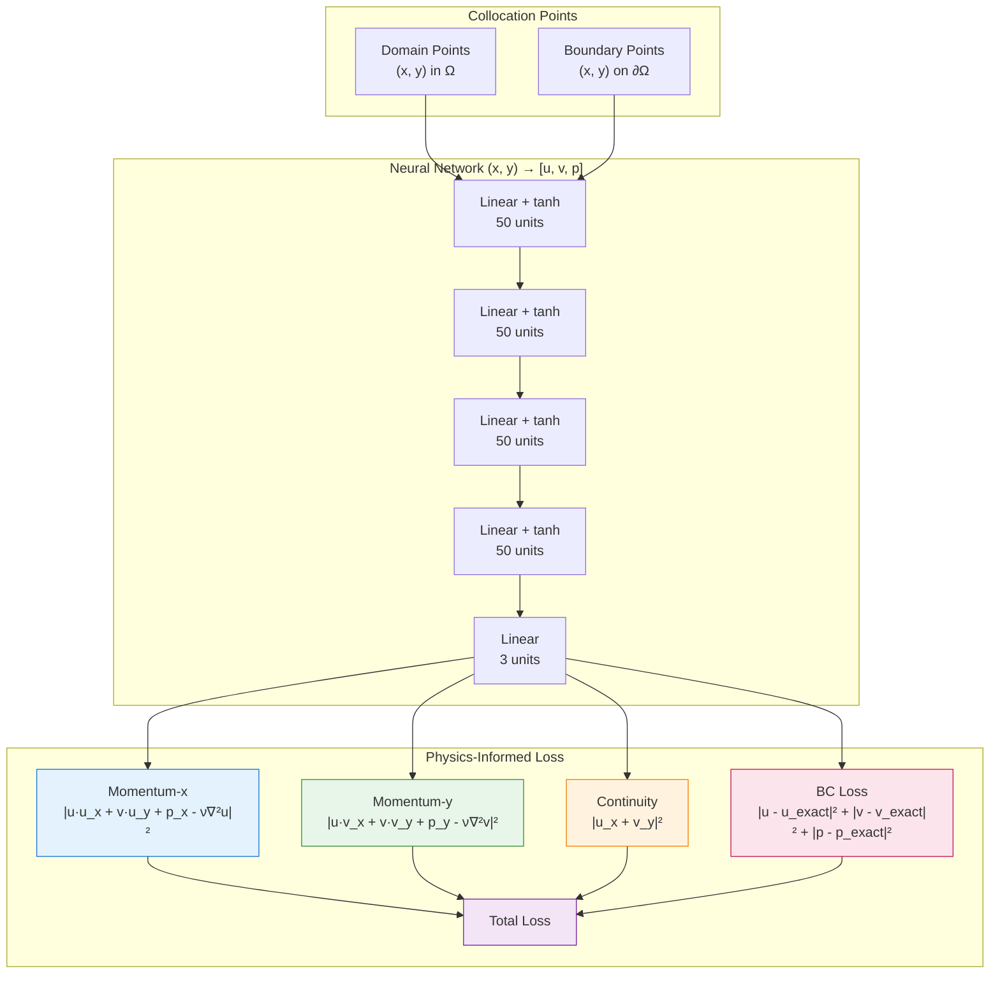
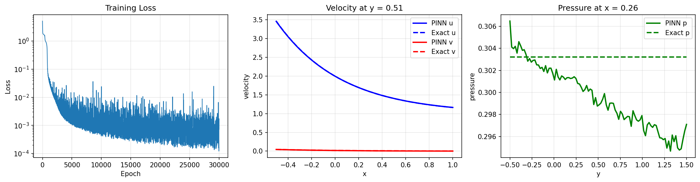

# Navier-Stokes PINN: Kovasznay Flow

| Metadata          | Value                            |
|-------------------|----------------------------------|
| **Level**         | Advanced                         |
| **Runtime**       | ~8 min (GPU) / ~30 min (CPU)     |
| **Prerequisites** | JAX, Flax NNX, fluid mechanics   |
| **Format**        | Python + Jupyter                 |
| **Memory**        | ~1 GB RAM                        |

## Overview

This tutorial demonstrates solving the 2D steady incompressible Navier-Stokes
equations using a Physics-Informed Neural Network (PINN). The Kovasznay flow
is an exact analytical solution to Navier-Stokes, making it an ideal benchmark
for validating numerical methods.

The Navier-Stokes equations describe the motion of viscous fluids and are
fundamental to computational fluid dynamics. PINNs can solve these equations
without mesh generation or explicit discretization, learning the velocity
and pressure fields directly from the governing physics.

## What You'll Learn

1. **Implement** a PINN for coupled multi-output PDEs (u, v, p)
2. **Compute** mixed derivatives using JAX Jacobian and Hessian
3. **Enforce** continuity and momentum equations simultaneously
4. **Validate** against analytical Kovasznay flow solution
5. **Visualize** velocity vector fields and pressure distributions

## Coming from DeepXDE?

If you are familiar with the DeepXDE library:

| DeepXDE                                     | Opifex (JAX)                                        |
|---------------------------------------------|-----------------------------------------------------|
| `dde.geometry.Rectangle(xmin, xmax)`        | `jax.random.uniform(key, (N, 2))` for (x, y)        |
| `dde.grad.jacobian(u, x, i=0, j=0)`         | `jax.jacobian(uvp_fn)(xy)[0, 0]` for u_x            |
| `dde.grad.hessian(u, x, component=0, i=0)`  | `jax.hessian(u_fn)(xy)[0, 0]` for u_xx              |
| `dde.nn.FNN([2]+[50]*4+[3], "tanh")`        | Custom `NavierStokesPINN` with nnx.Linear           |
| `model.compile("adam", lr=1e-3)`            | `nnx.Optimizer(pinn, optax.adam(lr), wrt=nnx.Param)`|
| `model.train(iterations=30000)`             | Custom training loop with `@nnx.jit`                |

**Key differences:**

1. **Multi-output**: Network outputs [u, v, p] as a single 3-channel tensor
2. **Jacobian-based**: Use `jax.jacobian` for efficient first derivatives of all outputs
3. **Coupled PDEs**: Momentum and continuity equations share the network output
4. **No L-BFGS**: This example uses Adam only; add L-BFGS for better convergence

## Files

- **Python Script**: [`examples/pinns/navier_stokes.py`](https://github.com/Opifex/Opifex/blob/main/examples/pinns/navier_stokes.py)
- **Jupyter Notebook**: [`examples/pinns/navier_stokes.ipynb`](https://github.com/Opifex/Opifex/blob/main/examples/pinns/navier_stokes.ipynb)

## Quick Start

### Run the Python Script

```bash
source activate.sh && python examples/pinns/navier_stokes.py
```

### Run the Jupyter Notebook

```bash
jupyter lab examples/pinns/navier_stokes.ipynb
```

## Core Concepts

### Navier-Stokes Equations

The 2D steady incompressible Navier-Stokes equations consist of momentum and continuity:

**Momentum (x-direction):**
$$u \frac{\partial u}{\partial x} + v \frac{\partial u}{\partial y} = -\frac{\partial p}{\partial x} + \frac{1}{Re}\left(\frac{\partial^2 u}{\partial x^2} + \frac{\partial^2 u}{\partial y^2}\right)$$

**Momentum (y-direction):**
$$u \frac{\partial v}{\partial x} + v \frac{\partial v}{\partial y} = -\frac{\partial p}{\partial y} + \frac{1}{Re}\left(\frac{\partial^2 v}{\partial x^2} + \frac{\partial^2 v}{\partial y^2}\right)$$

**Continuity:**
$$\frac{\partial u}{\partial x} + \frac{\partial v}{\partial y} = 0$$

### Kovasznay Flow

The Kovasznay flow is an exact solution with Re = 20:

| Component | Formula |
|-----------|---------|
| x-velocity | $u = 1 - e^{\lambda x} \cos(2\pi y)$ |
| y-velocity | $v = \frac{\lambda}{2\pi} e^{\lambda x} \sin(2\pi y)$ |
| Pressure | $p = \frac{1}{2}(1 - e^{2\lambda x})$ |
| Lambda | $\lambda = \frac{1}{2\nu} - \sqrt{\frac{1}{4\nu^2} + 4\pi^2}$ |

Where $\nu = 1/Re = 0.05$ is the kinematic viscosity.

### PINN Architecture



## Implementation

### Step 1: Imports and Configuration

```python
import jax
import jax.numpy as jnp
import optax
from flax import nnx
```

**Terminal Output:**

```text
======================================================================
Opifex Example: Navier-Stokes PINN (Kovasznay Flow)
======================================================================
JAX backend: gpu
JAX devices: [CudaDevice(id=0)]
Reynolds number: Re = 20
Domain: x in [-0.5, 1.0], y in [-0.5, 1.5]
Collocation: 2601 domain, 400 boundary
Network: [2] + [50, 50, 50, 50] + [3]
Training: 30000 epochs @ lr=0.001
```

### Step 2: Define Analytical Solution

```python
RE = 20
NU = 1.0 / RE
LAMBDA = 1.0 / (2.0 * NU) - jnp.sqrt(1.0 / (4.0 * NU**2) + 4.0 * jnp.pi**2)

def u_exact(xy):
    x, y = xy[:, 0], xy[:, 1]
    return 1.0 - jnp.exp(LAMBDA * x) * jnp.cos(2.0 * jnp.pi * y)

def v_exact(xy):
    x, y = xy[:, 0], xy[:, 1]
    return LAMBDA / (2.0 * jnp.pi) * jnp.exp(LAMBDA * x) * jnp.sin(2.0 * jnp.pi * y)

def p_exact(xy):
    x = xy[:, 0]
    return 0.5 * (1.0 - jnp.exp(2.0 * LAMBDA * x))
```

**Terminal Output:**

```text
Kovasznay Flow: Steady 2D incompressible Navier-Stokes
  Lambda = -1.810099
  u(x,y) = 1 - exp(lambda*x) * cos(2*pi*y)
  v(x,y) = (lambda/2*pi) * exp(lambda*x) * sin(2*pi*y)
  p(x,y) = 0.5 * (1 - exp(2*lambda*x))
```

### Step 3: Create the PINN

```python
class NavierStokesPINN(nnx.Module):
    def __init__(self, hidden_dims: list[int], *, rngs: nnx.Rngs):
        layers = []
        in_features = 2  # (x, y)

        for hidden_dim in hidden_dims:
            layers.append(nnx.Linear(in_features, hidden_dim, rngs=rngs))
            in_features = hidden_dim

        layers.append(nnx.Linear(in_features, 3, rngs=rngs))  # [u, v, p]
        self.layers = nnx.List(layers)

    def __call__(self, xy):
        h = xy
        for layer in self.layers[:-1]:
            h = jnp.tanh(layer(h))
        return self.layers[-1](h)

pinn = NavierStokesPINN(hidden_dims=[50, 50, 50, 50], rngs=nnx.Rngs(42))
```

**Terminal Output:**

```text
Creating PINN model...
PINN parameters: 7,953
```

### Step 4: Compute PDE Residuals

```python
def compute_pde_residuals(pinn, xy):
    def uvp_scalar(xy_single):
        return pinn(xy_single.reshape(1, 2)).squeeze()

    def residuals_single(xy_single):
        uvp = uvp_scalar(xy_single)
        u, v = uvp[0], uvp[1]

        # First derivatives via Jacobian
        jac = jax.jacobian(uvp_scalar)(xy_single)
        u_x, u_y = jac[0, 0], jac[0, 1]
        v_x, v_y = jac[1, 0], jac[1, 1]
        p_x, p_y = jac[2, 0], jac[2, 1]

        # Second derivatives (Hessian diagonals)
        hess_u = jax.hessian(lambda xy: uvp_scalar(xy)[0])(xy_single)
        hess_v = jax.hessian(lambda xy: uvp_scalar(xy)[1])(xy_single)

        u_xx, u_yy = hess_u[0, 0], hess_u[1, 1]
        v_xx, v_yy = hess_v[0, 0], hess_v[1, 1]

        # Momentum equations
        momentum_x = u * u_x + v * u_y + p_x - (1/RE) * (u_xx + u_yy)
        momentum_y = u * v_x + v * v_y + p_y - (1/RE) * (v_xx + v_yy)

        # Continuity
        continuity = u_x + v_y

        return jnp.array([momentum_x, momentum_y, continuity])

    return jax.vmap(residuals_single)(xy)
```

### Step 5: Training

**Terminal Output:**

```text
Training PINN...
  Epoch     1/30000: loss=5.135920e+00
  Epoch  5000/30000: loss=1.756912e-03
  Epoch 10000/30000: loss=4.721234e-04
  Epoch 15000/30000: loss=1.124221e-03
  Epoch 20000/30000: loss=2.046824e-03
  Epoch 25000/30000: loss=1.094199e-03
  Epoch 30000/30000: loss=7.266006e-04
Final loss: 7.266006e-04
```

### Step 6: Evaluation

**Terminal Output:**

```text
Evaluating PINN...
L2 relative error (u): 4.457689e-03
L2 relative error (v): 1.126896e-02
L2 relative error (p): 6.496343e-02
Mean PDE residual:     8.192191e-03
```

### Visualization

#### Solution Fields and Errors


#### Training and Cross-Sections



## Results Summary

| Metric              | Value       |
|---------------------|-------------|
| Final Loss          | 7.27e-04    |
| L2 Error (u)        | 0.45%       |
| L2 Error (v)        | 1.13%       |
| L2 Error (p)        | 6.50%       |
| Mean PDE Residual   | 8.19e-03    |
| Parameters          | 7,953       |
| Training Epochs     | 30,000      |

## Next Steps

### Experiments to Try

1. **Add L-BFGS**: Use `optax.lbfgs` for second-order refinement
2. **Higher Re**: Try Re = 100 or 400 for more challenging flows
3. **More epochs**: Train for 50,000+ epochs for better pressure accuracy
4. **Deeper network**: Try `hidden_dims=[100, 100, 100, 100, 100]`
5. **Loss weighting**: Balance momentum vs continuity losses

### Related Examples

| Example                                   | Level        | What You'll Learn              |
|-------------------------------------------|--------------|--------------------------------|
| [Poisson Equation](poisson.md)            | Intermediate | Simpler elliptic PDE           |
| [Burgers Equation](burgers.md)            | Intermediate | Nonlinear convection           |
| [FNO on Darcy Flow](../neural-operators/fno-darcy.md) | Intermediate | Data-driven alternative |
| [PINO on Burgers](../neural-operators/pino-burgers.md) | Advanced | Hybrid approach |

### API Reference

- [`nnx.Linear`](https://flax.readthedocs.io/en/latest/api_reference/flax.nnx/nn/linear.html) - Linear layer
- [`nnx.Optimizer`](https://flax.readthedocs.io/en/latest/api_reference/flax.nnx/training/optimizer.html) - Optimizer wrapper
- [`jax.jacobian`](https://jax.readthedocs.io/en/latest/_autosummary/jax.jacobian.html) - Jacobian computation
- [`jax.hessian`](https://jax.readthedocs.io/en/latest/_autosummary/jax.hessian.html) - Hessian computation

## Troubleshooting

### Pressure error much higher than velocity

**Symptom**: L2 error in p is 5-10x higher than u, v errors.

**Cause**: Pressure is determined only indirectly through momentum gradients.

**Solution**: Add pressure reference point constraint or increase BC weighting:

```python
# Fix pressure at a point (e.g., outflow corner)
def pressure_reference_loss(pinn):
    ref_point = jnp.array([[X_MAX, Y_MIN]])
    p_pred = pinn(ref_point)[0, 2]
    p_exact_val = p_exact(ref_point)[0]
    return (p_pred - p_exact_val) ** 2
```

### Loss oscillates without converging

**Symptom**: Loss fluctuates around a value without steady decrease.

**Cause**: Adam stuck in saddle point or local minimum.

**Solution**: Add learning rate scheduling or use L-BFGS refinement:

```python
# Learning rate schedule
schedule = optax.exponential_decay(
    init_value=1e-3,
    transition_steps=10000,
    decay_rate=0.5
)
opt = nnx.Optimizer(pinn, optax.adam(schedule), wrt=nnx.Param)
```

### Continuity not satisfied

**Symptom**: Large continuity residual even with small momentum residual.

**Cause**: Network not enforcing divergence-free constraint.

**Solution**: Increase continuity loss weight or use stream function formulation:

```python
# Higher weight for continuity
def total_loss(pinn, xy_dom, xy_bc, u_bc, v_bc, p_bc):
    mom_x, mom_y, cont = compute_pde_residuals(pinn, xy_dom)
    loss_pde = jnp.mean(mom_x**2) + jnp.mean(mom_y**2) + 10.0 * jnp.mean(cont**2)
    # ... boundary loss
    return loss_pde + loss_bc
```

### Slow training

**Symptom**: Each epoch takes >1 second on GPU.

**Cause**: Hessian computation is expensive for multi-output networks.

**Solution**: Enable gradient checkpointing via `TrainingConfig`, or split Hessian computation:

```python
# Gradient checkpointing for memory efficiency
config = TrainingConfig(gradient_checkpointing=True, gradient_checkpoint_policy="dots_saveable")
```
