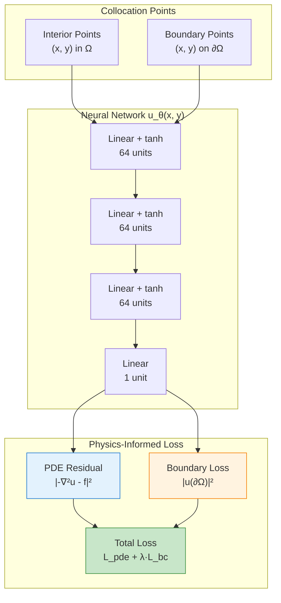
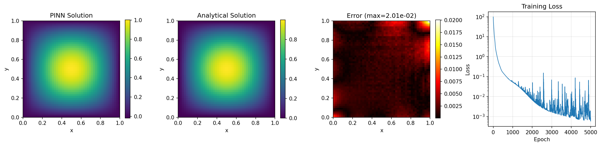

# Poisson Equation PINN

| Metadata          | Value                           |
|-------------------|---------------------------------|
| **Level**         | Intermediate                    |
| **Runtime**       | ~2 min (CPU) / ~30s (GPU)       |
| **Prerequisites** | JAX, Flax NNX, calculus basics  |
| **Format**        | Python + Jupyter                |
| **Memory**        | ~500 MB RAM                     |

## Overview

This tutorial demonstrates solving the 2D Poisson equation using a Physics-Informed
Neural Network (PINN). The Poisson equation is fundamental to electrostatics,
heat conduction, and potential flow theory.

Unlike data-driven neural operators (FNO, DeepONet), PINNs embed the governing
PDE directly into the loss function, requiring no simulation data. The network
learns to satisfy both the PDE residual and boundary conditions simultaneously.

## What You'll Learn

1. **Implement** a PINN architecture for elliptic PDEs
2. **Compute** PDE residuals using JAX automatic differentiation (Hessian)
3. **Generate** interior and boundary collocation points
4. **Balance** physics loss and boundary loss with weighting
5. **Validate** against known analytical solutions

## Coming from DeepXDE?

If you are familiar with the DeepXDE library:

| DeepXDE                                     | Opifex (JAX)                                        |
|---------------------------------------------|-----------------------------------------------------|
| `dde.geometry.Rectangle([0,0], [1,1])`      | `jax.random.uniform(key, (N, 2))` for interior      |
| `dde.grad.hessian(y, x)`                    | `jax.hessian(u_fn)(xy)` + `jnp.trace()`             |
| `dde.icbc.DirichletBC(geom, func, boundary)`| Manual boundary sampling + loss term                |
| `dde.data.PDE(geom, pde, bc, num_domain, num_boundary)` | Explicit collocation arrays        |
| `model.compile("adam", lr=1e-3)`            | `nnx.Optimizer(pinn, optax.adam(lr), wrt=nnx.Param)`|
| `model.train(iterations=10000)`             | Custom training loop with `@nnx.jit`                |

**Key differences:**

1. **Pure JAX autodiff**: Use `jax.hessian` directly instead of custom gradient APIs
2. **Explicit collocation**: Collocation points are simple JAX arrays, not data objects
3. **Manual loss balancing**: Explicit control over loss weights (`lambda_bc`)
4. **JIT compilation**: Entire training step is XLA-compiled for GPU acceleration

## Files

- **Python Script**: [`examples/pinns/poisson.py`](https://github.com/Opifex/Opifex/blob/main/examples/pinns/poisson.py)
- **Jupyter Notebook**: [`examples/pinns/poisson.ipynb`](https://github.com/Opifex/Opifex/blob/main/examples/pinns/poisson.ipynb)

## Quick Start

### Run the Python Script

```bash
source activate.sh && python examples/pinns/poisson.py
```

### Run the Jupyter Notebook

```bash
jupyter lab examples/pinns/poisson.ipynb
```

## Core Concepts

### PINN Architecture

PINNs solve PDEs by training a neural network to minimize physics residuals:



### Poisson Equation

The Poisson equation is a fundamental elliptic PDE:

$$-\nabla^2 u = f(x, y)$$

where $\nabla^2 = \frac{\partial^2}{\partial x^2} + \frac{\partial^2}{\partial y^2}$ is the Laplacian.

| Component | This Example |
|-----------|-------------|
| Domain | $[0,1] \times [0,1]$ unit square |
| Source term | $f(x,y) = 2\pi^2 \sin(\pi x) \sin(\pi y)$ |
| Boundary | Dirichlet: $u = 0$ on $\partial\Omega$ |
| Analytical solution | $u(x,y) = \sin(\pi x) \sin(\pi y)$ |

### Computing the Laplacian

The Laplacian is computed using JAX's Hessian and trace:

```python
def compute_laplacian(pinn, xy):
    def u_scalar(xy_single):
        return pinn(xy_single.reshape(1, 2)).squeeze()

    def laplacian_single(xy_single):
        hessian = jax.hessian(u_scalar)(xy_single)
        return jnp.trace(hessian)  # ∇²u = tr(H)

    return jax.vmap(laplacian_single)(xy)
```

## Implementation

### Step 1: Imports and Setup

```python
import jax
import jax.numpy as jnp
import optax
from flax import nnx
```

**Terminal Output:**

```text
======================================================================
Opifex Example: Poisson Equation PINN
======================================================================
JAX backend: gpu
JAX devices: [CudaDevice(id=0)]
Interior points: 2000, Boundary points: 500
Epochs: 5000, Learning rate: 0.001
Network: [64, 64, 64]
```

### Step 2: Define the Problem

```python
def source_term(x, y):
    """Source term f(x, y) for the Poisson equation."""
    return 2.0 * jnp.pi**2 * jnp.sin(jnp.pi * x) * jnp.sin(jnp.pi * y)

def analytical_solution(x, y):
    """Analytical solution u(x, y)."""
    return jnp.sin(jnp.pi * x) * jnp.sin(jnp.pi * y)
```

**Terminal Output:**

```text
Problem: -∇²u = f(x,y) on [0,1]²
Source term: f(x,y) = 2π² sin(πx) sin(πy)
Boundary: u = 0 (Dirichlet)
Analytical solution: u(x,y) = sin(πx) sin(πy)
```

### Step 3: Create the PINN

```python
class PoissonPINN(nnx.Module):
    def __init__(self, hidden_dims: list[int], *, rngs: nnx.Rngs):
        layers = []
        in_features = 2  # (x, y)
        for hidden_dim in hidden_dims:
            layers.append(nnx.Linear(in_features, hidden_dim, rngs=rngs))
            in_features = hidden_dim
        layers.append(nnx.Linear(in_features, 1, rngs=rngs))
        self.layers = nnx.List(layers)

    def __call__(self, xy: jax.Array) -> jax.Array:
        h = xy
        for layer in self.layers[:-1]:
            h = jnp.tanh(layer(h))
        return self.layers[-1](h)

pinn = PoissonPINN(hidden_dims=[64, 64, 64], rngs=nnx.Rngs(42))
```

**Terminal Output:**

```text
Creating PINN model...
PINN parameters: 8,577
```

### Step 4: Generate Collocation Points

```python
# Interior points
x_interior = jax.random.uniform(key, (N_INTERIOR, 2))

# Boundary points (sample all 4 edges)
bottom = jnp.column_stack([jax.random.uniform(key, (n,)), jnp.zeros(n)])
top = jnp.column_stack([jax.random.uniform(key, (n,)), jnp.ones(n)])
left = jnp.column_stack([jnp.zeros(n), jax.random.uniform(key, (n,))])
right = jnp.column_stack([jnp.ones(n), jax.random.uniform(key, (n,))])
x_boundary = jnp.concatenate([bottom, top, left, right], axis=0)
```

**Terminal Output:**

```text
Generating collocation points...
Interior points: (2000, 2)
Boundary points: (500, 2)
```

### Step 5: Define Physics-Informed Loss

```python
def total_loss(pinn, x_int, x_bc, lambda_bc=10.0):
    loss_pde = pde_residual_loss(pinn, x_int)
    loss_bc = boundary_loss(pinn, x_bc)
    return loss_pde + lambda_bc * loss_bc
```

### Step 6: Training

**Terminal Output:**

```text
Training PINN...
  Epoch     1/5000: loss=9.788428e+01
  Epoch  1000/5000: loss=5.333988e-02
  Epoch  2000/5000: loss=6.953341e-03
  Epoch  3000/5000: loss=3.755849e-03
  Epoch  4000/5000: loss=4.713943e-03
  Epoch  5000/5000: loss=6.020937e-04
Final loss: 6.020937e-04
```

### Step 7: Evaluation

**Terminal Output:**

```text
Evaluating PINN...
Relative L2 error:   4.711105e-03
Maximum point error: 2.005570e-02
Mean point error:    1.674831e-03
```

### Visualization

#### Solution Comparison



#### Cross-Sections


## Results Summary

| Metric              | Value       |
|---------------------|-------------|
| Final Loss          | 6.02e-04    |
| Relative L2 Error   | 0.47%       |
| Maximum Point Error | 2.01e-02    |
| Mean Point Error    | 1.67e-03    |
| Parameters          | 8,577       |
| Training Epochs     | 5,000       |

## Next Steps

### Experiments to Try

1. **Increase epochs**: Train for 10,000+ epochs to reduce error below 0.1%
2. **Larger network**: Try `hidden_dims=[128, 128, 128, 128]` for higher accuracy
3. **More collocation points**: Use 10,000 interior points for better coverage
4. **Adaptive sampling**: Concentrate points where error is high (residual-based)
5. **Different BCs**: Try Neumann or mixed boundary conditions

### Related Examples

| Example                                   | Level        | What You'll Learn              |
|-------------------------------------------|--------------|--------------------------------|
| [Heat Equation PINN](heat-equation.md)    | Intermediate | Time-dependent PDEs            |
| [FNO on Darcy Flow](../neural-operators/fno-darcy.md) | Intermediate | Data-driven alternative |
| [Domain Decomposition](../../methods/domain-decomposition-pinns.md) | Advanced | Large domain problems |

### API Reference

- [`nnx.Linear`](https://flax.readthedocs.io/en/latest/api_reference/flax.nnx/nn/linear.html) - Linear layer
- [`nnx.Optimizer`](https://flax.readthedocs.io/en/latest/api_reference/flax.nnx/training/optimizer.html) - Optimizer wrapper
- [`jax.hessian`](https://jax.readthedocs.io/en/latest/_autosummary/jax.hessian.html) - Hessian computation
- [`jax.vmap`](https://jax.readthedocs.io/en/latest/_autosummary/jax.vmap.html) - Vectorized mapping

## Troubleshooting

### Loss not decreasing

**Symptom**: Training loss stays flat or decreases very slowly.

**Cause**: Learning rate too low, or boundary loss weight too high/low.

**Solution**: Adjust learning rate and boundary weight:

```python
# Try higher learning rate initially
LEARNING_RATE = 1e-2  # Then decay

# Adjust boundary weight
lambda_bc = 1.0  # Lower if boundary dominates
lambda_bc = 100.0  # Higher if solution doesn't satisfy BCs
```

### PINN predicts constant zero

**Symptom**: All predictions are approximately zero.

**Cause**: Boundary loss dominates (trivial solution satisfies u=0 everywhere).

**Solution**: The source term f(x,y) must create a non-trivial solution. Verify:

```python
# Check source term is non-zero
f_values = source_term(x_interior[:, 0], x_interior[:, 1])
print(f"Source term range: [{f_values.min()}, {f_values.max()}]")
```

### Slow convergence

**Symptom**: Need many epochs (>100,000) to converge.

**Cause**: Network architecture not suited for the solution smoothness.

**Solution**: Use tanh activation (smooth) for smooth solutions, increase network depth:

```python
# Deeper network for complex solutions
hidden_dims = [64, 64, 64, 64]

# Use tanh for smooth PDEs
h = jnp.tanh(layer(h))  # Not ReLU
```

### Memory error with many collocation points

**Symptom**: OOM error when increasing `N_INTERIOR`.

**Cause**: Computing Hessian for all points simultaneously.

**Solution**: Use mini-batching in the training loop:

```python
batch_size = 500
for i in range(0, N_INTERIOR, batch_size):
    x_batch = x_interior[i:i+batch_size]
    loss = train_step(pinn, opt, x_batch, x_boundary)
```
