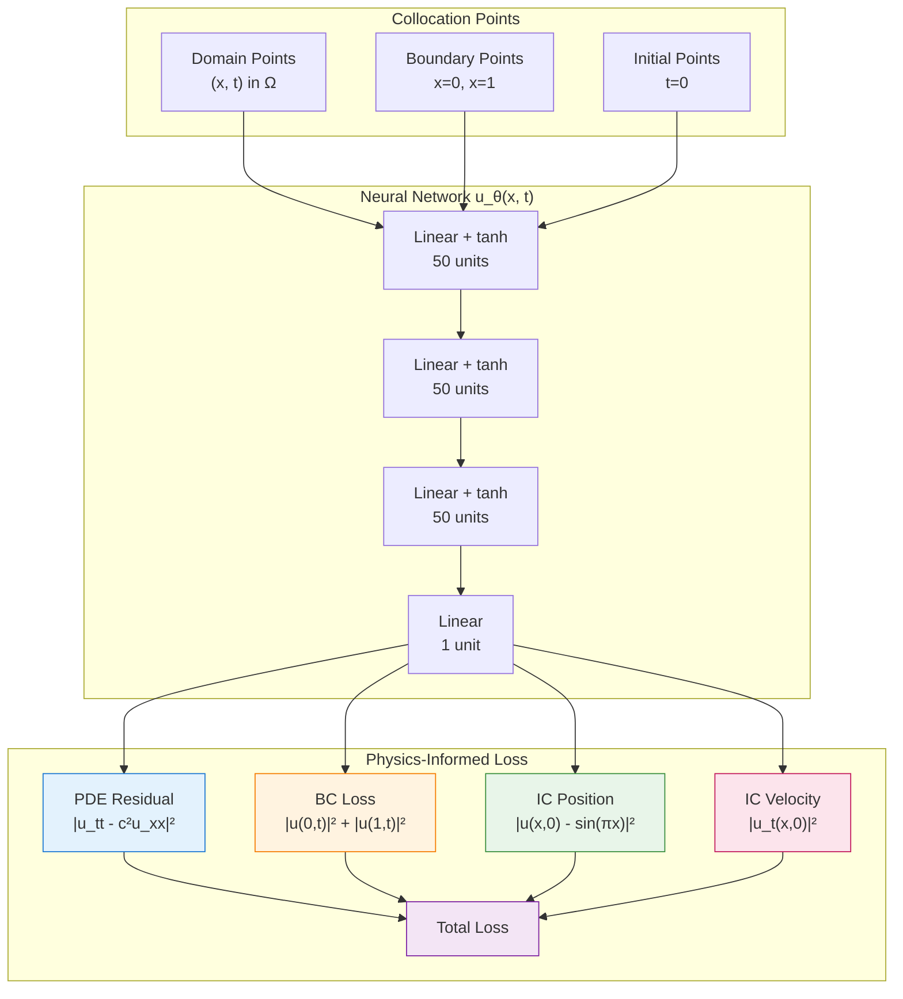
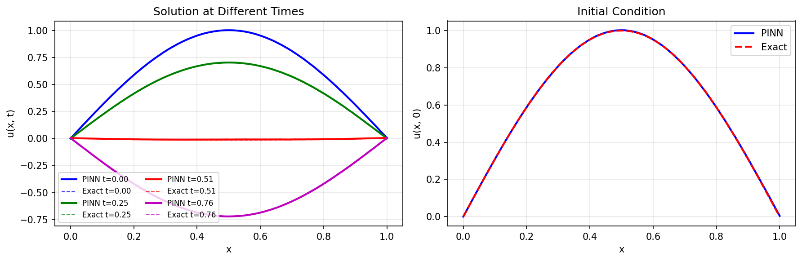

# Wave Equation PINN

| Metadata          | Value                            |
|-------------------|----------------------------------|
| **Level**         | Intermediate                     |
| **Runtime**       | ~3 min (GPU) / ~12 min (CPU)     |
| **Prerequisites** | JAX, Flax NNX, basic calculus    |
| **Format**        | Python + Jupyter                 |
| **Memory**        | ~500 MB RAM                      |

## Overview

This tutorial demonstrates solving the 1D wave equation using a Physics-Informed
Neural Network (PINN). The wave equation describes the propagation of waves in
strings, acoustics, and electromagnetic fields.

The wave equation is a hyperbolic PDE that presents unique challenges for PINNs:
the solution propagates information along characteristic lines, and sharp wave
fronts can be difficult to capture. This example uses a standing wave solution
which is more amenable to neural network approximation.

## What You'll Learn

1. **Implement** a PINN for second-order hyperbolic PDEs
2. **Enforce** initial position AND initial velocity conditions
3. **Compute** second-order time derivatives using JAX Hessian
4. **Validate** against analytical standing wave solution
5. **Visualize** spatiotemporal wave propagation

## Coming from DeepXDE?

If you are familiar with the DeepXDE library:

| DeepXDE                                     | Opifex (JAX)                                        |
|---------------------------------------------|-----------------------------------------------------|
| `dde.geometry.Interval(0, 1)`               | `jax.random.uniform(key, (N,), minval=0, maxval=1)` |
| `dde.geometry.GeometryXTime(geom, timedomain)` | `jnp.column_stack([x, t])` for (x, t)            |
| `dde.grad.hessian(y, x, i=1, j=1)`          | `jax.hessian(u_fn)(xt)[1, 1]` for u_tt             |
| `dde.icbc.IC(geom, func, on_initial)`       | Manual t=0 sampling + loss term                     |
| `dde.icbc.OperatorBC(geom, du_dt, on_initial)` | `jax.grad(u_fn)(xt)[1]` for velocity condition  |
| `model.compile("adam", lr=1e-3)`            | `nnx.Optimizer(pinn, optax.adam(lr), wrt=nnx.Param)`|

**Key differences:**

1. **Unified initial conditions**: Both position and velocity ICs handled as loss terms
2. **Pure JAX autodiff**: Use `jax.hessian` for second derivatives directly
3. **No special networks**: Standard MLP works for standing waves (DeepXDE uses STMsFFN)
4. **No resampling**: Fixed collocation points (add resampling for traveling waves)

## Files

- **Python Script**: [`examples/pinns/wave.py`](https://github.com/Opifex/Opifex/blob/main/examples/pinns/wave.py)
- **Jupyter Notebook**: [`examples/pinns/wave.ipynb`](https://github.com/Opifex/Opifex/blob/main/examples/pinns/wave.ipynb)

## Quick Start

### Run the Python Script

```bash
source activate.sh && python examples/pinns/wave.py
```

### Run the Jupyter Notebook

```bash
jupyter lab examples/pinns/wave.ipynb
```

## Core Concepts

### Wave Equation

The 1D wave equation is a hyperbolic PDE:

$$\frac{\partial^2 u}{\partial t^2} = c^2 \frac{\partial^2 u}{\partial x^2}$$

| Component | This Example |
|-----------|-------------|
| Domain | $x \in [0, 1]$, $t \in [0, 1]$ |
| Wave speed | $c = 1$ |
| Initial position | $u(x, 0) = \sin(\pi x)$ |
| Initial velocity | $\frac{\partial u}{\partial t}(x, 0) = 0$ |
| Boundary conditions | $u(0, t) = u(1, t) = 0$ (fixed ends) |
| Analytical solution | $u(x, t) = \sin(\pi x) \cos(c\pi t)$ |

### Physical Interpretation

- **Standing wave**: The initial condition $\sin(\pi x)$ with zero velocity creates a standing wave
- **Fixed boundaries**: String endpoints are held fixed (Dirichlet conditions)
- **Oscillation**: The solution oscillates in time with frequency $c\pi$

### PINN Loss Components



## Implementation

### Step 1: Imports and Configuration

```python
import jax
import jax.numpy as jnp
import optax
from flax import nnx
```

**Terminal Output:**

```text
======================================================================
Opifex Example: Wave Equation PINN
======================================================================
JAX backend: gpu
JAX devices: [CudaDevice(id=0)]
Wave speed: c = 1.0
Domain: x in [0.0, 1.0], t in [0.0, 1.0]
Collocation: 2000 domain, 200 boundary, 200 initial
Network: [2] + [50, 50, 50] + [1]
Training: 15000 epochs @ lr=0.001
```

### Step 2: Define the Problem

```python
C = 1.0  # Wave speed

def exact_solution(x, t):
    return jnp.sin(jnp.pi * x) * jnp.cos(C * jnp.pi * t)

def initial_condition(x):
    return jnp.sin(jnp.pi * x)
```

**Terminal Output:**

```text
Wave equation: u_tt = c^2 * u_xx
Initial condition: u(x, 0) = sin(pi*x)
Initial velocity: u_t(x, 0) = 0
Boundary conditions: u(0, t) = u(1, t) = 0
Analytical solution: u(x, t) = sin(pi*x) * cos(c*pi*t)
```

### Step 3: Create the PINN

```python
class WavePINN(nnx.Module):
    def __init__(self, hidden_dims: list[int], *, rngs: nnx.Rngs):
        layers = []
        in_features = 2  # (x, t)

        for hidden_dim in hidden_dims:
            layers.append(nnx.Linear(in_features, hidden_dim, rngs=rngs))
            in_features = hidden_dim

        layers.append(nnx.Linear(in_features, 1, rngs=rngs))
        self.layers = nnx.List(layers)

    def __call__(self, xt):
        h = xt
        for layer in self.layers[:-1]:
            h = jnp.tanh(layer(h))
        return self.layers[-1](h)

pinn = WavePINN(hidden_dims=[50, 50, 50], rngs=nnx.Rngs(42))
```

**Terminal Output:**

```text
Creating PINN model...
PINN parameters: 5,301
```

### Step 4: Compute PDE Residual

```python
def compute_pde_residual(pinn, xt):
    def u_scalar(xt_single):
        return pinn(xt_single.reshape(1, 2)).squeeze()

    def residual_single(xt_single):
        hess = jax.hessian(u_scalar)(xt_single)
        u_xx = hess[0, 0]  # d^2u/dx^2
        u_tt = hess[1, 1]  # d^2u/dt^2
        return u_tt - C**2 * u_xx

    return jax.vmap(residual_single)(xt)
```

### Step 5: Training

**Terminal Output:**

```text
Training PINN...
  Epoch     1/15000: loss=4.347104e+00
  Epoch  3000/15000: loss=1.659206e-03
  Epoch  6000/15000: loss=1.217277e-03
  Epoch  9000/15000: loss=8.646434e-04
  Epoch 12000/15000: loss=3.246390e-04
  Epoch 15000/15000: loss=9.056964e-04
Final loss: 9.056964e-04
```

### Step 6: Evaluation

**Terminal Output:**

```text
Evaluating PINN...
Relative L2 error:   8.166147e-03
Maximum point error: 9.041926e-03
Mean point error:    3.580939e-03
Mean PDE residual:   7.680781e-03
```

### Visualization

#### Solution Comparison


#### Time Snapshots



## Results Summary

| Metric              | Value       |
|---------------------|-------------|
| Final Loss          | 9.06e-04    |
| Relative L2 Error   | 0.82%       |
| Maximum Point Error | 9.04e-03    |
| Mean Point Error    | 3.58e-03    |
| Mean PDE Residual   | 7.68e-03    |
| Parameters          | 5,301       |
| Training Epochs     | 15,000      |

## Next Steps

### Experiments to Try

1. **Higher wave speed**: Try $c = 2$ or $c = 5$ (faster oscillations)
2. **Traveling wave**: Change IC to $u(x, 0) = e^{-(x-0.5)^2/0.01}$ Gaussian pulse
3. **Longer time**: Extend $t_{max}$ to observe multiple oscillations
4. **More modes**: Try IC $u(x,0) = \sin(\pi x) + 0.5\sin(2\pi x)$ for superposition
5. **Damped wave**: Add damping term $-\gamma u_t$ to the PDE

### Related Examples

| Example                                   | Level        | What You'll Learn              |
|-------------------------------------------|--------------|--------------------------------|
| [Heat Equation](heat-equation.md)         | Intermediate | Parabolic PDE (diffusion)      |
| [Burgers Equation](burgers.md)            | Intermediate | Nonlinear hyperbolic PDE       |
| [Poisson Equation](poisson.md)            | Intermediate | Elliptic PDE (steady-state)    |
| [Helmholtz Equation](helmholtz.md)        | Advanced     | Wave equation in frequency domain |

### API Reference

- [`nnx.Linear`](https://flax.readthedocs.io/en/latest/api_reference/flax.nnx/nn/linear.html) - Linear layer
- [`nnx.Optimizer`](https://flax.readthedocs.io/en/latest/api_reference/flax.nnx/training/optimizer.html) - Optimizer wrapper
- [`jax.hessian`](https://jax.readthedocs.io/en/latest/_autosummary/jax.hessian.html) - Hessian computation
- [`jax.vmap`](https://jax.readthedocs.io/en/latest/_autosummary/jax.vmap.html) - Vectorized mapping

## Troubleshooting

### Solution doesn't oscillate

**Symptom**: PINN solution decays to zero instead of oscillating.

**Cause**: Initial velocity condition not enforced strongly enough.

**Solution**: Increase the weight on the initial velocity loss:

```python
def total_loss(pinn, xt_dom, xt_bc, xt_ic, u_ic, lambda_ic=20.0):
    loss_pde = pde_loss(pinn, xt_dom)
    loss_bc = boundary_loss(pinn, xt_bc)
    loss_ic = initial_loss(pinn, xt_ic, u_ic)
    loss_vel = initial_velocity_loss(pinn, xt_ic)
    return loss_pde + 10 * loss_bc + lambda_ic * (loss_ic + 2.0 * loss_vel)
```

### High error at later times

**Symptom**: Error grows as $t$ increases.

**Cause**: Wave propagation is poorly captured far from initial conditions.

**Solution**: Use more collocation points or time-stratified sampling:

```python
# Stratify points uniformly across time
t_domain = jnp.linspace(T_MIN, T_MAX, N_DOMAIN)
x_domain = jax.random.uniform(key, (N_DOMAIN,), minval=X_MIN, maxval=X_MAX)
```

### Loss doesn't decrease

**Symptom**: Training loss stays constant or oscillates.

**Cause**: Network unable to satisfy competing constraints simultaneously.

**Solution**: Use adaptive loss weighting:

```python
# Adjust weights based on individual loss magnitudes
loss_pde_val = pde_loss(pinn, xt_domain)
loss_bc_val = boundary_loss(pinn, xt_boundary)
loss_ic_val = initial_loss(pinn, xt_initial, u_initial)

# Normalize to similar magnitudes
weight_bc = loss_pde_val / (loss_bc_val + 1e-8)
weight_ic = loss_pde_val / (loss_ic_val + 1e-8)
```

### Spectral bias issues

**Symptom**: Network captures low-frequency modes but misses high-frequency details.

**Cause**: Neural networks naturally favor low-frequency solutions (spectral bias).

**Solution**: Use Fourier feature encoding:

```python
def fourier_features(xt, scales=[1, 2, 4]):
    features = [xt]
    for s in scales:
        features.append(jnp.sin(2 * jnp.pi * s * xt))
        features.append(jnp.cos(2 * jnp.pi * s * xt))
    return jnp.concatenate(features, axis=-1)
```
