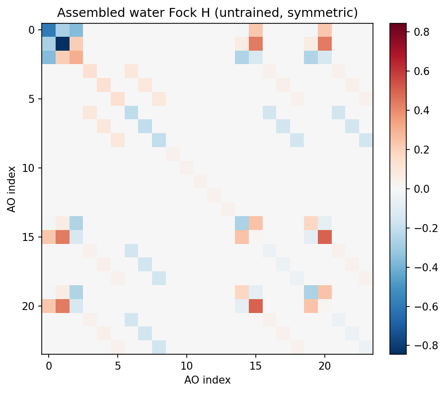

# Equivariant DFT Hamiltonian Prediction (QHNet block form)

| Metadata | Value |
|----------|-------|
| **Level** | Advanced |
| **Runtime** | ~1 min (GPU) |
| **Prerequisites** | JAX, Flax NNX, SE(3)-equivariant networks, DFT/Hartree-Fock |
| **Format** | Python + Jupyter |
| **Memory** | ~2 GB RAM |

## Overview

This example predicts the **dense atomic-orbital DFT/Hartree-Fock Hamiltonian
(Fock) matrix `H`** of a molecule directly from its geometry, with the
QHNet-style `BlockHamiltonianPredictor` (Yu et al. 2023,
[arXiv:2306.04922](https://arxiv.org/abs/2306.04922)). Rather than assembling one
dense matrix per fixed composition, the predictor emits a **fixed `(14, 14)` block
per atom (the on-site diagonal Fock block) and per directed edge (the off-site
off-diagonal block)** in the def2-SVP irrep layout
`BLOCK_IRREPS = 3x0e + 2x1e + 1x2e`. Because the blocks are fixed-size and the
NequIP convolution scatters messages only over within-molecule edges, **any
concatenation of heterogeneous molecules runs through one compiled forward** — the
property that makes batched QH9 training tractable.

The predicted blocks are SE(3)-equivariant *by construction* — rotating the
molecule rotates each block by the real Wigner-D matrix `D_14(R)` of
`BLOCK_IRREPS`, and the assembled dense matrix therefore obeys
`H(R x) = D(R) H(x) D(R)^T`. No ground-truth fit is needed to demonstrate the
structure: this example is a thin, **untrained** demo of the block mechanics.

The example is deliberately **thin** — it composes opifex's committed
electronic-structure stack and changes no library internals:

- `BlockHamiltonianPredictor` (QHNet block form) is the heterogeneous-batchable
  predictor: a NequIP steerable trunk feeds a shared `HamiltonianBlockExpansion`
  head that emits the `(14, 14)` diagonal (per atom) and off-diagonal (per edge)
  blocks.
- `assemble_matrix` masks each block to its element's valid AO slots
  (`block_validity_mask`), scatters it to the per-atom AO offsets, and symmetrizes
  `H = H~ + H~^T` into the dense Fock.
- `wigner_d` assembles the block-diagonal AO rotation for the equivariance check.

## What You'll Learn

1. **Build** the heterogeneous-batchable `BlockHamiltonianPredictor` from the
   library
2. **Run** it on a concatenated batch of two different molecules and read the
   per-atom / per-edge blocks
3. **Confirm** the flat batch reproduces the per-molecule blocks (the segment
   design)
4. **Assemble** a single molecule's symmetric dense Fock with `assemble_matrix`
5. **Verify** the assembled-matrix equivariance `H(R x) = D(R) H(x) D(R)^T`
6. **Visualize** the assembled Fock heatmap and the per-rotation equivariance
   error

## Background: the DFT Hamiltonian as an equivariant operator

Mean-field electronic structure (Hartree-Fock or Kohn-Sham DFT) solves the
generalised eigenvalue problem `H C = S C eps` in an atomic-orbital basis, where
`H` is the Fock/Kohn-Sham matrix, `S` the AO overlap, `C` the molecular-orbital
coefficients, and `eps` the orbital energies. The bottleneck is the
self-consistent-field iteration that converges `H`; predicting the converged `H`
in one shot skips it.

`H` and `S` are not invariant — they are **equivariant operators**. Each AO has a
definite angular momentum `l`, so a rigid rotation `R` of the molecule rotates the
AO components by the Wigner-D matrix `D^l(R)` of their shell. The whole matrix
therefore transforms as `H(R x) = D(R) H(x) D(R)^T`, with `D(R)` block-diagonal
over shells. A model that bakes this law in needs far less data and never has to
learn the symmetry from examples.

opifex builds the predictor from the native equivariant kit in
`opifex.neural.equivariant` (irreps, Clebsch-Gordan tensor products, spherical
harmonics, Bessel radial bases) and the NequIP steerable trunk. See
[Hamiltonian Prediction](../../methods/hamiltonian-prediction.md) for the
block-assembly design.

## Building the predictor

`BlockHamiltonianPredictor` carries steerable hidden features up to `l = 2` (so
the trunk can represent every degree the `s`/`p`/`d` blocks reach: `0e`, `1e`,
`2e`), two NequIP convolution layers, an 8-function Bessel radial basis, and a
generous cutoff so the small molecules form a complete within-molecule graph. No
weights are trained — the equivariance is structural and holds for any weights:

```python
from flax import nnx
from opifex.neural.quantum.hamiltonian import (
    BlockHamiltonianConfig, BlockHamiltonianPredictor,
)

predictor = BlockHamiltonianPredictor(
    config=BlockHamiltonianConfig(
        hidden_irreps="32x0e + 16x1o + 8x2e",
        sh_lmax=2,
        num_interactions=2,
        num_radial_basis=8,
        cutoff=20.0,           # Bohr; large enough that the molecule is a complete graph
    ),
    rngs=nnx.Rngs(0),
)
```

## Running a heterogeneous batch

The predictor consumes a flat concatenated batch: `(A,)` atomic numbers, `(A, 3)`
positions (Bohr) and a `(2, E)` within-molecule directed `(senders, receivers)`
edge index, offset per molecule so edges never cross boundaries. Water (`O, H, H`)
and a methane-like (`C, H, H, H, H`) fragment concatenate into one batch:

```python
batch_out = predictor(batch_atomic_numbers, batch_positions, batch_edge_index)
# batch_out["diagonal_blocks"]:     (8, 14, 14)  — one block per atom
# batch_out["off_diagonal_blocks"]: (26, 14, 14) — one block per directed edge
```

The segment design must give *exactly* the per-molecule blocks when the molecules
are run alone — the flat-batch blocks match the per-molecule blocks to float
round-off (`<= 6e-17`), so concatenation leaks no information across molecule
boundaries.

## Assembling the dense Fock

`assemble_matrix` masks each `(14, 14)` block to its element's valid AO slots
(hydrogen keeps `2s + 1p`, C/N/O/F all 14), scatters it to the per-atom AO
offsets, writes off-diagonal blocks at both `(i, j)` and `(j, i)`, and symmetrizes
`H = H~ + H~^T`. Water (`O` 14 + `H` 5 + `H` 5) gives a symmetric `(24, 24)`
matrix:

```python
matrix = predictor.assemble_matrix(
    water_out["diagonal_blocks"], water_out["off_diagonal_blocks"],
    water_atomic_numbers, water_edge_index,
)   # (24, 24), max |H - H^T| = 0
```

## Equivariance check

The defining property: under a random proper rotation `R` the assembled dense
matrix transforms as `H(R x) = D(R) H(x) D(R)^T`, where `D(R)` is block-diagonal
over atoms — each atom's block is the `(14, 14)` Wigner-D `D_14(R)` of
`BLOCK_IRREPS` restricted to that atom's populated AO slots (whole shells, so the
restriction is exact):

```python
import jax
from opifex.geometry.algebra.wigner import wigner_d

def block_wigner(rotation):
    matrices = []
    for mul, irrep in BLOCK_IRREPS.blocks:
        matrices.extend([wigner_d(irrep.l, rotation)] * mul)
    return jax.scipy.linalg.block_diag(*matrices)
```

The full AO rotation restricts `block_wigner` to each atom's valid slots and
stacks them block-diagonally. This holds for *any* weights, so the untrained
predictor already satisfies it to matmul precision.

## Results

A single GPU run of this example (untrained predictor, `float64`, ~30 s on one
RTX 4090). The block mechanics are exact up to floating-point round-off.

| Quantity | Value |
|----------|------:|
| Diagonal-block asymmetry (forward `D + D^T`) | **0.00e+00** |
| Flat-batch vs per-molecule diagonal blocks   | **5.55e-17** |
| Flat-batch vs per-molecule off-diagonal blocks | **6.94e-18** |
| Assembled water Fock symmetry `max \|H - H^T\|` | **0.00e+00** |

The flat heterogeneous batch reproduces the per-molecule blocks to floating-point
round-off, and the assembled `(24, 24)` Fock is exactly symmetric.

### Assembled-matrix SE(3) equivariance

Across five random rotations the worst-case residual
`max |H(R x) - D(R) H(x) D(R)^T|` is **5.55e-16** — at `float64` precision,
confirming the equivariance is exact up to numerical round-off and holds for the
untrained weights:

| Random rotation | 0 | 1 | 2 | 3 | 4 |
|-----------------|----:|----:|----:|----:|----:|
| Equivariance error | 2.22e-16 | 3.33e-16 | 3.33e-16 | 3.33e-16 | 5.55e-16 |

### Assembled Fock matrix



The assembled matrix is exactly symmetric; the masked hydrogen blocks (`2s + 1p`)
appear as the smaller diagonal sub-blocks beside the full 14-slot oxygen block.

### Equivariance error per rotation


## Training against QH9

This example shows the block *mechanics* with an untrained predictor. To **train**
the predictor against the QH9 benchmark — the converged B3LYP/def2-SVP Fock
matrices for the QM9 molecules — run:

```bash
uv run python scripts/train_qh9_blocks.py
```

It streams QH9-Stable through the block-form data pipeline
(`opifex.data.sources.qh9_blocks` / `qh9_block_stream`), cuts each Fock matrix
into the per-atom / per-edge blocks the predictor emits, and minimises the masked
block loss (`qh9_block_loss`, `make_block_train_step`).

## Running the example

```bash
uv run python examples/quantum-chemistry/hamiltonian_prediction.py
```

No external download is required (the molecules are defined inline).

## Key takeaways

- The block-form predictor is a **thin composition** of the opifex
  electronic-structure stack: predictor → flat batch → per-atom/per-edge blocks →
  `assemble_matrix`.
- **Heterogeneous molecules concatenate into one compiled forward** — the
  fixed-size `(14, 14)` blocks and within-molecule edge scatter mean any batch of
  mixed compositions runs without per-composition recompile, and the batch blocks
  reproduce the per-molecule blocks exactly.
- **Equivariance is structural, not learned** — `H(R x) = D(R) H(x) D(R)^T` holds
  to matmul precision for *any* weights, because each block is a Clebsch-Gordan
  (Wigner-Eckart) contraction of a steerable feature and the matrix is symmetrized
  `H = H~ + H~^T`.
- **The block form is the QH9 training target** — `scripts/train_qh9_blocks.py`
  fits the predictor to the def2-SVP Fock benchmark through the block-form data
  pipeline and masked block loss.

## See also

- [Hamiltonian Prediction](../../methods/hamiltonian-prediction.md) — the
  block-assembly design (`HamiltonianBlockExpansion`, per-atom/per-edge blocks,
  masking, symmetrization), trunk reuse, QH9 training, and how to extend (overlap
  `S`, QHNetV2 SO(2) frame).
- [Atomistic Potentials](../../methods/atomistic-potentials.md) — the NequIP
  steerable trunk the predictor reuses.
- Yu et al. 2023, *Efficient and Equivariant Graph Networks for Predicting
  Quantum Hamiltonian* (QHNet), ICML 2023
  ([arXiv:2306.04922](https://arxiv.org/abs/2306.04922)).
- Yu et al. 2025, *QHNetV2: A Fully Equivariant Network for Quantum Hamiltonian
  Prediction* ([arXiv:2506.09398](https://arxiv.org/abs/2506.09398)).
- Unke et al. 2021, *SE(3)-equivariant prediction of molecular wavefunctions and
  electronic densities* (PhiSNet), NeurIPS 2021
  ([arXiv:2106.02347](https://arxiv.org/abs/2106.02347)).
- Yu et al. 2023, *QH9: A Quantum Hamiltonian Prediction Benchmark for QM9
  Molecules*, NeurIPS 2023
  ([arXiv:2306.09549](https://arxiv.org/abs/2306.09549)).
