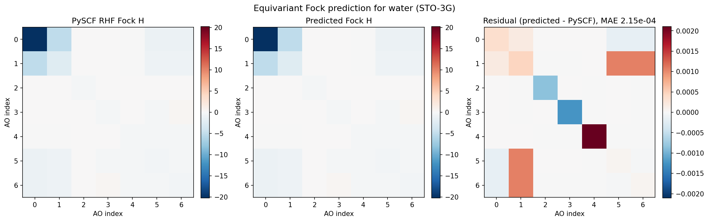
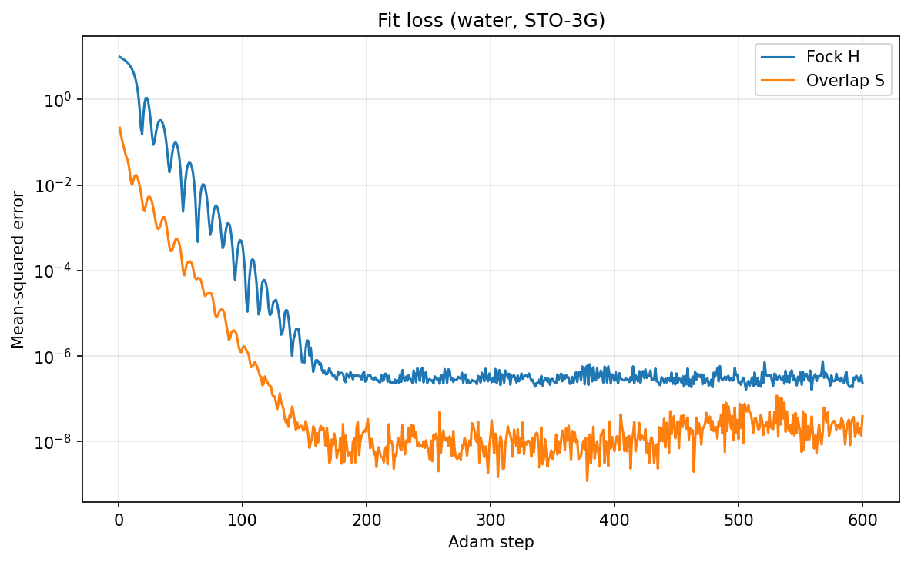
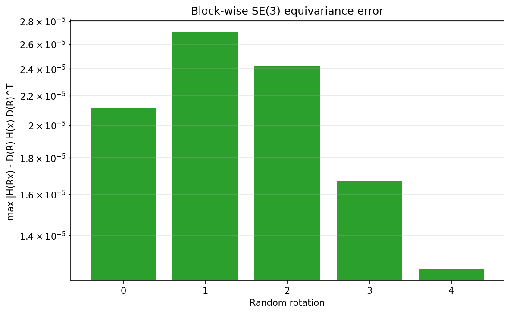

# Equivariant DFT Hamiltonian Prediction (QHNet-style)

| Metadata | Value |
|----------|-------|
| **Level** | Advanced |
| **Runtime** | ~2 min (GPU) |
| **Prerequisites** | JAX, Flax NNX, SE(3)-equivariant networks, DFT/Hartree-Fock |
| **Format** | Python + Jupyter |
| **Memory** | ~2 GB RAM |

## Overview

This example predicts the **dense atomic-orbital DFT/Hartree-Fock Hamiltonian
(Fock) matrix `H`** and the **overlap matrix `S`** of a molecule directly from its
geometry, with the QHNet-style equivariant predictor (Yu et al. 2023,
[arXiv:2306.04922](https://arxiv.org/abs/2306.04922)). The predicted matrix is
SE(3)-equivariant *by construction* — rotating the molecule rotates `H` by the
block-diagonal Wigner-D matrix, `H(R x) = D(R) H(x) D(R)^T` — so a single
converged self-consistent-field (SCF) solution is enough geometric supervision to
learn the operator.

Ground truth comes from [PySCF](https://pyscf.org/): a restricted Hartree-Fock
(RHF) calculation in the STO-3G minimal basis gives the converged Fock matrix and
the AO overlap, in opifex's exact shell/AO ordering (`cart=True`: atom-major, `s`
shells then `p` in `(x, y, z)`). The predictor is fit to that matrix, and the
eigenvalues of the fitted `H` against the true `S` recover the molecular-orbital
energies — the quantity a downstream calculation actually consumes.

The example is deliberately **thin** — it composes opifex's committed
electronic-structure stack and changes no library internals:

- `AtomicOrbitalBasis.from_molecular_system` builds the STO-3G shell/AO layout.
- `HamiltonianPredictor` (registered `@register_property_head("hamiltonian")`) is
  the QHNet-style predictor: a NequIP steerable trunk feeds per-shell-pair
  `PairExpansion` blocks (node blocks on the diagonal, edge blocks off-diagonal),
  scattered into a dense matrix and symmetrized `H = H~ + H~^T`.
- PySCF supplies the converged RHF Fock `H` and overlap `S`.
- `optax` Adam with a jitted step overfits the predictor to one geometry.
- `wigner_d` assembles the block-diagonal AO rotation for the equivariance check.

## What You'll Learn

1. **Generate** a converged RHF Fock `H` and overlap `S` from PySCF in opifex's
   AO ordering
2. **Build** the equivariant `HamiltonianPredictor` from the library
3. **Fit** it to the Fock matrix with a jitted Adam step
4. **Evaluate** element-wise MAE on `H` and `S`, and recover the orbital energies
5. **Verify** the block-wise rotational equivariance `H(R x) = D(R) H(x) D(R)^T`
6. **Visualize** the predicted vs PySCF Fock heatmaps, the fit-loss curves, and
   the per-rotation equivariance error

## Background: the DFT Hamiltonian as an equivariant operator

Mean-field electronic structure (Hartree-Fock or Kohn-Sham DFT) solves the
generalised eigenvalue problem `H C = S C eps` in an atomic-orbital basis, where
`H` is the Fock/Kohn-Sham matrix, `S` the AO overlap, `C` the molecular-orbital
coefficients, and `eps` the orbital energies. The bottleneck is the
self-consistent-field iteration that converges `H`; predicting the converged `H`
in one shot skips it.

`H` and `S` are not invariant — they are **equivariant operators**. Each AO has a
definite angular momentum `l`, so a rigid rotation `R` of the molecule rotates the
AO components by the Wigner-D matrix `D^l(R)` of their shell. The whole matrix
therefore transforms as `H(R x) = D(R) H(x) D(R)^T`, with `D(R)` block-diagonal
over shells. A model that bakes this law in needs far less data and never has to
learn the symmetry from examples.

opifex builds the predictor from the native equivariant kit in
`opifex.neural.equivariant` (irreps, Clebsch-Gordan tensor products, spherical
harmonics, Bessel radial bases) and the NequIP steerable trunk. See
[Hamiltonian Prediction](../../methods/hamiltonian-prediction.md) for the
block-assembly design.

## Ground truth from PySCF

A restricted Hartree-Fock calculation gives the converged Fock matrix `H` and the
AO overlap `S`. PySCF is run with `cart=True` so its Cartesian-AO ordering matches
opifex's STO-3G shell/AO layout exactly (atom-major; `s` shells then `p` in
`(x, y, z)`), so the matrices need no reordering before they become fit targets:

```python
import numpy as np
from pyscf import gto, scf

def pyscf_targets(atomic_numbers, positions):
    atoms = [
        (int(z), tuple(float(c) for c in pos))
        for z, pos in zip(np.asarray(atomic_numbers), np.asarray(positions), strict=True)
    ]
    molecule = gto.M(atom=atoms, basis="sto-3g", unit="Bohr", cart=True)
    mean_field = scf.RHF(molecule)
    mean_field.kernel()
    overlap = np.asarray(molecule.intor("int1e_ovlp"))
    fock = np.asarray(mean_field.get_fock())
    return fock, overlap
```

Water (`H2O`) gives a `7 x 7` matrix (O `1s/2s` plus a `2p` shell, and one `1s`
on each hydrogen); H2 gives a `2 x 2` matrix. The example fits both.

## Building the predictor

`HamiltonianPredictor` reads its block layout from the molecule's
`AtomicOrbitalBasis`: every intra-atom shell pair `(l_i, l_j)` becomes a diagonal
block driven by a node feature, and every directed atom pair an off-diagonal block
driven by an edge feature. A shared `PairExpansion` per angular-momentum pair type
turns the steerable feature into the dense `(2 l_i + 1) x (2 l_j + 1)` block via a
Clebsch-Gordan (Wigner-Eckart) contraction, so the assembled matrix is symmetric
and equivariant regardless of the weights. The hidden irreps must carry every
degree the `s`/`p` shell-pair blocks reach (`0e`, `1o`, `2e`):

```python
from flax import nnx
from opifex.core.quantum.basis import AtomicOrbitalBasis
from opifex.core.quantum.molecular_system import MolecularSystem
from opifex.neural.quantum.hamiltonian import (
    HamiltonianPredictor, HamiltonianPredictorConfig,
)

water = MolecularSystem(
    atomic_numbers=jnp.array([8, 1, 1]),
    positions=jnp.array([[0.0, 0.0, 0.0], [0.0, 1.43, 1.11], [0.0, -1.43, 1.11]]),
    basis_set="sto-3g",
)
basis = AtomicOrbitalBasis.from_molecular_system(water, basis_name="sto-3g")
predictor = HamiltonianPredictor(
    basis=basis,
    config=HamiltonianPredictorConfig(
        hidden_irreps="32x0e + 24x1o + 16x2e",
        sh_lmax=2,
        num_interactions=2,
        num_radial_basis=8,
        cutoff=8.0,           # Bohr; large enough that the molecule is a complete graph
        property_name="hamiltonian",
    ),
    rngs=nnx.Rngs(0),
)
```

A separate `property_name="overlap"` predictor fits `S` with the identical
mechanism — the overlap obeys the same transformation law as the Fock.

## Fitting the Fock matrix

The fit minimises the mean-squared error between the predicted and the PySCF Fock
matrix with Adam. The step is jitted with `nnx.jit`; because the predictor is
`jit`/`grad`/`vmap` clean over geometry, the whole fit runs on the GPU at the
jitted path. A single geometry is overfit — the predictor's guaranteed
equivariance means this directly tests whether the architecture can *represent* a
real Fock matrix in opifex's AO ordering, not just memorise scalars:

```python
import optax

def fit_matrix(predictor, system, target, *, property_name):
    optimizer = nnx.Optimizer(predictor, optax.adam(3e-3), wrt=nnx.Param)
    target_array = jnp.asarray(target)

    def loss_fn(module):
        return jnp.mean((module(system)[property_name] - target_array) ** 2)

    @nnx.jit
    def step(module, opt):
        loss, grads = nnx.value_and_grad(loss_fn)(module)
        opt.update(module, grads)
        return loss

    return [float(step(predictor, optimizer)) for _ in range(600)]
```

## Equivariance check

The defining property: under a random proper rotation `R` of the geometry the
predicted matrix must transform as `H(R x) = D(R) H(x) D(R)^T`, where `D(R)` is
the **block-diagonal Wigner-D matrix** assembled per shell — one `wigner_d(l, R)`
block per shell of degree `l`. This holds for *any* weights (the predictor is
equivariant by construction), and is measured on the *fitted* water predictor
across several random rotations:

```python
import jax
from opifex.geometry.algebra.wigner import wigner_d

def block_diagonal_wigner(basis, rotation):
    blocks = [wigner_d(shell.angular_momentum, rotation) for shell in basis.shells]
    return jax.scipy.linalg.block_diag(*blocks)

base_matrix = predictor(water)["hamiltonian"]
rotated = MolecularSystem(
    atomic_numbers=water.atomic_numbers,
    positions=water.positions @ rotation.T,
    basis_set="sto-3g",
)
wigner = block_diagonal_wigner(basis, rotation)
error = jnp.max(jnp.abs(predictor(rotated)["hamiltonian"] - wigner @ base_matrix @ wigner.T))
```

The example sets `jax.config.update("jax_default_matmul_precision", "high")` so the
GPU float32 matmuls use the 3x-TF32 path and the equivariance residual is dominated
by real model error rather than reduced-precision matmul.

## Results

Fit quality on a single geometry per molecule, measured on one GPU run of this
example (600 Adam steps per geometry, STO-3G, ~30 s on one RTX 4090). The Fock
matrix `H` is in Hartree; the overlap `S` is dimensionless.

| Quantity | Value | Relative |
|----------|------:|---------:|
| Water Fock `H` MAE   | **3.62e-04 Hartree** | 0.00% of \|H\|max (20.23) |
| Water overlap `S` MAE | **7.33e-05**        | 0.01% of \|S\|max (1.00) |
| H2 Fock `H` MAE      | **2.85e-06 Hartree** | — |

The fitted `H` reproduces the PySCF Fock to a fraction of a milli-Hartree, four
orders of magnitude below the matrix scale. The physics-level check solves the
generalised eigenvalue problem `H C = S C eps` for the *fitted* `H` and the *true*
`S`, recovering the converged molecular-orbital energies:

| Orbital | 1 | 2 | 3 | 4 | 5 | 6 | 7 |
|---------|----:|----:|----:|----:|----:|----:|----:|
| PySCF RHF (Ha) | -20.2420 | -1.2682 | -0.6173 | -0.4533 | -0.3913 | 0.6052 | 0.7411 |
| Predicted (Ha) | -20.2421 | -1.2694 | -0.6184 | -0.4513 | -0.3921 | 0.6081 | 0.7373 |

The molecular-orbital-energy MAE is **1.68e-03 Hartree** (~0.05 eV) — the
predicted Hamiltonian is usable for downstream eigenvalue work, not just close in
matrix norm.

### Block-wise SE(3) equivariance

Across five random rotations the worst-case residual
`max |H(R x) - D(R) H(x) D(R)^T|` is **1.59e-05** — at GPU float32 matmul
precision, confirming the equivariance is exact up to numerical round-off and
holds for the fitted weights:

| Random rotation | 0 | 1 | 2 | 3 | 4 |
|-----------------|----:|----:|----:|----:|----:|
| Equivariance error | 1.59e-05 | 9.27e-06 | 1.19e-05 | 1.24e-05 | 8.58e-06 |

### Predicted vs PySCF Fock matrix



The predicted heatmap is visually indistinguishable from the PySCF reference; the
residual panel uses a colour scale four orders of magnitude smaller to make the
sub-milli-Hartree error visible at all.

### Fit loss



### Equivariance error per rotation



## Running the example

```bash
uv run python examples/quantum-chemistry/hamiltonian_prediction.py
```

The run needs PySCF (`pyscf`), `optax`, and `scipy`; no external download is
required (the molecules are defined inline).

## Key takeaways

- An equivariant Hamiltonian predictor is a **thin composition** of the opifex
  electronic-structure stack: basis → predictor → jitted Adam fit → metrics.
- **Equivariance is structural, not learned** — `H(R x) = D(R) H(x) D(R)^T` holds
  to matmul precision for *any* weights, because each block is a Clebsch-Gordan
  (Wigner-Eckart) contraction of a steerable feature and the matrix is symmetrized
  `H = H~ + H~^T`. One converged geometry is enough geometric supervision.
- **The fit is physics-usable** — the molecular-orbital energies of the predicted
  `H` (with the true `S`) match the PySCF RHF eigenvalues to ~1.7 mHa, so the
  matrix is good for the downstream generalised eigenproblem, not just close in
  norm.
- **STO-3G needs no Cartesian-to-spherical transform** — H/C/N/O are `s`/`p` only,
  so the Cartesian AO components already equal the irrep components; `d` orbitals
  (def2-SVP) need that transform on the predicted blocks, a documented extension.

## See also

- [Hamiltonian Prediction](../../methods/hamiltonian-prediction.md) — the
  block-assembly design (`block_from_irreps`, node/edge blocks, symmetrization),
  trunk reuse, validation, and how to extend (def2-SVP, QHNetV2 SO(2) frame, QH9).
- [Atomistic Potentials](../../methods/atomistic-potentials.md) — the NequIP
  steerable trunk the predictor reuses.
- Yu et al. 2023, *Efficient and Equivariant Graph Networks for Predicting
  Quantum Hamiltonian* (QHNet), ICML 2023
  ([arXiv:2306.04922](https://arxiv.org/abs/2306.04922)).
- Yu et al. 2025, *QHNetV2: A Fully Equivariant Network for Quantum Hamiltonian
  Prediction* ([arXiv:2506.09398](https://arxiv.org/abs/2506.09398)).
- Unke et al. 2021, *SE(3)-equivariant prediction of molecular wavefunctions and
  electronic densities* (PhiSNet), NeurIPS 2021
  ([arXiv:2106.02347](https://arxiv.org/abs/2106.02347)).
- Yu et al. 2023, *QH9: A Quantum Hamiltonian Prediction Benchmark for QM9
  Molecules*, NeurIPS 2023
  ([arXiv:2306.09549](https://arxiv.org/abs/2306.09549)).
