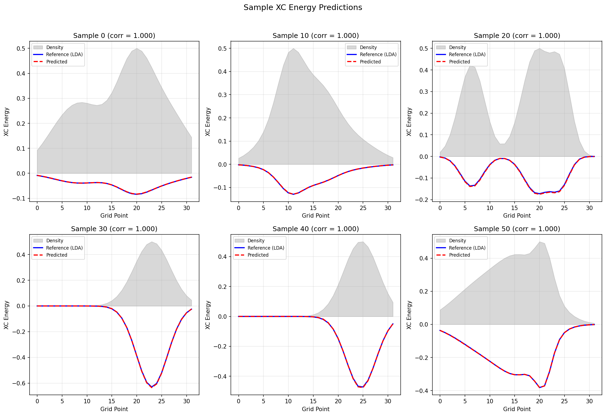
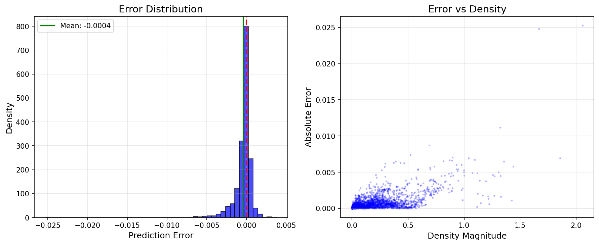

# Training a Neural Exchange-Correlation Functional

| Metadata          | Value                              |
|-------------------|-----------------------------------|
| **Level**         | Advanced                           |
| **Runtime**       | ~15 sec (GPU) / ~2 min (CPU)       |
| **Prerequisites** | JAX, Flax NNX, DFT Basics          |
| **Format**        | Python + Jupyter                   |
| **Memory**        | ~1 GB RAM                          |

## Overview

This example demonstrates training a neural exchange-correlation (XC) functional
from electron density data. The neural XC functional learns to predict
exchange-correlation energies from electron density, going beyond traditional
LDA/GGA approximations.

**Key Concepts:**

- **Exchange-Correlation Energy**: The challenging part of DFT
- **Density Feature Extraction**: Physics-informed input processing
- **Attention Mechanism**: Captures non-local electron correlations
- **Physics Constraints**: Ensures negative XC energy and proper scaling

## What You'll Learn

1. **Generate** synthetic training data with LDA reference energies
2. **Configure** `NeuralXCFunctional` with attention and advanced features
3. **Train** using MSE loss to match reference XC energies
4. **Evaluate** accuracy with R² and correlation metrics
5. **Verify** physics constraints (negative XC energy)

## Coming from PyTorch/DeepChem?

| Traditional ML (PyTorch)               | Opifex Neural XC                         |
|----------------------------------------|------------------------------------------|
| Generic MLP                            | Physics-informed architecture            |
| Standard features                       | Density + gradients + kinetic energy     |
| No physics constraints                  | Built-in negativity + scaling constraints|
| `torch.nn.Module`                      | `NeuralXCFunctional`                     |
| `model(x)`                             | `model(density, gradients)`              |

**Key differences:**

1. **Physics-aware**: Features include reduced gradient, Fermi wavevector
2. **Attention for non-locality**: Captures beyond-local correlations
3. **Constrained output**: Guarantees physically valid XC energy
4. **JAX-native**: Automatic differentiation for functional derivatives

## Files

- **Python Script**: [`examples/quantum-chemistry/neural_xc_functional.py`](https://github.com/Opifex/Opifex/blob/main/examples/quantum-chemistry/neural_xc_functional.py)
- **Jupyter Notebook**: [`examples/quantum-chemistry/neural_xc_functional.ipynb`](https://github.com/Opifex/Opifex/blob/main/examples/quantum-chemistry/neural_xc_functional.ipynb)

## Quick Start

### Run the Python Script

```bash
source activate.sh && python examples/quantum-chemistry/neural_xc_functional.py
```

### Run the Jupyter Notebook

```bash
jupyter lab examples/quantum-chemistry/neural_xc_functional.ipynb
```

## Core Concepts

### Exchange-Correlation Energy

In DFT, the XC energy captures:
- **Exchange**: Pauli exclusion effects
- **Correlation**: Electron-electron interactions beyond mean-field

The LDA approximation:
$$E_{xc}^{LDA} = -C_x \\int \\rho^{4/3} dr$$

Neural XC functionals can learn more accurate energy predictions by:
- Including gradient information (GGA-like)
- Using attention for non-local correlations
- Learning from high-level ab initio data

### Neural XC Architecture

```
Density ρ(r) ──┐
               ├─→ Feature Extractor ─→ Attention ─→ MLP ─→ E_xc(r)
Gradients ∇ρ ──┘
```

**Feature Extractor** computes:
- Log density: log(ρ)
- Gradient magnitude: |∇ρ|
- Reduced gradient: |∇ρ| / ρ^(4/3)
- Kinetic energy density
- Fermi wavevector

### Physics Constraints

The neural XC functional enforces:
1. **Negative energy**: XC energy should be attractive
2. **Density scaling**: Proper behavior at low densities
3. **Numerical stability**: Clipping and smoothing

## Implementation

### Step 1: Generate Training Data

```python
def compute_lda_xc_energy(density):
    """Compute LDA exchange-correlation energy."""
    c_x = 0.738  # Exchange coefficient
    exchange = -c_x * jnp.power(density, 4/3)

    c_c = 0.044  # Correlation coefficient
    correlation = -c_c * density * jnp.log1p(density)

    return exchange + correlation

# Generate synthetic densities
train_densities = jnp.stack([
    generate_density_sample(key, grid_points)
    for key in train_keys
])
train_xc_ref = jnp.stack([
    compute_lda_xc_energy(d) for d in train_densities
])
```

**Terminal Output:**

```text
Generating training data...
--------------------------------------------------
  Training samples: 500
  Test samples: 100
  Grid points per sample: 32

  Train densities shape: (500, 32)
  Train gradients shape: (500, 32, 3)
  Train XC reference shape: (500, 32)
```

### Step 2: Create Neural XC Functional

```python
from opifex.neural.quantum import NeuralXCFunctional
from flax import nnx

model = NeuralXCFunctional(
    hidden_sizes=(64, 64, 32),
    activation=nnx.gelu,
    use_attention=True,
    num_attention_heads=4,
    use_advanced_features=True,
    dropout_rate=0.0,
    rngs=nnx.Rngs(42),
)
```

**Terminal Output:**

```text
Creating Neural XC Functional...
--------------------------------------------------
  Hidden sizes: (64, 64, 32)
  Use attention: True
  Attention heads: 4
  Use advanced features: True
  Total parameters: 23,303
```

### Step 3: Train the Model

```python
def loss_fn(model, densities, gradients, targets):
    predictions = model(densities, gradients, deterministic=True)
    return jnp.mean((predictions - targets) ** 2)

optimizer = nnx.Optimizer(model, optax.adam(1e-3), wrt=nnx.Param)

@nnx.jit
def train_step(model, optimizer, densities, gradients, targets):
    loss, grads = nnx.value_and_grad(loss_fn)(model, densities, gradients, targets)
    optimizer.update(model, grads)
    return loss
```

**Terminal Output:**

```text
Training Neural XC Functional...
--------------------------------------------------
  Epoch   1/100: train_loss = 0.004533, test_loss = 0.001263
  Epoch  10/100: train_loss = 0.000041, test_loss = 0.000054
  Epoch  20/100: train_loss = 0.000017, test_loss = 0.000013
  Epoch  50/100: train_loss = 0.000006, test_loss = 0.000008
  Epoch 100/100: train_loss = 0.000002, test_loss = 0.000002

Training complete!
  Training time: 10.3s
  Final train loss: 0.000002
  Final test loss: 0.000002
```

### Step 4: Evaluate Performance

```python
test_predictions = model(test_densities, test_gradients, deterministic=True)

mse = jnp.mean((test_predictions - test_xc_ref) ** 2)
r2 = 1 - jnp.sum((test_xc_ref - test_predictions) ** 2) / \
         jnp.sum((test_xc_ref - jnp.mean(test_xc_ref)) ** 2)
```

**Terminal Output:**

```text
Evaluating model performance...
--------------------------------------------------
  Mean Squared Error (MSE): 1.703340e-06
  Mean Absolute Error (MAE): 6.605385e-04
  R-squared (R2): 0.9999
  Mean Correlation: 1.0000

Physics Constraint Verification:
  XC energy negative: 100.0% of predictions
```

## Visualization






## Results Summary

| Metric                    | Value           |
|---------------------------|-----------------|
| Hidden sizes              | (64, 64, 32)    |
| Attention heads           | 4               |
| Parameters                | 23,303          |
| Training samples          | 500             |
| Training time             | ~10s            |
| Final MSE                 | 1.70e-6         |
| R-squared                 | 0.9999          |
| Mean correlation          | 1.0000          |
| Negative XC energy        | 100%            |

## Next Steps

### Experiments to Try

1. **More hidden layers**: Try (128, 128, 64, 32) for complex patterns
2. **More attention heads**: 8 heads may capture finer correlations
3. **Disable attention**: Compare with/without for local vs non-local effects
4. **Real DFT data**: Train on reference data from PySCF or Gaussian

### Related Examples

| Example                                      | Level        | What You'll Learn               |
|----------------------------------------------|--------------|--------------------------------|
| [Neural DFT](neural-dft.md)                  | Advanced     | Full DFT energy calculation     |
| [FNO on Darcy](../neural-operators/fno-darcy.md) | Beginner | Data-driven operator learning  |

### API Reference

- `NeuralXCFunctional`: Main neural XC functional class
- `DensityFeatureExtractor`: Physics-informed feature extraction
- `MultiHeadAttention`: Attention for non-local correlations
- `compute_functional_derivative()`: Compute XC potential V_xc
- `assess_chemical_accuracy()`: Built-in accuracy assessment

### Troubleshooting

| Issue                        | Solution                                   |
|------------------------------|-------------------------------------------|
| NaN in training              | Reduce learning rate, check density range |
| Poor R²                      | More training data, larger model          |
| Positive XC energy           | Check physics constraints are enabled     |
| Slow training                | Use GPU, reduce batch size                |

### Advanced Usage

**Computing the XC Potential:**

```python
# Functional derivative for Kohn-Sham equations
xc_potential = model.compute_functional_derivative(
    density, gradients, deterministic=True
)
```

**Using with Neural DFT:**

```python
from opifex.neural.quantum import NeuralDFT

# The neural DFT framework uses NeuralXCFunctional internally
neural_dft = NeuralDFT(
    xc_functional_type="neural",  # Uses NeuralXCFunctional
    rngs=rngs,
)
```
