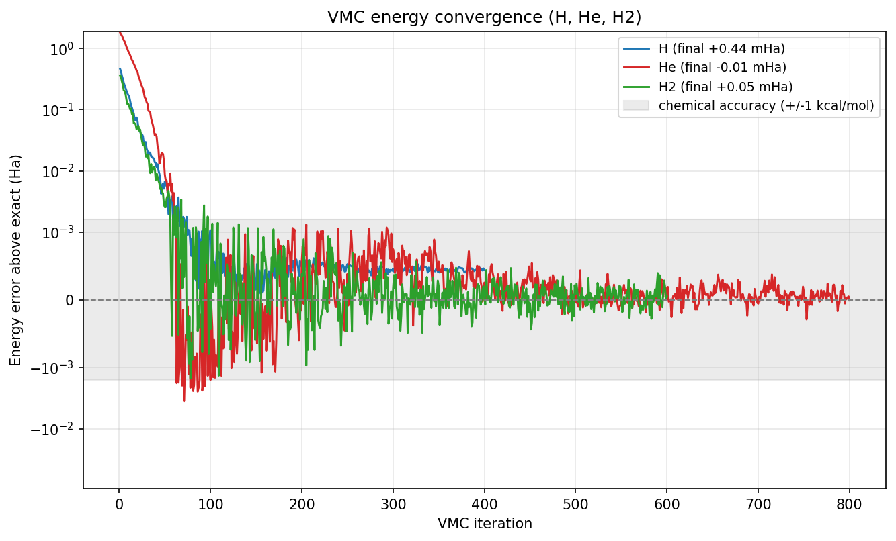
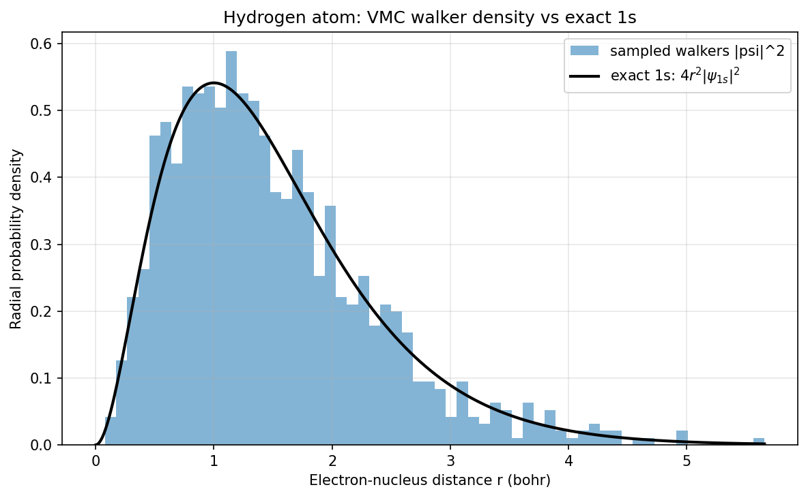

# Variational Monte Carlo: H, He and H2 ground states

| Metadata | Value |
|----------|-------|
| **Level** | Advanced |
| **Runtime** | ~2 min (GPU, jit + lax.scan sampler) |
| **Prerequisites** | JAX, Flax NNX, variational Monte Carlo, neural wavefunctions |
| **Format** | Python + Jupyter |
| **Memory** | ~2 GB RAM |

## Overview

This example recovers the ground-state energies of the **hydrogen atom**, the
**helium atom**, and the **hydrogen molecule** from first principles with
variational Monte Carlo (VMC), using a
[FermiNet](https://journals.aps.org/prresearch/abstract/10.1103/PhysRevResearch.2.033429)
neural-network wavefunction (Pfau et al. 2020, arXiv:1909.02487). VMC minimises
the variational energy

```
E[theta] = < E_loc >_{|psi_theta|^2},   E_loc(r) = (H psi_theta)(r) / psi_theta(r)
```

of a trial wavefunction `psi_theta` by stochastic gradient descent on its
parameters, with the expectation taken over walkers sampled from the Born density
`|psi_theta|^2`. By the variational principle the energy is an upper bound on the
true ground state, so *lower is always better* — there is no label set to overfit,
and matching the exact reference is a faithful recovery of known physics.

These three systems have essentially exact references (H `-0.5`, He `-2.9037`
(Pekeris 1958), H2 at R=1.4 bohr `-1.1745` Hartree), so the goal here is faithful
recovery to **chemical accuracy** (better than 1 mHa), not beating a benchmark.
The identical ansatz, sampler and optimiser scale unchanged to larger molecules
where no exact answer exists.

The example is deliberately **thin** — it composes opifex's committed VMC stack
and changes no library internals:

- `FermiNet` is the generalized-Slater equivariant ansatz, evaluated in the log
  domain one walker at a time and `vmap`-ed over the batch.
- `MetropolisHastingsSampler` draws walkers from `|psi|^2` with the FermiNet
  harmonic-mean proposal, fusing all MCMC sweeps into one `jax.lax.scan`.
- `VMCDriver` runs the energy-minimisation loop: each jitted step samples
  walkers, evaluates the per-walker local energy (forward-Laplacian kinetic term),
  and applies a SPRING natural-gradient update.
- `VMCConfig` selects the SPRING optimiser, the batch size and the iteration
  budget.

## What You'll Learn

1. **Build** a `FermiNet` wavefunction for an atom or molecule
2. **Sample** the Born density `|psi|^2` with the harmonic-mean Metropolis sampler
3. **Minimise** the variational energy with the SPRING natural-gradient optimiser
4. **Recover** H, He and H2 ground-state energies to chemical accuracy
5. **Read** the energy-convergence curve and the sampled walker density

## Background: variational Monte Carlo

VMC turns the Schrödinger eigenvalue problem into an optimisation. For any trial
wavefunction the *local energy* `E_loc(r) = (H psi)(r) / psi(r)` is a function of a
single electron configuration `r`, and its average over the Born density
`|psi|^2` equals the variational energy `E[theta]`. The variational principle
guarantees `E[theta] >= E_0`, the exact ground state, with equality only at the
true ground-state wavefunction. So minimising `E[theta]` drives `psi_theta`
toward the ground state, and the recovered energy is always an upper bound.

opifex evaluates the local energy with a native **forward-Laplacian** kinetic
term — the Hessian diagonal of `log|psi|` obtained from stacked JVPs in `O(1)`
forward passes (the LapNet speed-up) rather than `O(n)` reverse-then-forward
passes. The gradient signal is the FermiNet score-function estimator
`grad E = 2 < (E_loc - <E_loc>) grad log|psi| >`, preconditioned by the SPRING
natural gradient. See [Variational Monte Carlo](../../methods/variational-monte-carlo.md)
for the backbone → local-energy → optimiser design.

## Configuration

Each system is described by its nuclear geometry (in bohr), charges, spin
partition `(n_up, n_down)`, exact reference, and a per-system optimisation budget.
The ansatz, sampler and optimiser hyper-parameters are **shared** across all three
systems and follow the FermiNet small-atom recipe: a two-layer equivariant
backbone (one-electron widths `(32, 32)`, two-electron widths `(16, 16)`) with
four generalized-Slater determinants, the SPRING optimiser, and a 1024-walker
harmonic-mean Metropolis sampler with 10 sweeps per step.

```python
from dataclasses import dataclass
import jax
import jax.numpy as jnp

# float64 + matmul precision "high": VMC energies are validated to ~1 mHa, well
# below the TF32 fallback error on GPU.
jax.config.update("jax_enable_x64", True)
jax.config.update("jax_default_matmul_precision", "high")


@dataclass(frozen=True, slots=True, kw_only=True)
class System:
    name: str
    atoms: jax.Array
    charges: jax.Array
    nspins: tuple[int, int]
    exact_energy: float
    iterations: int
    learning_rate: float
    seed: int


SYSTEMS = (
    System(name="H", atoms=jnp.array([[0.0, 0.0, 0.0]]), charges=jnp.array([1.0]),
           nspins=(1, 0), exact_energy=-0.5, iterations=400, learning_rate=0.05, seed=0),
    System(name="He", atoms=jnp.array([[0.0, 0.0, 0.0]]), charges=jnp.array([2.0]),
           nspins=(1, 1), exact_energy=-2.9037, iterations=800, learning_rate=0.04, seed=2),
    System(name="H2", atoms=jnp.array([[0.0, 0.0, 0.0], [0.0, 0.0, 1.4]]),
           charges=jnp.array([1.0, 1.0]), nspins=(1, 1), exact_energy=-1.1745,
           iterations=600, learning_rate=0.05, seed=1),
)
```

## Building one VMC run

A VMC run for any system is the same three-object composition: a `FermiNet`
ansatz, a `MetropolisHastingsSampler`, and a `VMCDriver` carrying the `VMCConfig`.
The ansatz exposes a single-walker `positions -> (sign, log|psi|)` call (log
domain for stability); the driver `vmap`s it over the walker batch for sampling
and the local energy, and `grad`s it for the score-function gradient and the
per-sample Jacobian the SPRING solve needs. Spin `(n_up, n_down)` is a *static*
attribute, so the whole step is one `jit`-compiled GPU kernel.

```python
from flax import nnx
from opifex.neural.quantum.vmc import (
    FermiNet, MetropolisHastingsSampler, VMCConfig, VMCDriver,
)


def build_driver(system):
    ansatz = FermiNet(
        nspins=system.nspins, atoms=system.atoms, charges=system.charges,
        hidden_one=(32, 32), hidden_two=(16, 16),
        determinants=4, full_det=True, rngs=nnx.Rngs(system.seed),
    )
    sampler = MetropolisHastingsSampler(atoms=system.atoms, steps=10, step_size=0.4)
    config = VMCConfig(
        batch_size=1024, iterations=system.iterations, optimizer="spring",
        learning_rate=system.learning_rate, equilibration_steps=200,
    )
    return VMCDriver(ansatz=ansatz, sampler=sampler, config=config)
```

## Training

`VMCDriver.run` equilibrates the walkers under the freshly initialised
wavefunction, then runs `iterations` jitted optimisation steps. Each step

1. advances the walkers by 10 Metropolis-Hastings sweeps (one fused `lax.scan`)
   so they track the *current* `|psi_theta|^2`;
2. evaluates the per-walker local energy with the native forward-Laplacian
   kinetic term, with outlier-robust median-absolute-deviation clipping; then
3. forms the FermiNet score-function energy gradient, preconditions it with the
   SPRING natural-gradient solve (Fisher inverse in sample space + Nesterov
   momentum), and updates the parameters.

The reported energy is the mean local energy over the final batch with its Monte
Carlo standard error `sigma / sqrt(N)`.

```python
import jax

results = {}
for system in SYSTEMS:
    driver = build_driver(system)
    results[system.name] = driver.run(jax.random.PRNGKey(system.seed))
```

The SPRING natural gradient is what makes this fast: it preconditions the energy
gradient by the inverse Fisher matrix, solved in the cheap *sample* space (an
`N x N` Gram system, not a parameter-space one), and adds Nesterov momentum — so
the energy reaches chemical accuracy in a few hundred iterations rather than the
thousands a plain first-order optimiser would need.

## Results

Recovered energies on a single GPU run of this example (float64, matmul precision
`high`), against the essentially-exact references. **Chemical accuracy** is the
conventional 1 kcal/mol ~ 1.594 mHa threshold; the variational principle bounds
every recovered energy from above, so the errors are essentially all positive
(above the true ground state) up to Monte Carlo noise.

```
======================================================================
VMC ground-state energies vs exact references
======================================================================
System |           E_VMC (Ha) |  Exact (Ha) |      Error |   Status
-------------------------------------------------------------------
     H | -0.49956 +/- 0.00002 |     -0.5000 |   +0.44 mHa | chem-acc
    He | -2.90369 +/- 0.00008 |     -2.9037 |   +0.01 mHa | chem-acc
    H2 | -1.17448 +/- 0.00012 |     -1.1745 |   +0.02 mHa | chem-acc
-------------------------------------------------------------------
Chemical accuracy threshold: |error| < 1.594 mHa (1 kcal/mol)
```

| System | E_VMC (Ha) | Exact (Ha) | Error | Reference |
|--------|-----------:|-----------:|------:|-----------|
| H  | **-0.49956 ± 0.00002** | -0.5000 | **+0.44 mHa** | exact `-1/2` |
| He | **-2.90369 ± 0.00008** | -2.9037 | **+0.01 mHa** | Pekeris 1958 (essentially exact) |
| H2 | **-1.17448 ± 0.00012** | -1.1745 | **+0.02 mHa** | exact Born-Oppenheimer @ R=1.4 bohr |

All three land **inside chemical accuracy** — He and H2 to a few hundredths of a
milli-Hartree, H to under half a milli-Hartree. The whole run (three systems,
400/800/600 iterations) takes about **82 seconds** of compute on a single GPU
plus jit compilation. These are recoveries of *known physics*, not a benchmark
score: because the variational principle bounds every energy from above,
recovering the exact references to under 1 mHa is direct evidence the ansatz,
sampler and optimiser are correct and accurate — and the same stack scales,
unchanged, to molecules where no exact answer exists.

### Energy convergence



The error above the exact reference is plotted on a symmetric-log axis so both the
early macroscopic descent and the final sub-milli-Hartree convergence are visible.
All three systems fall from ~1 Hartree into the shaded chemical-accuracy band
(±1 kcal/mol) within a few hundred SPRING iterations and then fluctuate around
zero at the Monte Carlo noise floor.

### Hydrogen walker density



A direct check that the Metropolis sampler draws from the correct Born density:
the converged hydrogen walkers' radial distribution matches the exact hydrogen 1s
radial density `4 r^2 |psi_1s|^2` (with `psi_1s = exp(-r) / sqrt(pi)`), peaking at
the Bohr radius `r = 1`.

## Running the example

```bash
uv run python examples/quantum-chemistry/vmc_atoms.py
```

The run is self-contained — no dataset download. It enables float64 and pins the
matmul precision to `high` so the GPU float32 (TF32) fallback does not pollute the
milli-Hartree energies.

## Key takeaways

- A VMC ground-state calculation is a **thin composition** of the opifex VMC
  stack: `FermiNet` ansatz → `MetropolisHastingsSampler` → `VMCDriver` with the
  SPRING optimiser → energy table and plots.
- **The variational principle makes this honest** — every recovered energy is an
  upper bound on the exact ground state, so matching the references to <1 mHa is a
  faithful recovery of known physics, not a fit to labels.
- **The forward-Laplacian local energy** gives the kinetic term in `O(1)` forward
  passes, and the whole optimisation step (sampler `lax.scan` + local energy +
  SPRING update) is one `jit`-compiled GPU kernel.
- **SPRING natural gradient converges fast** — preconditioning by the inverse
  Fisher matrix in sample space plus Nesterov momentum reaches chemical accuracy
  in a few hundred iterations rather than thousands.
- The **same stack scales unchanged** to larger molecules; for bigger systems,
  swap in a PsiFormer attention backbone, a MALA sampler, or larger walker counts.

## See also

- [Variational Monte Carlo](../../methods/variational-monte-carlo.md) — the
  FermiNet ansatz, forward-Laplacian kinetic energy, MinSR/SPRING optimisers, and
  how to extend the stack.
- Pfau, Spencer, Matthews & Foulkes 2020, *Ab initio solution of the many-electron
  Schrödinger equation with deep neural networks*, Phys. Rev. Research 2, 033429
  ([arXiv:1909.02487](https://arxiv.org/abs/1909.02487)) — FermiNet.
- Goldshlager, Abrahamsen & Lin 2024, *A Kaczmarz-inspired approach to accelerate
  the optimization of neural network wavefunctions*
  ([arXiv:2401.10190](https://arxiv.org/abs/2401.10190)) — SPRING.
- Pekeris 1958, *Ground State of Two-Electron Atoms*, Phys. Rev. 112, 1649 — the
  essentially-exact helium reference.
