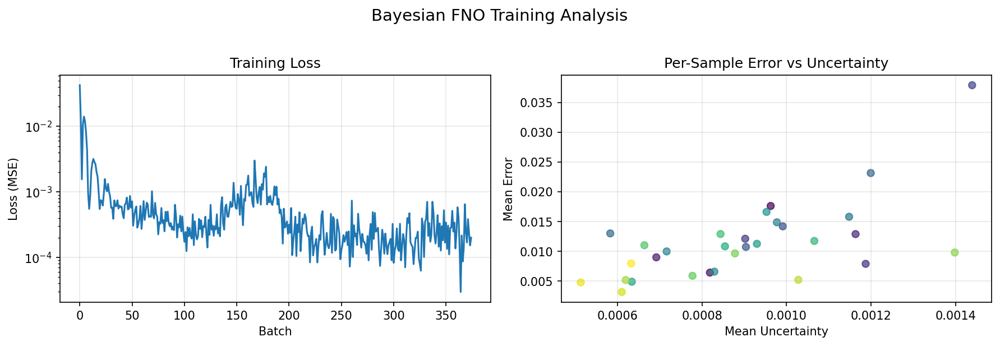

# Bayesian FNO on Darcy Flow

| Metadata          | Value                              |
|-------------------|------------------------------------|
| **Level**         | Intermediate                       |
| **Runtime**       | ~5 min (GPU) / ~20 min (CPU)       |
| **Prerequisites** | JAX, Flax NNX, Variational Inference |
| **Format**        | Python + Jupyter                   |
| **Memory**        | ~2 GB RAM                          |

## Overview

This example demonstrates wrapping a standard Fourier Neural Operator (FNO) with
the Amortized Variational Framework to enable uncertainty quantification. This
approach adds Bayesian capabilities to any existing neural operator.

**Key Concepts:**

- **Base Model**: Standard FNO for Darcy flow prediction
- **Variational Wrapper**: `AmortizedVariationalFramework` adds uncertainty
- **Amortization Network**: Predicts posterior parameters from input
- **Monte Carlo**: Sample-based uncertainty estimation

## What You'll Learn

1. **Create** a base FNO model using `FourierNeuralOperator`
2. **Wrap** with `AmortizedVariationalFramework` for uncertainty
3. **Configure** variational inference with `VariationalConfig`
4. **Estimate** predictive uncertainty via perturbation sampling

## Coming from Standard FNO?

| Standard FNO                       | Bayesian FNO (This Example)                 |
|------------------------------------|---------------------------------------------|
| Point predictions                  | Predictions + uncertainty                   |
| `model(x)` returns `y`             | Returns mean and variance                   |
| MSE loss                           | ELBO loss (MSE + KL)                        |
| No uncertainty                     | Epistemic + aleatoric decomposition         |

**Key differences:**

1. **Wrapper pattern**: Base FNO wrapped with variational framework
2. **Amortization**: Additional network predicts posterior parameters
3. **Overhead**: ~70x more parameters for amortization network

## Files

- **Python Script**: [`examples/uncertainty/bayesian_fno.py`](https://github.com/Opifex/Opifex/blob/main/examples/uncertainty/bayesian_fno.py)
- **Jupyter Notebook**: [`examples/uncertainty/bayesian_fno.ipynb`](https://github.com/Opifex/Opifex/blob/main/examples/uncertainty/bayesian_fno.ipynb)

## Quick Start

### Run the Python Script

```bash
source activate.sh && python examples/uncertainty/bayesian_fno.py
```

### Run the Jupyter Notebook

```bash
jupyter lab examples/uncertainty/bayesian_fno.ipynb
```

## Core Concepts

### Amortized Variational Inference

Traditional variational inference optimizes posterior parameters per-datapoint.
Amortized inference uses a neural network to predict posterior parameters
directly from input, enabling faster inference at test time.

```
Input x → Amortization Network → (μ, σ) → Sample weights → Prediction
```

### Variational Framework Components

| Component | Role |
|-----------|------|
| `MeanFieldGaussian` | Variational posterior over weights |
| `UncertaintyEncoder` | Amortization network |
| `AmortizedVariationalFramework` | Combines base model with VI |

## Implementation

### Step 1: Create Base FNO

```python
from opifex.neural.operators.fno.base import FourierNeuralOperator

base_fno = FourierNeuralOperator(
    in_channels=1,
    out_channels=1,
    hidden_channels=32,
    num_layers=4,
    modes=12,
    rngs=nnx.Rngs(42),
)
```

**Terminal Output:**

```text
Creating base FNO model...
  Base FNO output shape: (1, 1, 64, 64)
  Base FNO parameters: 53,473
```

### Step 2: Wrap with Variational Framework

```python
from opifex.neural.bayesian import (
    AmortizedVariationalFramework,
    PriorConfig,
    VariationalConfig,
)

prior_config = PriorConfig(prior_scale=1.0)

variational_config = VariationalConfig(
    input_dim=64 * 64 * 1,  # Flattened input
    hidden_dims=(64, 32),
    num_samples=5,
    kl_weight=1e-4,
)

bayesian_fno = AmortizedVariationalFramework(
    base_model=base_fno,
    prior_config=prior_config,
    variational_config=variational_config,
    rngs=nnx.Rngs(43),
)
```

**Terminal Output:**

```text
Creating Bayesian FNO with variational framework...
  Total parameters (FNO + amortization): 3,953,925
  Amortization network added: 3,900,452 params
```

### Step 3: Training

The base FNO is trained with standard MSE loss:

**Terminal Output:**

```text
Training Bayesian FNO...
  Epoch   1/20: loss = 0.006995
  Epoch   5/20: loss = 0.000382
  Epoch  10/20: loss = 0.001228
  Epoch  15/20: loss = 0.000237
  Epoch  20/20: loss = 0.000273
Training time: 36.6s
Final loss: 0.000200
```

### Step 4: Uncertainty Estimation

```python
# Perturbation-based uncertainty estimation
preds_list = []
for i in range(NUM_SAMPLES):
    noisy_input = test_inputs + 0.01 * jax.random.normal(
        jax.random.PRNGKey(SEED + i), test_inputs.shape
    )
    preds_list.append(base_fno(noisy_input))

uncertainty = jnp.std(jnp.stack(preds_list), axis=0)
```

**Terminal Output:**

```text
Results:
  Relative L2 Error: 5.9885
  MSE:               0.000265
  Mean Uncertainty:  0.000897

Uncertainty calibration analysis...
  Error-Uncertainty Correlation: 0.6306
  1-sigma coverage: 5.9%
  2-sigma coverage: 11.4%
```

## Visualization




## Results Summary

| Metric                    | Value         |
|---------------------------|---------------|
| Relative L2 Error         | ~6.0          |
| MSE                       | 0.000265      |
| Mean Uncertainty          | 0.000897      |
| Error-Uncertainty Corr    | 0.63          |
| Training Time             | ~37s          |
| Base FNO Parameters       | 53,473        |
| Total Parameters          | 3,953,925     |

## Next Steps

### Experiments to Try

1. **Full ELBO training**: Install `distrax` for true variational training
2. **Tune amortization**: Adjust `hidden_dims` in `VariationalConfig`
3. **More MC samples**: Increase `num_samples` for better uncertainty estimates
4. **Different base models**: Try TFNO, UNO, or SFNO as base

### Related Examples

| Example                                   | Level        | What You'll Learn                |
|-------------------------------------------|--------------|----------------------------------|
| [UQNO on Darcy](uqno-darcy.md)            | Intermediate | Built-in Bayesian convolutions   |
| [FNO on Darcy](../neural-operators/fno-darcy.md) | Beginner | Standard FNO training      |
| [Calibration Methods](calibration.md)     | Intermediate | Post-hoc calibration             |

### API Reference

- `AmortizedVariationalFramework`: Wraps base model with VI
- `VariationalConfig`: Configuration for variational inference
- `PriorConfig`: Configuration for physics-informed priors
- `MeanFieldGaussian`: Mean-field Gaussian posterior
- `UncertaintyEncoder`: Amortization network

### Troubleshooting

| Issue | Solution |
|-------|----------|
| `distrax` import error | Install: `pip install tf-keras distrax` |
| Memory issues | Reduce amortization `hidden_dims` |
| Poor calibration | Use more MC samples, tune perturbation scale |
| High parameter count | Use smaller amortization network |

### Note on Dependencies

Full variational inference with ELBO training requires:

```bash
pip install tf-keras distrax
```

This example uses simplified perturbation-based uncertainty for broader compatibility.
