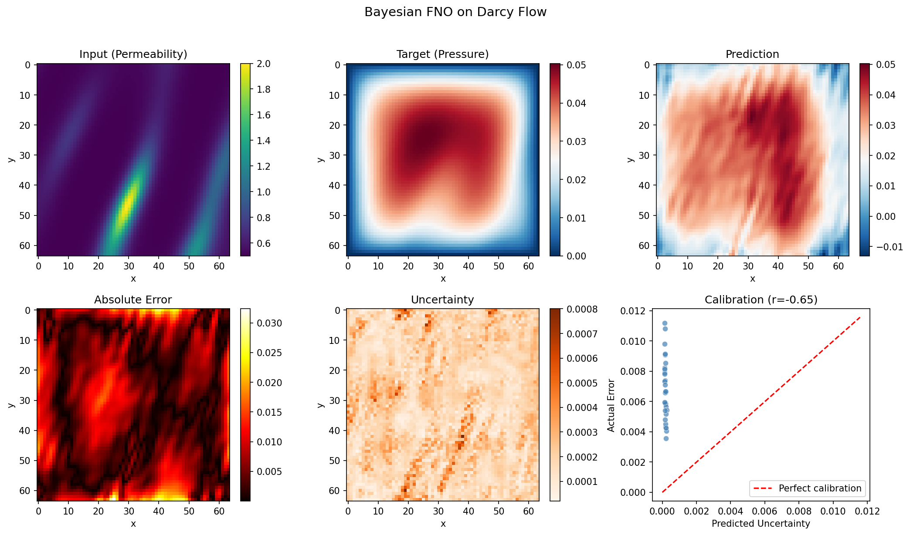
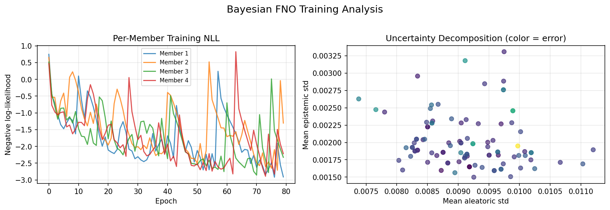

# Bayesian FNO on Darcy Flow

| Metadata          | Value                              |
|-------------------|------------------------------------|
| **Level**         | Intermediate                       |
| **Runtime**       | ~2 min (GPU) / ~10 min (CPU)       |
| **Prerequisites** | JAX, Flax NNX, Deep Ensembles      |
| **Format**        | Python + Jupyter                   |
| **Memory**        | ~2 GB RAM                          |

## Overview

This example quantifies predictive uncertainty for the Darcy
permeability-to-pressure operator with a **heteroscedastic deep ensemble**
of Fourier Neural Operators. Each member is a
`ProbabilisticFourierNeuralOperator` — an FNO backbone with twin pointwise
heads that emit a per-location `mean` and `log-variance`. Training each
member by the heteroscedastic-Gaussian negative log-likelihood gives the
*aleatoric* axis (input-dependent noise); the disagreement *across*
members gives the *epistemic* axis (model uncertainty). Their sum is the
total predictive variance.

**Key Concepts:**

- **Deep Ensemble**: Independently-trained members; their spread is the
  epistemic (model) uncertainty (Lakshminarayanan et al. 2017).
- **Heteroscedastic Head**: Each member predicts a per-location variance,
  the aleatoric (data) uncertainty (Kendall & Gal 2017).
- **Variance Calibration**: A single positive scale, fit on a held-out
  split, aligns the predictive std with the observed error spread.

## What You'll Learn

1. **Build** a heteroscedastic FNO with `ProbabilisticFourierNeuralOperator`
2. **Train** an ensemble with the heteroscedastic-Gaussian NLL loss
3. **Decompose** predictive variance into aleatoric + epistemic parts
4. **Calibrate** and visualize the predictive uncertainty

## Coming from Standard FNO?

| Standard FNO                       | Bayesian FNO (This Example)                 |
|------------------------------------|---------------------------------------------|
| Point predictions                  | Predictive mean + calibrated std            |
| `model(x)` returns `y`             | Member returns `(mean, log_variance)`       |
| Relative-L2 loss                   | Heteroscedastic-Gaussian NLL                |
| No uncertainty                     | Aleatoric + epistemic decomposition         |

**Key differences:**

1. **Ensemble**: Several independently-seeded members vote on the answer.
2. **Variance head**: Each member learns an input-dependent noise level.
3. **Calibration**: One held-out scale aligns the interval with coverage.

## Files

- **Python Script**: [`examples/uncertainty/bayesian_fno.py`](https://github.com/avitai/opifex/blob/main/examples/uncertainty/bayesian_fno.py)
- **Jupyter Notebook**: [`examples/uncertainty/bayesian_fno.ipynb`](https://github.com/avitai/opifex/blob/main/examples/uncertainty/bayesian_fno.ipynb)

## Quick Start

### Run the Python Script

```bash
source activate.sh && python examples/uncertainty/bayesian_fno.py
```

### Run the Jupyter Notebook

```bash
jupyter lab examples/uncertainty/bayesian_fno.ipynb
```

## Core Concepts

### Heteroscedastic Deep Ensemble

Each member predicts a per-location Gaussian `N(mu(x), sigma^2(x))`. The
ensemble decomposes the total predictive variance as

```
total = aleatoric + epistemic
      = mean_m[sigma_m^2(x)] + var_m[mu_m(x)]
```

where `m` indexes ensemble members. The aleatoric term captures
input-dependent noise; the epistemic term captures member disagreement.

### Components

| Component | Role |
|-----------|------|
| `ProbabilisticFourierNeuralOperator` | FNO backbone + mean / log-variance heads |
| `probabilistic_fno_negative_log_likelihood` | Heteroscedastic-Gaussian training loss |
| `append_grid_coordinates` | Positional embedding (boundary-value problems) |
| `ensemble_predictive` | Aggregates member means into the epistemic spread |

## Implementation

### Step 1: Build a Heteroscedastic Member

The backbone is translation-equivariant, so grid-coordinate channels are
prepended to the input — each member is built with `in_channels = 1 + 2`.

```python
from opifex.neural.operators.fno.probabilistic import (
    ProbabilisticFourierNeuralOperator,
)

member = ProbabilisticFourierNeuralOperator(
    in_channels=3,  # 1 permeability + 2 grid coordinates
    out_channels=1,
    hidden_channels=32,
    modes=12,
    num_layers=4,
    rngs=nnx.Rngs(42),
)
```

**Terminal Output:**

```text
Creating heteroscedastic FNO ensemble...
  Member: ProbabilisticFNO (modes=12, width=32, layers=4)
  Input channels: 1 (+ 2 grid = 3)
  Parameters per member: 2,372,066
  Ensemble parameters:   9,488,264
```

### Step 2: Train the Ensemble

Every member is trained independently with the heteroscedastic-Gaussian
NLL on grid-augmented, Gaussian-normalized inputs.

```python
from opifex.neural.operators.fno._positional import append_grid_coordinates
from opifex.neural.operators.fno.probabilistic import (
    probabilistic_fno_negative_log_likelihood,
)


@nnx.jit
def train_step(member, optimizer, x, y):
    def loss_fn(model):
        return probabilistic_fno_negative_log_likelihood(
            model, append_grid_coordinates(x), y
        )

    loss, grads = nnx.value_and_grad(loss_fn)(member)
    optimizer.update(member, grads)
    return loss
```

**Terminal Output:**

```text
Training ensemble members...
  Member 1/4: NLL +0.7451 -> -2.9116
  Member 2/4: NLL +0.6524 -> -1.3052
  Member 3/4: NLL +0.5145 -> -2.3262
  Member 4/4: NLL +0.4694 -> -2.2192
Training time: 63.4s
```

### Step 3: Predict and Calibrate

The predictive mean and aleatoric + epistemic variance are assembled in
physical units, then a single scale is fit on a held-out calibration
split so the `1.64-sigma` interval covers ~90% of the residuals.

**Terminal Output:**

```text
Calibrating predictive uncertainty...
  Calibration std scale: 0.2316

Evaluating on test set...

Results:
  Predictive-mean Relative L2: 0.009013
  Min / Max Relative L2:       0.003607 / 0.023608
  Test MSE:                    6.115206e-06
  Mean predictive std:         2.180397e-03
  Mean aleatoric std:          9.141234e-03
  Mean epistemic std:          2.010190e-03
```

### Step 4: Calibration Analysis

**Terminal Output:**

```text
Uncertainty calibration analysis...
  Coverage @ 1.64-sigma: 87.8% (target 90%)
  1-sigma coverage:           66.3%
  2-sigma coverage:           93.4%
  Error-uncertainty corr (per-sample): 0.1709
  Error-uncertainty corr (per-pixel):  0.3546
```

## Visualization





## Results Summary

| Metric                              | Value         |
|-------------------------------------|---------------|
| Predictive-mean Relative L2         | 0.009013      |
| Min / Max Relative L2               | 0.003607 / 0.023608 |
| Coverage @ 1.64-sigma               | 87.8%         |
| 2-sigma coverage                    | 93.4%         |
| Error-uncertainty corr (per-sample) | 0.1709        |
| Error-uncertainty corr (per-pixel)  | 0.3546        |
| Parameters per member               | 2,372,066     |
| Ensemble parameters                 | 9,488,264     |
| Training time                       | ~63s          |

The predictive mean visually matches the smooth ground-truth pressure
field, and the calibrated predictive std is larger where the absolute
error is larger — an actionable, well-calibrated risk signal.

## Next Steps

### Experiments to Try

1. **More members**: Increase `NUM_MEMBERS` for a smoother epistemic
   estimate (diminishing returns past ~5 on this smooth dataset).
2. **Higher capacity**: Raise `MODES` / `HIDDEN_WIDTH` for sharper means.
3. **Target coverage**: Change `TARGET_COVERAGE` to calibrate a different
   predictive interval (e.g. `0.95`).
4. **Different backbones**: Swap the member backbone for TFNO or UNO and
   keep the same heteroscedastic-ensemble wrapper.

### Related Examples

| Example                                   | Level        | What You'll Learn                |
|-------------------------------------------|--------------|----------------------------------|
| [UQNO on Darcy](uqno-darcy.md)            | Intermediate | Built-in Bayesian convolutions   |
| [FNO on Darcy](../neural-operators/fno-darcy.md) | Beginner | Standard FNO training      |
| [Calibration Methods](calibration.md)     | Intermediate | Post-hoc calibration             |

### API Reference

- `ProbabilisticFourierNeuralOperator`: FNO with mean + log-variance heads
- `probabilistic_fno_negative_log_likelihood`: Heteroscedastic-Gaussian NLL
- `append_grid_coordinates`: Grid positional embedding
- `ensemble_predictive`: Member-aggregation predictive constructor

### Troubleshooting

| Issue | Solution |
|-------|----------|
| Over-confident intervals | The held-out variance scale corrects this; widen the calibration split if it is noisy |
| Out-of-memory on evaluation | Lower `EVAL_CHUNK` |
| Weak per-sample correlation | Train members longer or reduce per-member capacity for more diversity |

### Notes

This example uses a heteroscedastic deep ensemble: each member is a
`ProbabilisticFourierNeuralOperator` trained by the heteroscedastic-Gaussian
NLL, and the predictive variance is the standard aleatoric + epistemic
decomposition, calibrated to the target coverage on a held-out split. This
is the canonical scalable Bayesian-predictive recipe and it preserves the
operator-learning accuracy of a deterministic FNO.
