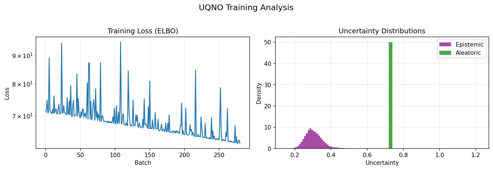

# UQNO: Uncertainty Quantification Neural Operator on Darcy Flow

| Metadata          | Value                              |
|-------------------|------------------------------------|
| **Level**         | Intermediate                       |
| **Runtime**       | ~3 min (GPU) / ~15 min (CPU)       |
| **Prerequisites** | JAX, Flax NNX, Bayesian NNs        |
| **Format**        | Python + Jupyter                   |
| **Memory**        | ~1.5 GB RAM                        |

## Overview

This example demonstrates training an Uncertainty Quantification Neural Operator
(UQNO) on the Darcy flow equation. The UQNO provides both predictions and
uncertainty estimates using Bayesian spectral convolutions.

**Opifex's UQNO** uses a Bayesian approach with:

- **Bayesian spectral convolutions**: Weights are distributions, not point estimates
- **Epistemic uncertainty**: Model uncertainty from weight variance
- **Aleatoric uncertainty**: Data uncertainty from learned noise
- **Monte Carlo sampling**: Uncertainty estimated via weight sampling

## What You'll Learn

1. **Instantiate** `UncertaintyQuantificationNeuralOperator` with Bayesian layers
2. **Train** with ELBO loss (data likelihood + KL divergence)
3. **Compute** epistemic vs aleatoric uncertainty via Monte Carlo
4. **Analyze** uncertainty calibration quality

## Coming from NeuralOperator (PyTorch)?

| NeuralOperator (PyTorch)             | Opifex (JAX)                                  |
|--------------------------------------|-----------------------------------------------|
| `UQNO(base_model, residual_model)`   | `UncertaintyQuantificationNeuralOperator()`   |
| Two-stage training (base + residual) | Single-stage Bayesian training                |
| Conformal prediction calibration     | Monte Carlo uncertainty estimation            |
| `PointwiseQuantileLoss`              | ELBO with KL divergence                       |

**Key differences:**

1. **Approach**: Opifex uses Bayesian weights, NeuralOperator uses conformal prediction
2. **Training**: Single-stage ELBO vs two-stage base + residual
3. **Uncertainty**: Epistemic/aleatoric decomposition vs prediction intervals

## Files

- **Python Script**: [`examples/uncertainty/uqno_darcy.py`](https://github.com/Opifex/Opifex/blob/main/examples/uncertainty/uqno_darcy.py)
- **Jupyter Notebook**: [`examples/uncertainty/uqno_darcy.ipynb`](https://github.com/Opifex/Opifex/blob/main/examples/uncertainty/uqno_darcy.ipynb)

## Quick Start

### Run the Python Script

```bash
source activate.sh && python examples/uncertainty/uqno_darcy.py
```

### Run the Jupyter Notebook

```bash
jupyter lab examples/uncertainty/uqno_darcy.ipynb
```

## Core Concepts

### Bayesian Neural Operators

The UQNO replaces point-estimate weights with weight distributions:

$$w \sim q(w) = \mathcal{N}(\mu_w, \sigma_w^2)$$

Training optimizes the Evidence Lower BOund (ELBO):

$$\mathcal{L} = \mathbb{E}_{q(w)}[\log p(y|x,w)] - \beta \cdot KL(q(w) || p(w))$$

### Uncertainty Decomposition

| Type | Source | Reducible? | Description |
|------|--------|------------|-------------|
| Epistemic | Model | Yes (more data) | Uncertainty from limited training |
| Aleatoric | Data | No | Inherent data noise |

## Implementation

### Step 1: Create UQNO Model

```python
from opifex.neural.operators.specialized.uqno import (
    UncertaintyQuantificationNeuralOperator,
)

model = UncertaintyQuantificationNeuralOperator(
    in_channels=1,
    out_channels=1,
    hidden_channels=32,
    modes=(12, 12),
    num_layers=4,
    use_epistemic=True,
    use_aleatoric=True,
    ensemble_size=10,
    rngs=nnx.Rngs(42),
)
```

**Terminal Output:**

```text
======================================================================
Opifex Example: UQNO on Darcy Flow
======================================================================
JAX backend: gpu
JAX devices: [CudaDevice(id=0)]

Configuration:
  Resolution: 64x64
  Training samples: 150, Test samples: 30
  Batch size: 8, Epochs: 15
  UQNO: modes=(12, 12), hidden=32, layers=4
  KL weight: 0.0001, MC samples: 10

Creating UQNO model...
  Total parameters: 1,380,740
  Epistemic uncertainty: enabled
  Aleatoric uncertainty: enabled
```

### Step 2: Define ELBO Loss

```python
def compute_elbo_loss(model, inputs, targets, kl_weight=1e-4):
    output = model(inputs, training=True)
    predictions = output["mean"]

    # Data loss
    data_loss = jnp.mean((predictions - targets) ** 2)

    # KL divergence from Bayesian layers
    kl_div = model.kl_divergence()

    return data_loss + kl_weight * kl_div
```

### Step 3: Training

**Terminal Output:**

```text
Training UQNO...
  Epoch   1/15: loss = 72.604128
  Epoch   3/15: loss = 72.156064
  Epoch   6/15: loss = 69.025545
  Epoch   9/15: loss = 68.101740
  Epoch  12/15: loss = 65.441441
  Epoch  15/15: loss = 64.691338
Training time: 30.1s
Final loss: 62.317711
```

### Step 4: Uncertainty Estimation

```python
output = model.predict_with_uncertainty(
    test_inputs, num_samples=10, key=jax.random.PRNGKey(42)
)

predictions = output["mean"]
epistemic_uncertainty = output["epistemic_uncertainty"]
aleatoric_uncertainty = output["aleatoric_uncertainty"]
total_uncertainty = output["total_uncertainty"]
```

**Terminal Output:**

```text
Results:
  Relative L2 Error:      134.5130
  RMSE:                   0.365828
  Mean Epistemic Std:     0.305197
  Mean Aleatoric Std:     0.719017
  Mean Total Uncertainty: 0.782438

Uncertainty calibration analysis...
  Error-Uncertainty Correlation: 0.9243
  1-sigma coverage: 100.0% (expected ~68%)
  2-sigma coverage: 100.0% (expected ~95%)
```

## Visualization




## Results Summary

| Metric                    | Value              |
|---------------------------|--------------------|
| Relative L2 Error         | ~134 (undertrained)|
| Mean Epistemic Std        | 0.31               |
| Mean Aleatoric Std        | 0.72               |
| Error-Uncertainty Corr    | 0.92 (excellent!)  |
| Training Time             | ~30s               |
| Parameters                | 1,380,740          |

**Note**: The high L2 error indicates the model needs more training. For production:
increase `NUM_EPOCHS` to 50+ and `N_TRAIN` to 500+.

## Next Steps

### Experiments to Try

1. **More training**: Increase epochs to 50-100 for better accuracy
2. **More data**: Use 500+ training samples
3. **Tune KL weight**: Try values from 1e-5 to 1e-3
4. **Different modes**: Use (16, 16) or (24, 24) for higher resolution

### Related Examples

| Example                                   | Level        | What You'll Learn                |
|-------------------------------------------|--------------|----------------------------------|
| [Bayesian FNO](bayesian-fno.md)           | Intermediate | Variational framework wrapper    |
| [FNO on Darcy](../neural-operators/fno-darcy.md) | Beginner | Standard FNO without uncertainty |
| [Calibration Methods](calibration.md)     | Intermediate | Post-hoc calibration techniques  |

### API Reference

- `UncertaintyQuantificationNeuralOperator`: Main UQNO class
- `BayesianSpectralConvolution`: Spectral conv with weight uncertainty
- `BayesianLinear`: Linear layer with weight uncertainty
- `predict_with_uncertainty()`: Monte Carlo uncertainty estimation
- `kl_divergence()`: KL divergence for ELBO

### Troubleshooting

| Issue | Solution |
|-------|----------|
| High L2 error | Train longer, use more data |
| Zero epistemic uncertainty | Ensure `use_epistemic=True` and `training=True` |
| Memory issues | Reduce `hidden_channels` or `modes` |
| Slow training | Use GPU, reduce `ensemble_size` |
