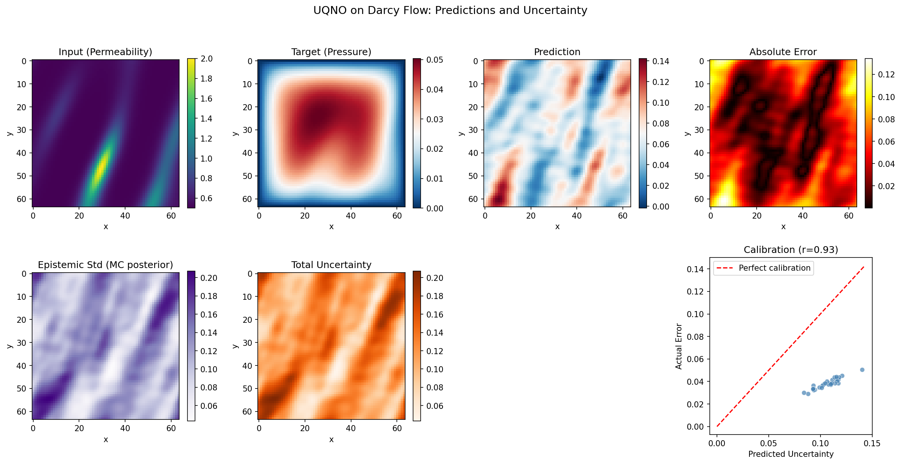
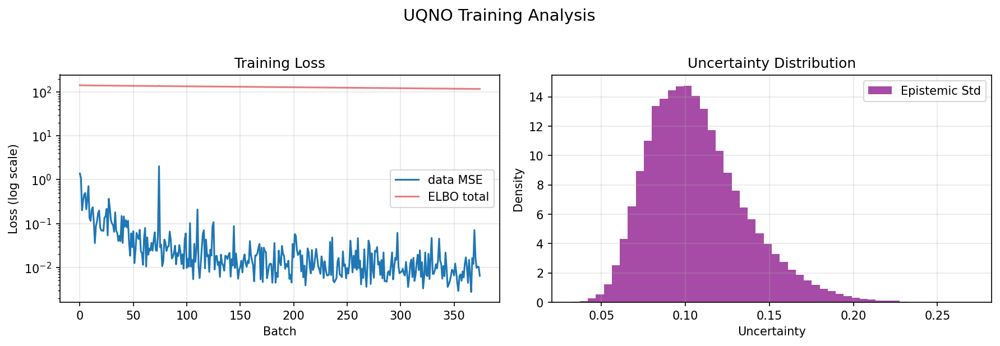

# UQNO on Darcy Flow — Conformal Prediction Bands

| Property      | Value                                    |
|---------------|------------------------------------------|
| Level         | Intermediate                             |
| Runtime       | ~3 min (GPU) / ~15 min (CPU)             |
| Memory        | ~1 GB                                    |
| Prerequisites | JAX, Flax NNX, Conformal Prediction      |

## Overview

This example trains an Uncertainty Quantification Neural Operator
(UQNO) on the Darcy flow equation and produces **calibrated prediction
intervals** with finite-sample coverage guarantees. The implementation
follows the canonical three-stage recipe from Ma, Pitt, Azizzadenesheli,
Anandkumar (TMLR 2024,
[arXiv:2402.01960](https://arxiv.org/abs/2402.01960)):

1. **Base solution operator** — a standard deterministic
   ``FourierNeuralOperator`` trained on `(input, target)` pairs with
   the relative-L2 loss (the canonical operator-learning objective).
2. **Residual quantile operator** — a *separate* FNO trained against
   ``opifex.uncertainty.losses.PointwiseQuantileLoss`` on the
   residuals of the (frozen) base.
3. **Scalar conformal calibration** — on a held-out calibration set,
   ratios ``|y - base(x)| / residual(x)`` are reduced to a single
   ``uncertainty_scaling_factor`` via the canonical
   ``get_coeff_quantile_idx`` formula. Test-time bands are
   ``base(x) ± residual(x) * scaling_factor``.

To reach both **good accuracy** and **meaningful calibrated
uncertainty**, the example uses the proven operator-learning recipe:
Gaussian input/output normalization (fit on the base-train split), the
relative-L2 loss for the base, grid positional embedding, and ~1000
base training samples. The predicted mean is un-normalized back to
physical pressure (and band widths scaled by ``y_std``) before the
relative-L2 error and conformal coverage are reported.

Conformal prediction is **distribution-free**: the bands cover the
true target on at least ``1 - alpha`` fraction of points (per the
chosen ``(alpha, delta)`` configuration), independent of how well the
base / residual operators fit. There is no Bayesian posterior, no
Monte-Carlo sampling, and no KL term — the uncertainty surface lives
entirely in the residual operator + the scalar scaling factor.

## What You'll Learn

1. Compose ``UncertaintyQuantificationNeuralOperator`` from a base +
   residual ``FourierNeuralOperator``.
2. Train the residual operator with
   :class:`opifex.uncertainty.losses.PointwiseQuantileLoss`.
3. Calibrate a scalar uncertainty scaling factor with
   ``UncertaintyQuantificationNeuralOperator.calibrate``.
4. Predict + evaluate coverage with ``predict_with_bands``.

## Files

- **Python Script**: [`examples/uncertainty/uqno_darcy.py`](https://github.com/avitai/opifex/blob/main/examples/uncertainty/uqno_darcy.py)
- **Jupyter Notebook**: [`examples/uncertainty/uqno_darcy.ipynb`](https://github.com/avitai/opifex/blob/main/examples/uncertainty/uqno_darcy.ipynb)

## Quick Start

### Run the Python Script

```bash
source activate.sh && python examples/uncertainty/uqno_darcy.py
```

### Run the Jupyter Notebook

```bash
jupyter lab examples/uncertainty/uqno_darcy.ipynb
```

## Core Concepts

### Three-Stage Conformal UQNO

The canonical UQNO (the PyTorch reference at
[`neuraloperator/neuralop/models/uqno.py`](https://github.com/neuraloperator/neuraloperator/blob/main/neuralop/models/uqno.py))
is **not** Bayesian — neither at the layer level nor
at the predictive-distribution level. It is a conformal-prediction
wrapper around a pair of deterministic FNOs:

| Stage | Object | Loss | Output |
|-------|--------|------|--------|
| 1 | `base: UQNOBaseSolutionOperator(FNO)` | relative-L2 on `(x, y)` | $\hat{u}(x)$ |
| 2 | `residual: UQNOResidualOperator(FNO)` | `PointwiseQuantileLoss(alpha)` on `base(x) - y_true` | width$E(x)$ |
| 3 | `UQNOConformalCalibrator` | scalar factor from held-out ratios | `scaling_factor` |

At test time, ``UncertaintyQuantificationNeuralOperator.predict_with_bands(x)`` returns
a :class:`opifex.uncertainty.types.PredictiveDistribution` whose
:class:`opifex.uncertainty.types.PredictionInterval` is
``[base(x) - E(x) * scaling_factor, base(x) + E(x) * scaling_factor]``.

### Coverage Guarantee

The conformal calibration rule
(``opifex.neural.operators.specialized.uqno.get_coeff_quantile_idx``)
picks two indices ``(domain_idx, function_idx)`` from
``(alpha, delta, n_samples, n_gridpts)`` such that, on average, the
predicted bands cover the true target on at least ``1 - alpha``
fraction of grid points per function, for at least ``1 - delta``
fraction of functions in the calibration distribution.

## Implementation

### Step 0: Materialise the Darcy Dataset

The PDE data layer is backed by **datarax**. ``create_darcy_loader``
returns a frozen ``PDELoaders`` with ``.train`` / ``.val`` pipelines that
serve channels-first ``(batch, 1, H, W)`` batches. For UQNO we need one
contiguous in-memory block of ``n_total`` samples, so both pipelines are
drained and the concatenation is sliced to ``[:n_total]`` before being
split into the base / residual / calibration / test sets.

```python
import jax.numpy as jnp
import numpy as np
from opifex.data.loaders import create_darcy_loader

n_total = N_TRAIN_BASE + N_TRAIN_RESIDUAL + N_CALIB + N_TEST  # 2100

loaders = create_darcy_loader(
    n_samples=n_total,
    batch_size=32,
    resolution=64,
    seed=42,
)

inputs_all, outputs_all = [], []
for pipeline in (loaders.train, loaders.val):
    for batch in pipeline:
        inputs_all.append(jnp.asarray(np.asarray(batch["input"])))
        outputs_all.append(jnp.asarray(np.asarray(batch["output"])))

inputs = jnp.concatenate(inputs_all, axis=0)[:n_total]
outputs = jnp.concatenate(outputs_all, axis=0)[:n_total]  # (2100, 1, 64, 64)

splits = [N_TRAIN_BASE, N_TRAIN_RESIDUAL, N_CALIB]
cuts = [sum(splits[: i + 1]) for i in range(len(splits))]
x_base, x_residual, x_calib, x_test = jnp.split(inputs, cuts, axis=0)
y_base, y_residual, y_calib, y_test = jnp.split(outputs, cuts, axis=0)
```

datarax serves **every** generated sample — it does not drop partial
batches — so draining both pipelines yields exactly ``n_total`` samples
and the slice is purely defensive.

### Step 1: Train the Base Solution Operator

```python
from flax import nnx
import optax
from opifex.neural.operators.fno.base import FourierNeuralOperator

base_fno = FourierNeuralOperator(
    in_channels=1,
    out_channels=1,
    hidden_channels=32,
    modes=12,
    num_layers=4,
    positional_embedding=True,  # append normalized grid-coordinate channels
    rngs=nnx.Rngs(42),
)
base_opt = nnx.Optimizer(base_fno, optax.adam(1e-3), wrt=nnx.Param)


def relative_l2(pred, target, eps=1e-8):
    diff = (pred - target).reshape(pred.shape[0], -1)
    ref = target.reshape(target.shape[0], -1)
    return jnp.mean(jnp.linalg.norm(diff, axis=1) / (jnp.linalg.norm(ref, axis=1) + eps))


@nnx.jit
def base_train_step(model, opt, x, y):
    def loss_fn(m):
        return relative_l2(m(x), y)  # standard operator-learning objective
    loss, grads = nnx.value_and_grad(loss_fn)(model)
    opt.update(model, grads)
    return loss
```

The base and residual operators train on **Gaussian-normalized** inputs
and targets (statistics fit on the base-train split); the predicted
mean is un-normalized — and the band half-widths are scaled by
``y_std`` — before any physical-space metric is computed.

### Step 2: Train the Residual Quantile Operator

```python
from opifex.uncertainty.losses import PointwiseQuantileLoss

residual_fno = FourierNeuralOperator(
    in_channels=1, out_channels=1,
    hidden_channels=32, modes=12, num_layers=4,
    positional_embedding=True, rngs=nnx.Rngs(43),
)
residual_opt = nnx.Optimizer(residual_fno, optax.adam(1e-3), wrt=nnx.Param)
quantile_loss = PointwiseQuantileLoss(alpha=0.1, reduction="mean")


@nnx.jit
def residual_train_step(base, residual, opt, quantile_loss, x, y):
    def loss_fn(r):
        base_pred = jax.lax.stop_gradient(base(x))
        quantile_widths = jnp.abs(r(x))
        return quantile_loss(y_pred=quantile_widths, y=base_pred - y)
    loss, grads = nnx.value_and_grad(loss_fn)(residual)
    opt.update(residual, grads)
    return loss
```

``PointwiseQuantileLoss`` is registered as a static pytree
(``jax.tree_util.register_static``), so it can be passed straight into
the ``nnx.jit``-compiled step as a regular argument — no closure capture
and no re-tracing per call.

### Step 3: Compose, Calibrate, Predict

```python
from opifex.neural.operators.specialized.uqno import (
    UncertaintyQuantificationNeuralOperator,
    UQNOBaseSolutionOperator,
    UQNOResidualOperator,
)

uqno = UncertaintyQuantificationNeuralOperator(
    base=UQNOBaseSolutionOperator(base_fno),
    residual=UQNOResidualOperator(residual_fno),
)

# Calibrate on a held-out set (normalized space).
calibrator = uqno.calibrate(x_calib_n, y_calib_n, alpha=0.1, delta=0.1)
uqno = uqno.with_calibrator(calibrator)
print(f"scaling factor: {float(calibrator.scaling_factor):.6f}")

# Predict with bands, then un-normalize the mean and scale widths by y_std.
dist = uqno.predict_with_bands(x_test_n)
mean_prediction = dist.mean * y_std + y_mean
half_width = (dist.interval.upper - dist.interval.lower) * 0.5 * y_std
lower, upper = mean_prediction - half_width, mean_prediction + half_width

# Predictive-mean accuracy in physical units.
diff = (mean_prediction - y_test).reshape(y_test.shape[0], -1)
ref = y_test.reshape(y_test.shape[0], -1)
rel_l2 = float(jnp.mean(jnp.linalg.norm(diff, axis=1) / jnp.linalg.norm(ref, axis=1)))
coverage = float(jnp.mean((y_test >= lower) & (y_test <= upper)))
print(f"predictive-mean rel-L2: {rel_l2:.6f}")
print(f"empirical coverage: {coverage:.3f} (target 1-alpha = {1-0.1:.2f})")
```

## Visualisation





## Results Summary

Representative run at resolution 64 (1000 / 500 / 500 / 100 samples for
base / residual / calibration / test; 120 base + 80 residual epochs;
~27 s total on a single GPU — 17.6 s base + 8.9 s residual). Each FNO
has **2,368,001** parameters (base + residual = 4,736,002).

| Metric                                | Value                         |
|---------------------------------------|-------------------------------|
| Predictive-mean test rel-L2 (mean)    | **0.0103**                    |
| Predictive-mean test rel-L2 (min/max) | 0.0053 / 0.0216               |
| `calibrator.scaling_factor`           | 4.855470                      |
| `calibrator.domain_idx`               | 228                           |
| `calibrator.function_idx`             | 51                            |
| Empirical pointwise coverage (test)   | 0.975 (target $1-\alpha=0.9$) |
| Mean band width (physical units)      | 0.025168                      |
| Predicted std positive everywhere     | yes                           |
| `\|error\|` vs predicted-std correlation | 0.365                      |
| Mean `\|error\|` (high vs low uncertainty)| 0.002590 vs 0.001667       |

The predictive mean reaches **~1.0 % relative-L2** error in physical
units — the base prediction is visually indistinguishable from the
smooth ground-truth pressure field. The empirical coverage lands
**above** the nominal $1 - \alpha = 0.9$: the conformal
``get_coeff_quantile_idx`` rule with $\delta = 0.1$ targets a
*function-level* guarantee that is intentionally conservative
pointwise, so coverage near 0.975 is expected, not a bug. The predicted
uncertainty is positive everywhere and correlates positively with the
absolute error (corr ≈ 0.37); the mean error is larger in the
high-uncertainty half of the grid than in the low-uncertainty half,
the qualitative signature of a sensible uncertainty surface.

For tighter (less conservative) pointwise coverage, raise $\delta$
toward $\alpha$; for higher accuracy, scale up the per-stage epoch
counts or the hidden channels / Fourier modes.

## Next Steps

### Experiments to Try

1. **Tune $\alpha$ / $\delta$**: Smaller $\alpha$ widens bands;
   smaller $\delta$ raises the function-level coverage demand.
2. **Different base architectures**: The same conformal calibrator
   wraps any deterministic operator that satisfies the
   :class:`opifex.uncertainty.adapters.operators.FNOConformalAdapterSpec`
   capability.
3. **Trade coverage for tightness**: raise $\delta$ toward $\alpha$
   to pull the conservative pointwise coverage down toward the nominal
   $1 - \alpha$, or scale up epochs / hidden channels for accuracy.

### Related Examples

| Example                                            | Level        | What You'll Learn                |
|----------------------------------------------------|--------------|----------------------------------|
| [Bayesian FNO](bayesian-fno.md)                    | Intermediate | Variational framework wrapper    |
| [FNO on Darcy](../neural-operators/fno-darcy.md)   | Beginner     | Standard FNO without uncertainty |
| [Calibration Methods](calibration.md)              | Intermediate | Post-hoc calibration techniques  |

### API Reference

- `UncertaintyQuantificationNeuralOperator`: Three-stage conformal orchestrator
- `UQNOBaseSolutionOperator`: Thin wrapper tagging an FNO as the base
- `UQNOResidualOperator`: Thin wrapper tagging an FNO as the residual
- `UQNOConformalCalibrator`: Fitted scalar scaling factor (pytree)
- `PointwiseQuantileLoss`: Quantile (pinball) loss for the residual stage
- `get_coeff_quantile_idx`: Canonical conformal-index helper

### Troubleshooting

| Issue | Solution |
|-------|----------|
| Coverage well below $1 - \alpha$ | Train base + residual longer; calibration set may be too small |
| Bands too wide | The residual operator hasn't concentrated yet — train it more |
| Calibration `scaling_factor` is `inf` | `residual(x)` is near zero somewhere — increase `eps` in `calibrate(..., eps=...)` |
| Memory issues | Reduce `hidden_channels` or `modes`; `RESOLUTION` if needed |
